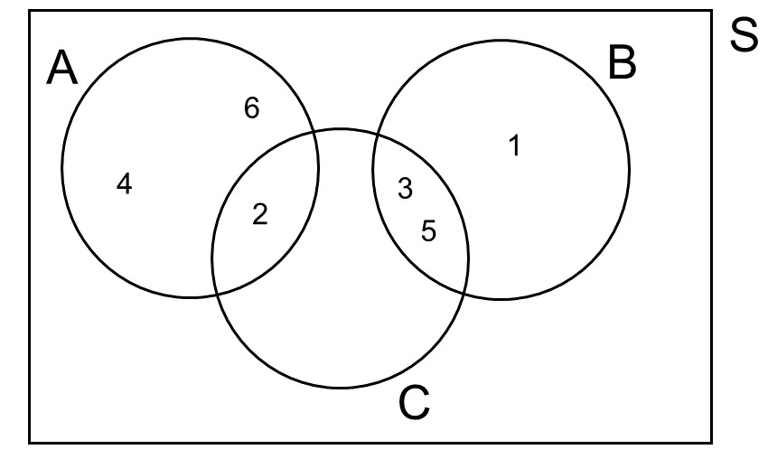
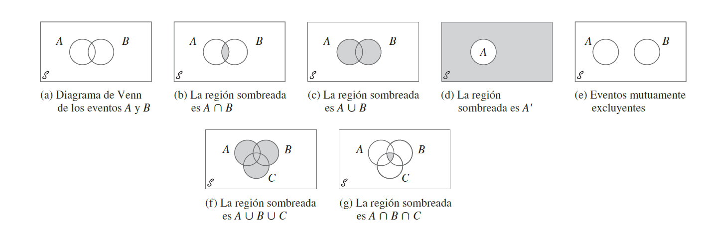



```{r}
#| include: false
library(tidyverse)
library(gapminder)
library(MetBrewer)
theme_set(
  theme_classic(base_size = 16) +
  theme(
    # Título
    plot.title    = element_text(face = "bold", size = 16, 
                                 color = "black", hjust = 0),
    # Subtítulo
    plot.subtitle = element_text(size = 14, color = "#6B7C93", 
                                 hjust = 0, margin = margin(t = 2, b = 8)),
    # Caption
    plot.caption  = element_text(size = 10, color = "#868e96", 
                                 hjust = 1, face = "italic"),
    # Ejes
    # axis.title    = element_text(color = "gray20"),
    # axis.text     = element_text(color = "gray20"),
    # Leyenda
    legend.title  = element_text(face = "bold")
  )
)

options(
  ggplot2.discrete.colour = met.brewer("Hiroshige", 3),
  ggplot2.discrete.fill   = met.brewer("Hiroshige", 3)
)
```

# ¡Bienvenidas y Bienvenidos a la Clase 2!

## 🔁 Repaso Clase 1: Estadísticas Descriptivas en `R` {.smaller}

::: fragment
| Concepto | Definición | Función en `R` | Ejemplo de uso |
|:---------------|:------------------|:---------------|:---------------------|
| **Media** | Promedio aritmético: suma de los valores dividida por $n$ | `mean(x, na.rm = T)` | `mean(gapminder$lifeExp, na.rm = T)` |
| **Mediana** | Valor central de los datos ordenados; más robusta ante *outliers* | `median(x, na.rm = T)` | `median(gapminder$lifeExp, na.rm = T)` |
| **Desv. Estándar** | Distancia *típica* de cada observación respecto a la media | `sd(x, na.rm = T)` | `sd(gapminder$lifeExp, na.rm = T)` |
| **Percentil** | Valor bajo el cual cae el $p$% de los datos | `quantile(x, probs = p)` | `quantile(gapminder$lifeExp, probs = c(.25, .75))` |
| **Puntaje Z** | N° de desviaciones estándar que separan una observación de la media | `(x - mean(x)) / sd(x)` | `(200 - mean(bdims$hgt)) / sd(bdims$hgt)` |
| **Correlación** | Fuerza y dirección de la asociación lineal entre dos variables cuantitativas ($-1$ a $+1$) | `cor(x, y)` `geom_point()` | `cor(gapminder$gdpPercap, gapminder$lifeExp)` |
:::

## 🔁 Repaso Clase 1: Estadísticas Descriptivas en `R` {.medium}

:::: fragment
::: callout-tip
## Para obtenerlas todas de una vez: `summary()`

```{r}
#| echo: true
gapminder |> filter(year == 2007) |> select(lifeExp, gdpPercap) |> summary()
```
:::
::::

# [Introducción a la Probabilidad]{style="color:white"} {background="#E49B0F"}

## Probabilidad {.smaller}

- El término probabilidad se refiere al estudio del azar y la
  incertidumbre en cualquier situación en la que diferentes sucesos
  pueden ocurrir.

- **Definición *frecuentista*:** La probabilidad de un resultado está
  definida por la **proporción de veces** que ese resultado es observado
  a través de un **alto número de repeticiones de procesos aleatorios**:

::: {.fragment .fade-in .smaller}
$$Probabilidad = \frac{\#Eventos\ Favorables}{\#Eventos\ Totales}$$
:::

:::: fragment
::: callout-note
## Estadística [@agresti2018]

En una muestra o experimento aleatorio, la probabilidad de que una
observación tenga un resultado particular es la [**proporción de
veces**]{style="color: darkblue;"} que ese resultado ocurriría en una
secuencia **muy larga** de observaciones similares.
:::
::::

- Dado que definimos probabilidad como una **proporción**, es un número entre 0 y 1 (o 0 y 100 si se expresan en %)
- Otro aspecto relevante a destacar que las probabilidades se interpretan bajo un contexto de **largo plazo**. Por ejemplo, si un meteorólogo dice que la probabilidad de lluvia hoy es del 70%, esto significa que en una **larga serie de días con condiciones atmosféricas como las de hoy**, llueve el 70% de los días.

## Proceso Aleatorio

- En un proceso aleatorio hay más de una posibilidad de resultado y la
  predicción de algún resultado está sujeto a variabilidad:

- Clásicos ejemplos:

  - Tirar una moneda.
  - Tirar un dado.

- Se puede pensar como un proceso donde el resultado es
  **probabilístico** (o estocástico) y no determinístico. Es decir, hay
  **incertidumbre** en el resultado.

## Espacio Muestral

- Es el conjunto de todos los posibles resultados de un proceso
  aleatorio. Se denota con el símbolo $S$
  - Dados: $S=\{1,2,3,4,5,6\}$.
  - Moneda: $S=\{C,S\}$.

## Evento

- Un **evento** un subconjunto del espacio muestral.

- Para el caso del dado, digamos que:

- $A$ representa el evento de que al tirar un dado el resultado sea un
  número par: $A=\{2,4,6\}$.

- $B$ representa el evento de que al tirar un dado el resultado sea un
  número impar: $B=\{1,3,5\}$.

- $C$ representa el evento de que al tirar un dado el resultado sea un
  número primo: $C=\{2,3,5\}$.

## Reglas Básicas de Probabilidad {.smaller .justify}

- $0 \leq P(A) \leq 1$: La probabilidad de cualquier evento se encuentra
  entre cero y uno.
- La probabilidad de un evento nulo es igual 0 ($P(\phi) = 0$).
- $P(S)=1$: El conjunto de todos los eventos posibles es igual a 1.
- **Probabilidad de eventos complementarios:** $P(A)+P(A^c)=1$. Por
  ejemplo, si sabemos que la **probabilidad de que llueva es 0.1**,
  entonces sabemos también que la **probabilidad de que no llueva es
  0.9**.
- **Regla de Independencia y Multiplicación:** Dos procesos son
  independientes si el saber el resultado de uno no afecta el resultado
  de otro. Por ejemplo, tirar dos monedas al aire. Si el evento $A$ y
  $B$ son independientes, entonces: $P(A \cap B)=P(A) \times P(B)$.
- La probabilidad de sacar dos *caras* en dos lanzamientos de una misma
  moneda es: $\frac{1}{2} \times \frac{1}{2}=\frac{1}{4}$.

## Diagrama de Venn {.smaller .justify}

- Un diagrama de Venn usa círculos que se superponen para ilustrar las
  relaciones lógicas entre dos o más **conjuntos** de elementos.
  Consideremos el siguiente diagrama de Venn:

::: {.fragment .fade-in .smaller}
{width="80%"}
:::

## Complemento de un Evento {.smaller .justify}

::::::: columns
:::: {.column width="50%"}
::: {.fragment .fade-in}
- **Definición**: El complemento de un evento son todos los resultados
  en el espacio muestral que no corresponden al evento mismo.

- **Ejemplo**: el complemento del evento $C$ es el conjunto de
  resultados de tirar un dado que **no** corresponden a números primos.

- **Notación**: $\Large C^c$.

- $\Large C^c:\{1,4,6\}$.
:::
::::

:::: {.column width="50%"}
::: {.fragment .fade-in}
{width="100%"}
:::
::::
:::::::

## Complemento de un Evento {.smaller .justify}

- Definamos los tres conjuntos anteriores a partir de *vectores* en R:
  $A$, $B$, $C$.

::: {.fragment .fade-in}
```{r complemento}
#| echo: true
A <- c(2,4,6)
B <- c(1,3,5)
C <- c(2,3,5)
```
:::

- Definamos un vector que contenga los elementos de $A$ y $B$: Para
  ello, utilizamos la función `union()`.

::: {.fragment .fade-in}
```{r complemento2}
#| echo: true
AyB <- union(A, B)
```
:::

- Ver que elementos que están en $A$ o $B$, no están en $C$: Para ello,
  utilizamos la función `setdiff()`.

::: {.fragment .fade-in}
```{r complemento3}
#| echo: true
setdiff(AyB, C)
```
:::

::: {.fragment .fade-in}
- Recordar que para ver qué hace una función (por ejemplo `setdiff()`),
  pueden usar `?setdiff`.
:::

## Eventos Mutuamente Excluyentes {.smaller .justify}

::::::: columns
:::: {.column width="50%"}
::: {.fragment .fade-in}
- **Definición**: Los eventos mutuamente excluyentes son eventos que no
  pueden ocurrir al mismo tiempo.

- **Ejemplo**: El evento $A$ y el evento $B$ son mutuamente excluyentes
  porque el resultado de tirar un dado no puede ser par e impar al mismo
  tiempo.

- Los eventos $A$ y $C$ no son mutuamente excluyentes solamente porque 2
  es tanto par como primo.
:::
::::

:::: {.column width="50%"}
::: {.fragment .fade-in}
{width="100%"}
:::
::::
:::::::

## Eventos Mutuamente Excluyentes {.smaller .justify}

- ¿Existe al menos un elemento de $A$ igual a un elemento en $C$?: Para
  ello, utilizamos la función `intersect()`.

::: {.fragment .fade-in}
```{r mutuamente}
#| echo: true
intersect(A, C)
```
:::

- $A$ y $C$ **no** son mutuamente excluyentes

- ¿Existe al menos un elemento de $B$ igual a un elemento en $C$?

::: {.fragment .fade-in}
```{r mutuamente2}
#| echo: true
intersect(B, C)
```
:::

- $B$ y $C$ **no** son mutuamente excluyentes

- ¿Existe al menos un elemento de $A$ igual a un elemento en $B$?

::: {.fragment .fade-in}
```{r mutuamente3}
#| echo: true
intersect(A, B)
```
:::

- $A$ y $B$ **sí** son mutuamente excluyentes

<!-- ## Notación de conjuntos -->

<!-- ::: {.fragment .fade-in} -->

<!-- |Descripción |Notación    |Lectura  |Elementos| -->

<!-- | -------    |:-------    |:------- |:------- | -->

<!-- |Unión       | $A \cup C$ |A o C    | $\{2,3,4,5,6\}$ | -->

<!-- |Intersección| $A \cap C$ |A y C    | $\{2\}$ | -->

<!-- ::: -->

<!-- ::: {.fragment .fade-in} -->

<!-- {width="50%"} -->

<!-- ::: -->

## Notación de Conjuntos {.r-stack .smaller}

::: {.fragment .fade-in}
| Descripción  | Notación   | Lectura | Elementos       |
|--------------|:-----------|:--------|:----------------|
| Unión        | $A \cup C$ | A o C   | $\{2,3,4,5,6\}$ |
| Intersección | $A \cap C$ | A y C   | $\{2\}$         |
:::

::: {.fragment .fade-in}
```{r conjunto}
#| echo: true
union(A, C)
intersect(A, C)
```
:::

::: {.fragment .fade-in}
{width="40%"}
:::

## Resumen Probabilidad I {.smaller .justify}

::: callout-tip
## Conceptos Importantes [@devore2016]

- Un **proceso aleatorio** (en libros de estadística, llamado también
  *experimento*) es cualquier acción o proceso cuyo resultado está
  sujeto a la incertidumbre.
- El **espacio muestral** de un experimento, denotado por $S$, es el
  conjunto de todos los posibles resultados de dicho experimento.
- Un **evento** es cualquier recopilación (subconjunto) de resultados
  contenidos en el espacio muestral $S$.
- Sea que $\phi$ denote el evento nulo (el evento sin resultados).
  Cuando $A \cap B = \phi$, se dice que A y B son eventos mutuamente
  excluyentes o disjuntos.
- El **complemento** de un evento $A$, denotado por $A'$, es el conjunto
  de todos los resultados en S que no están contenidos en A.
- La **unión** de dos eventos $A$ y $B$, denotados por $A \cup B$ y
  leída como *A o B*, es el evento que consiste en todos los resultados
  que están en A o en B o en ambos eventos, es decir, todos los
  resultados en al menos uno de los eventos:
  $P(A \cup B) = P(A) + P(B) - P(A \cap B)$. También $A \cup B$ se puede
  descomponer en dos eventos excluyentes: $A$ y $B \cap A'$; la última
  es la parte de $B$ que queda afuera de $A$, por lo que
  $P(A \cup B) = P(A) + P(B \cap A')$.
- La **intersección** de dos eventos $A$ y $B$, denotada por $A \cap B$
  y leída como *A y B*, es el evento que consiste en todos los
  resultados que están tanto en A como en B.
:::

## Resumen Probabilidad I 

::: {.fragment .fade-in}
{width="100%" fig-align="center"}
:::

## Aplicando los Conceptos

- Asumamos que repetimos el proceso aleatorio de tirar una moneda y que
  registramos como evento $X$ el número de veces que sale *cara* en $n$
  lanzamientos de moneda. Entonces:

::: {.fragment .fade-in}
$$\Large P(Cara)=\lim_{n\to\infty}\frac{X}{n}$$
:::

::: {.fragment .fade-in}
$$\Large P(Cara)=\frac{1}{2}$$
:::

## Lanzar 1 Vez una Moneda {.smaller .justify}

- Definamos un vector *moneda* con los posibles eventos y simulemos un
  solo lanzamiento de esa moneda.
- Para hacerlo en R, debemos utilizar la función `sample()` considerando
  los siguientes argumentos:
  - `x`: Un vector de uno o más elementos entre los cuales elegir, o un
    número entero positivo.
  - `size`: Un número entero no negativo que indica el número de
    elementos a elegir.
  - `replace`: Un valor lógico que indica si es que el muestreo debe ser
    con reposición (`= T`) o no (`= F`).
- Además, *seteamos una semilla* con la función `set.seed()` para
  proceso definir un proceso pseudo-aleatorio que nos permita replicar
  los mismos resultados. En la medida que se utilice la misma semilla,
  todos los procesos aleatorios que se hagan en adelante serán
  replicables siempre y cuando utilicen la misma semilla (en la
  práctica, cualquier número natural).

::: {.fragment .fade-in}
```{r moneda, echo=TRUE}
set.seed(123)
moneda <- c("cara", "sello")
sample(moneda, size = 1)
```
:::

## Repitamos 5 Veces Este Proceso

::: {.fragment .fade-in}
```{r moneda2, echo=TRUE}
tirar_moneda <- sample(moneda, size = 5, replace = TRUE)
table(tirar_moneda)
```
:::

- Dados estos resultados, vemos que $P(Cara)=\frac{3}{5}=60\%$

## Repitamos 5.000 Veces Este Proceso

::: {.fragment .fade-in}
```{r moneda4, echo=TRUE}
tirar_moneda <- sample(moneda, size = 5000, replace = TRUE)
table(tirar_moneda)
```
:::

- En este caso vemos que $P(Cara)=\frac{2497}{5000}=49,94\%$

## Obtengamos la Frecuencia Relativa Acumulada de 10.000 repeticiones

```{r simularmoneda, echo = FALSE}

tirar_moneda_10000 <- sample(moneda, 10000, replace = TRUE)

frec_cara <- cumsum(tirar_moneda_10000 == 'cara') / 1:10000

as.data.frame(cbind(x = 1:10000, y = frec_cara)) %>%
  ggplot(aes(x = x, y = y)) +
  geom_hline(yintercept = 0.5, linetype = 2) +
  geom_line(col = "red", size = 1) +
  #geom_point() +
  ylim(0, 1) +
  labs(y = "Frecuencia relativa", x = "Número de tiros")

```

## Probabilidades de una distribución normal

## ¿Qué representa el Puntaje Z (*Z-Score*)?

## Significancia estadística V/S significancia práctica

## Las pruebas de significancia son menos útiles que los
intervalos de confianza


# Cierre

## Bibliografía

<!-- ## 🧠 Pregunta {.quiz-question .smaller .nonincremental} -->

<!-- El INE publica que el **ingreso mediano mensual en Chile es $650.000** -->

<!-- basándose en la Encuesta Suplementaria de Ingresos 2024, que encuestó -->

<!-- a 80.000 hogares del total nacional. -->

<!-- ¿Qué tipo de estadística representa este resultado? -->

<!-- ::: {.nonincremental} -->

<!-- - [Estadística descriptiva, porque resume los datos de la muestra encuestada.]{.correct -->

<!--   data-explanation="Correcto. El valor $650.000 describe los datos recolectados en la muestra de 80.000 hogares. Es un resumen del conjunto de datos observado."} -->

<!-- - [Estadística inferencial, porque permite hacer conclusiones sobre todos los chilenos.]{data-explanation="No exactamente. La estadística inferencial ocurre cuando *usamos* ese valor muestral para hacer estimaciones o pruebas sobre la población. Publicar el valor de la muestra es descriptivo."} -->

<!-- - [Ambas, porque describe la muestra y también representa a la población.]{data-explanation="El valor describe la muestra. Usarlo para inferir sobre la población sería estadística inferencial, pero eso requiere un paso adicional de estimación con incertidumbre."} -->

<!-- - [Ninguna, porque los datos de encuesta no son estadísticamente válidos.]{data-explanation="Las encuestas con diseño muestral adecuado son una fuente válida y estándar en estadística. La ESI del INE sigue protocolos rigurosos de muestreo."} -->

<!-- ::: -->

<!-- ## 🧠 Pregunta N° 1 {.smaller} -->

<!-- La **Encuesta CEP N°95 (septiembre-octubre 2025)** preguntó a 1.217 personas en 100 comunas de Chile cuáles son los 3 problemas a los que debería dedicar el mayor esfuerzo el gobierno. A partir de esta información responda la siguiente pregunta: -->

<!-- ```{r} -->

<!-- #| echo: false -->

<!-- library(rquiz) -->

<!-- dark <- rquizTheme( -->

<!--   fontFamily = "serif", -->

<!--   fontSize = 18, -->

<!--   titleCol = "#E0E0E0", titleBg = "#1A1A2E", -->

<!--   questionCol = "#FFFFFF", questionBg = "#16213E", -->

<!--   mainCol = "#E0E0E0", mainBg = "#1A1B2E", -->

<!--   optionBg = "#252540", -->

<!--   navButtonCol = "#FFFFFF", navButtonBg = "#E94560", -->

<!--   tipButtonCol = "#E0E0E0", tipButtonBg = "#2C2C3E", -->

<!--   solutionButtonCol = "#E0E0E0", solutionButtonBg = "#2C2C3E" -->

<!-- ) -->

<!-- question1 <- list( -->

<!--   question = "La <strong>Encuesta CEP N°95 (septiembre-octubre 2025)</strong> muestra que el 61% mencionó la delincuencia, asaltos y robos en primer lugar. ¿Qué tipo de estadística representa este 61%?", -->

<!--   options = c( -->

<!--     "Estadística descriptiva para una muestra.", -->

<!--     "Estadística inferencial sobre la población chilena.", -->

<!--     "Un parámetro poblacional.", -->

<!--     "Estadística descriptiva para la población chilena." -->

<!--   ), -->

<!--   answer = 1, -->

<!--   tip = "Piensa en quién respondió la encuesta: ¿toda la población o una parte de ella?" -->

<!-- ) -->

<!-- singleQuestion( -->

<!--   x = question1, -->

<!--   language = "es", -->

<!--   # theme = dark, -->

<!--   title = "Pregunta", -->

<!--   scroll = TRUE, -->

<!--   height = "420px" -->

<!-- ) -->

<!-- ``` -->
