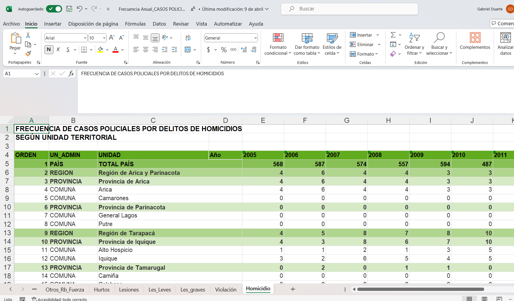
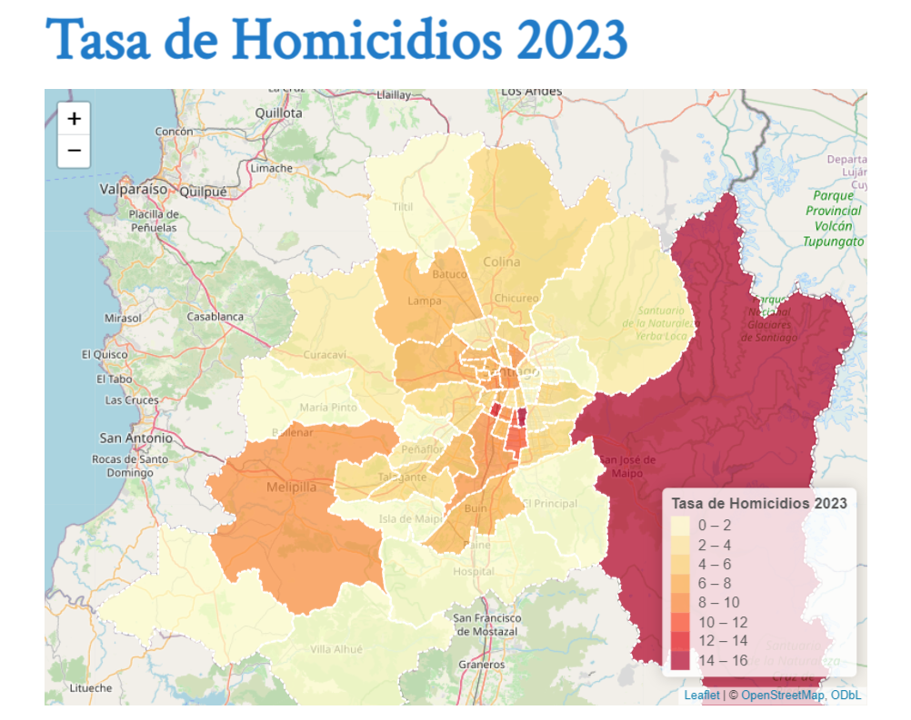
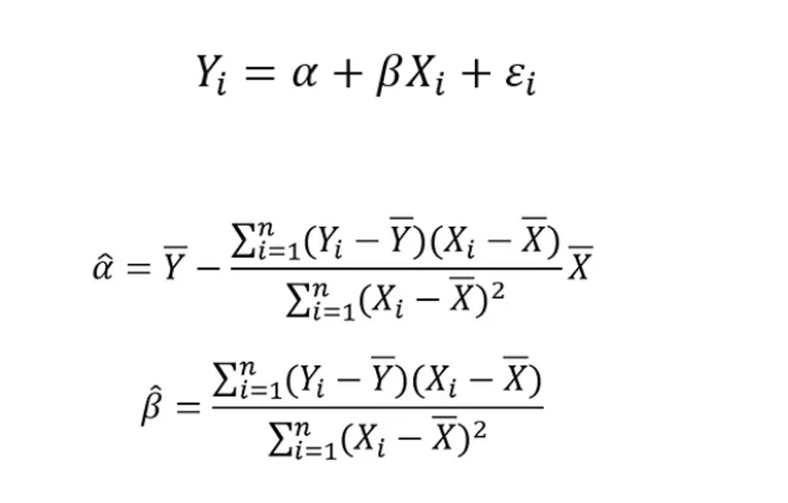
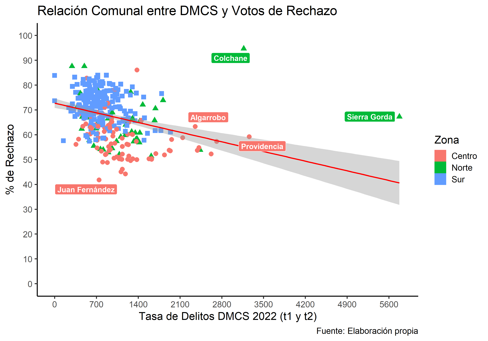
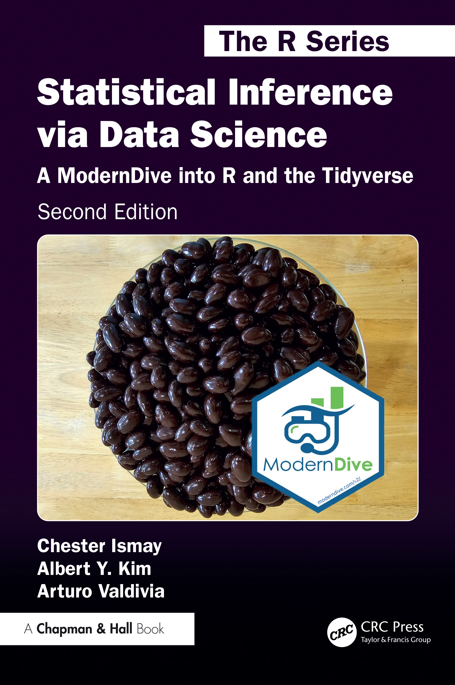
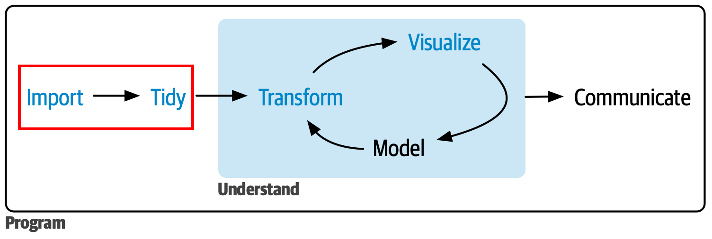
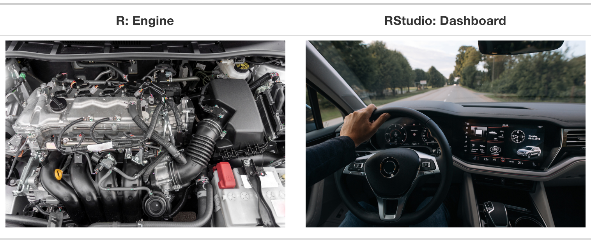
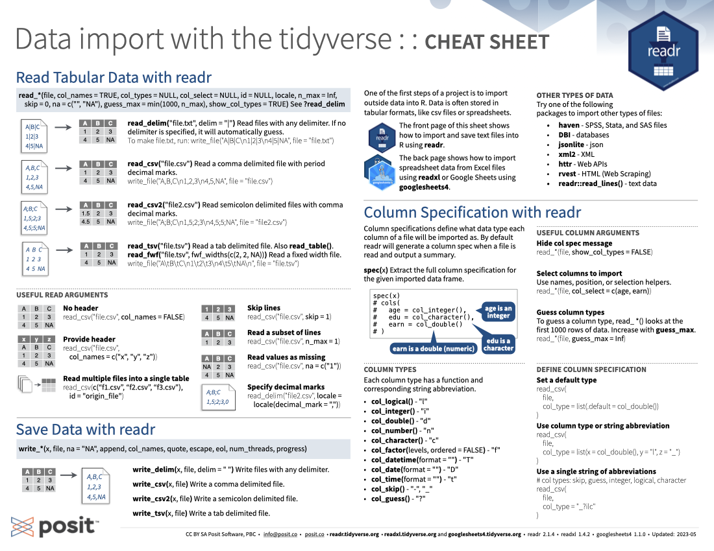
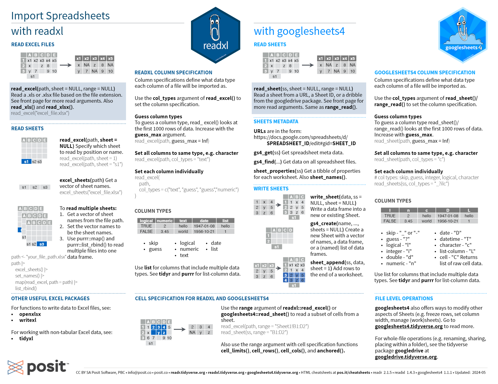



```{r}
#| include: false
library(pacman)
p_load(tidyverse)
p_load(readxl)
p_load(haven)
p_load(janitor)
p_load(sf)
library(gapminder)
library(MetBrewer)
library(openintro)
library(knitr)

theme_set(
  theme_classic(base_size = 16) +
  theme(
    plot.title    = element_text(face = "bold", size = 16, 
                                 color = "black", hjust = 0),
    plot.subtitle = element_text(size = 14, color = "#6B7C93", 
                                 hjust = 0, margin = margin(t = 2, b = 8)),
    plot.caption  = element_text(size = 10, color = "#868e96", 
                                 hjust = 1, face = "italic"),
    legend.title  = element_text(face = "bold")
  )
)

options(
  ggplot2.discrete.colour = met.brewer("Hiroshige", 3),
  ggplot2.discrete.fill   = met.brewer("Hiroshige", 3)
)
```

# ¡Bienvenid\@s!

## ¿Hacia donde queremos llegar? {.incremental}

::::::: columns
:::: {.column width="50%"}
::: {.fragment .fade-in}
{width="100%"}
:::
::::

:::: {.incremental .column width="50%"}
::: {.fragment .fade-in}

:::
::::
:::::::

## ¿Hacia donde queremos llegar? {.incremental}

::::::: columns
:::: {.column width="50%"}
::: {.fragment .fade-in}

:::
::::

:::: {.incremental .column width="50%"}
::: {.fragment .fade-in}

:::
::::
:::::::

## Objetivo Clase 1 {.smaller .justify}

Esta primera clase tiene como objetivo general introducirlos al curso de
**Análisis de Datos y Estadística Computacional** y aprender a
**importar y cruzar** bases de datos en `R`. Las bases que trabajeremos hoy, serán utilizadas posteriormente en las siguientes clases. 

Como objetivos específicos se busca:

- Presentar el programa del curso y algunas de las reglas básicas.
- Trabajar de manera ordenada y reproducible mediante **proyectos**
  (`.Rproj`).
- Aprender a importar bases de datos de distintos formatos: `.csv`,
  `.xlsx`, `.dta`, `.shp`.
- Realizar una limpieza inicial de nombres de columnas (variables) con el paquete `janitor`.
- Cruzar información de dos datasets con `left_join()`.

## Información General {.medium}

- 8 clases en total con una duración de 3:20 hrs cada una.
- Se subirá el **link** de la presentación el mismo día previo al inicio
  de la clase para que los alumnos puedan seguirla en línea.
- El curso consta de **2 unidades** de **4 clases** cada una:
  - **Unidad I**: Herramientas de Ciencia de Datos con R
  - **Unidad II**: Estadística Aplicada con R.
- Este curso requiere un **75% de asistencia** para ser aprobado. Toda
  justificación debe ser enviada por correo siempre con copia al
  **ayudante**. Si tienen problemas con el horario de conexión, también
  pueden escribirle al ayudante por el chat privado de zoom y/o por
  correo.
- El canal principal de comunicación fuera de clases es
  [Webcursos](https://webcursos.uai.cl/login/index.php)

## Metodología {.medium}

- La clase se divide en diferentes secciones:

  i.  👨‍🏫 **Exposición:** Láminas de contenido que resumen el
      conocimiento principal esperado como resultado de aprendizaje,
      junto con código de ejemplo.
  ii. 🧠 **Preguntas:** A lo largo de la clase se realizarán preguntas
      que pueden ir contestando en línea para evaluar el aprendizaje de
      cada sección.
  iii. 💻 **Ejercicio guiado:** Ejercicio práctico resuelto de manera
       simultánea por el profesor junto con los alumnos.
  iv. 👥 **Ejercicio grupal:** Ejercicios en grupos de 4-6 personas para
      resolver en conjunto los problemas propuestos. El profesor y
      ayudante pasarán por las salas recurrentemente.
  v.  🔒 **Cierre:** Resumen de los aspectos más relevantes y espacio
      final de preguntas.

- 📤 La grabación se subirá a **Webcursos** al finalizar cada clase.

## Reglas Generales {.justify}

- Durante clases se debe mantener la **cámara prendida**. Quienes no
  puedan por algún motivo deben avisar por medio de correo electrónico o
  chat privado de zoom a la ayudante.
- ¡Siéntanse libres de hacer consultas! Sin embargo, el mayor
  aprendizaje se adquiere a través de la **práctica**: ensayo y error.
- Toda comunicación y consultas fuera de clase deben realizarse a través
  del foro de ***webcursos***: ¡no solo se beneficiarán ustedes, sino
  que también sus compañer\@s!
- Las evaluaciones (tareas) son **individuales**.

## Evaluación {.smaller .justify}

- [Evaluaciones:]{.underline} **2 tareas**, cada una pondera **50%** de
  la nota:
  - **Tarea 1** (manejo, transformación y comunicación de datos con R):
    **28/06/2026**
  - **Tarea 2** (modelamiento estadístico y reporte reproducible en
    Quarto): **19/07/2026**
- [Entregas:]{.underline} En formato html, con el código completo y la
  justificación o análisis escrito cuando corresponda. Toda entrega debe
  realizarse a través de **webcursos** en el buzón creado para ello.
- [Cálculo de la nota:]{.underline} Sobre la base del puntaje obtenido
  en cada tarea:
  $$Nota = \left(\frac{\text{Puntaje obtenido}}{\text{Puntaje total}}\right)\times 6 + 1$$
- [Aprobación del Curso:]{.underline} Promedio simple de ambas tareas
  igual o superior a 4,0 (escala de 1 a 7).

<!-- Nota: la "tarea recuperativa" del deck anterior no aparece en el programa 2026. Reincorporar aquí solo si decides mantenerla. -->

## Bibliografía Principal {.smaller}

::::::: columns
:::: {.column width="50%"}
::: {.fragment .fade-in .smaller}
[**UNIDAD I: HERRAMIENTAS DE CIENCIA DE DATOS CON
R**]{style="color:green"}

[{width="70%"}](https://es.r4ds.hadley.nz/)

[@wickham2023]
:::
::::

:::: {.incremental .column width="50%"}
::: {.fragment .fade-in .smaller}
[**UNIDAD II: ESTADÍSTICA APLICADA CON R**]{style="color:steelblue"}

[{width="70%"}](https://moderndive.com/v2/index.html)

[@ismay2025]
:::
::::
:::::::

## Y muchos libros más... {.smaller}

- [Introduction to Modern Statistics (2e) (Çetinkaya-Rundel &
  Hardin)](https://openintro-ims.netlify.app/) — Estadística aplicada
  con R con un enfoque moderno.
- [R Cookbook (Long & Teetor)](https://rc2e.com/) — consulta rápida de
  tareas cotidianas en R
- [Fundamentals of Data Visualization
  (Wilke)](https://clauswilke.com/dataviz/)
- [ggplot2: Elegant Graphics for Data Analysis
  (Wickham)](https://ggplot2-book.org/)
- [Using R for Introductory Econometrics
  (Heiss)](https://www.urfie.net/)
- [Introduction to Econometrics with R (Hanck et
  al.)](https://www.econometrics-with-r.org/)
- [The Effect (Huntington-Klein)](https://theeffectbook.net/) —
  inferencia causal aplicada
- [Causal Inference: The Mixtape
  (Cunningham)](https://mixtape.scunning.com/)

## ¿En qué consiste la primera parte del curso?

{width="100%" fig-align="center"}

## ¿Qué veremos hoy?

{width="100%" fig-align="center"}

## Ventajas de programar {.justify .smaller}

**Supongamos que queremos realizar un documento corto de análisis que
sirva de insumo para un tomador de decisiones de política pública**

::::::: columns
:::: {.column width="50%"}
::: {.fragment .fade-in .smaller}
[**SIN PROGRAMACIÓN**]{style="color:red"}

1.  Ingresar a la web y descargar datos o solicitarlos
2.  Limpiar, ordenar, y analizar datos en *MS Excel*
3.  Escribir documento en *MS Word*
4.  Guardar en "algún lado" (ojalá no en "Mis Documentos" o "Descargas")
:::
::::

:::: {.incremental .column width="50%"}
::: {.fragment .fade-in .smaller}
[**CON PROGRAMACIÓN**]{style="color:green"}

1.  Crear una carpeta para el proyecto/tarea
    - `datos`
    - `scripts`
    - `resultados`
2.  Descargar datos desde `R` o bien llamarlos desde nuestra carpeta
    *datos*
3.  Limpiar, ordenar, y analizar datos en `R` a través de un `script`
4.  Escribir documento en `R Markdown` o `Quarto`
:::
::::
:::::::

## Reproducibilidad {.justify .smaller}

**Seis meses después se debe repetir la tarea**

::::::: columns
:::: {.column width="50%"}
::: {.fragment .fade-in .smaller}
[**SIN PROGRAMACIÓN**]{style="color:red"}

1.  Recordar que se hizo
2.  Ingresar a la web y descargar datos
3.  Limpiar, ordenar, y analizar datos en *MS Excel*
4.  Escribir documento en *MS Word*
5.  Guardar en "algún lado" (ojalá no en "Mis Documentos" o "Descargas")
:::
::::

:::: {.incremental .column width="50%"}
::: {.fragment .fade-in .smaller}
[**CON PROGRAMACIÓN**]{style="color:green"}

1.  Ejecutar el código
:::
::::
:::::::

## ¿Cuál es la principal dificultad?

{width="80%"
fig-align="center"}

## Pero hay herramientas que lo facilitan ...

::: r-stack
{.fragment width="100%\""}

{.fragment width="100%\""}

{.fragment width="100%\""}

{.fragment width="100%\""}

{.fragment width="80%\""}
:::

## Cheatsheets

<iframe 
  src="https://rstudio.github.io/cheatsheets/data-import.pdf"
  width="100%" 
  height="600px">
</iframe>

## Y una de las más usadas: `help()`

Antes de utilizar cualquier función, es útil consultar sus detalles
(argumentos, valores, ejemplos, etc.) a través del comando `help(x)` o
`?x`

. . .

```{r}
#| eval: false
help("ggplot2")

#Lo mismo de manera abreviada
?ggplot2
```

# [Rstudio, Proyectos y Orden en R]{style="color:white"} {background-color="#7A1904"}

## ¿Qué es R y Rstudio?

{width="80%"
fig-align="center"}

**R** es un lenguaje de programación que ejecuta código, mientras que
**RStudio** es un entorno de desarrollo integrado (IDE) que proporciona una
**interfaz** que facilita la ejecución y trabajo con R

## Instalar R y Rstudio (Realizar en orden) {.justify}

::: fragment
1.  [Descargar R](https://cran.rstudio.com/)
2.  [Descargar Rstudio](https://posit.co/download/rstudio-desktop/)
3.  Abrir Rstudio
:::

:::: fragment
::: callout-warning
## Advertencia

Es importante que la ruta en donde se aloje R y Rstudio **no tenga
caracteres especiales**
:::
::::

:::: fragment
::: callout-important
## Importante

Una vez instalado R y Rstudio, solo deben abrir **Rstudio** para
trabajar con R
:::
::::

## ¿Por qué trabajar con proyectos (`.Rproj`)? {.smaller .justify}

::: fragment
Un **proyecto de RStudio** es una carpeta que contiene todo lo necesario
para un análisis (datos, scripts, resultados) y un archivo `.Rproj` que
la identifica como proyecto.
:::

::: fragment
Sus principales ventajas:

- **Rutas relativas**: El proyecto fija automáticamente el *directorio
  de trabajo* en su carpeta raíz, por lo que **no** necesitamos usar
  `setwd()` ni rutas absolutas del tipo
  `"C:/Users/.../mis documentos/..."`.
- **Portabilidad**: El proyecto funciona igual en cualquier computador,
  sin tener que reescribir rutas.
- **Reproducibilidad y orden**: Cada análisis vive en su propia carpeta,
  autocontenido.
:::

## Crear un proyecto en RStudio {.smaller}

::: fragment
**File → New Project → New Directory → New Project**, y elegimos el
nombre y la ubicación de la carpeta.
:::

1.  Abrir rstudio
2.  Hacer clic en file → New Project o en la esquina superior derecha
3.  Hacer clic en *"New Directory"* si no han creado una carpeta de
    trabajo de sus clases o *"Existing Directory"* si ya tienen definido
    donde trabajar
4.  Hacer clic en *"New Project"* si escogieron la opcion de *"New
    Directory"*
5.  Finalmente escoger el nombre del proyecto: *"clase_01"* y una
    ubicación (recomendada *escritorio/DIAPP26*)

:::: fragment
::: callout-warning
## Advertencia

Eviten que la ruta donde se aloja el proyecto tenga **caracteres
especiales** (tildes, ñ, espacios, etc.), ya que pueden generar errores
difíciles de diagnosticar.
:::
::::

:::: fragment
::: callout-tip
Una vez creado el proyecto, ábranlo siempre haciendo doble clic en el
archivo `.Rproj` así se abre RStudio con el directorio de trabajo ya
configurado.
:::
::::

## Estructura recomendada de subcarpetas {.smaller .justify}

Dentro del proyecto conviene **separar insumos, código y resultados**.
Una estructura simple y suficiente para este curso:

::: fragment
```         
mi_proyecto/
├── mi_proyecto.Rproj      # archivo del proyecto
├── data/                  # datos de entrada (NO se modifican a mano)
│   ├── raw/               # datos originales tal como se descargaron
│   └── clean/             # datos ya procesados y guardados desde R
├── scripts/               # códigos .R o .qmd en orden de ejecución
├── output/                # resultados generados
│   ├── figuras/
│   └── tablas/
└── README.txt             # breve descripción del proyecto
```
:::

:::: fragment
::: callout-tip
Regla de oro: los datos en `data/raw/` se tratan como **solo lectura**.
Toda transformación se hace en R y se guarda en `data/clean/`, de modo
que siempre podamos reconstruir el resultado ejecutando el código.
:::
::::

## La importancia del orden {.smaller .justify .incremental}

- Una de las ventajas de programar es la **reproducibilidad**: cualquier
  persona (¡o nosotros mismos en seis meses después!) debería poder obtener los
  mismos resultados ejecutando los mismos pasos.

- Por eso importa mantener el orden tanto en la **carpeta** del proyecto
  como en la **sintaxis del script**. Piensen en escribir su código como
  si escribieran una receta.

- Ordenen su script en **secciones** (atajo: `CTRL + SHIFT + R`) e
  intenten comentar el *por qué* de cada paso más que el *cómo*: el qué
  y el cómo siempre se pueden deducir del código, pero el *por qué* es
  lo más difícil de recuperar después.

## Identación y estilo de código {.smaller}

Un código **bien indentado y espaciado** es más fácil de leer, depurar y
compartir:

::::::: columns
:::: {.column width="50%"}
::: {.fragment .fade-in .smaller}
[**Recomendado**]{style="color:green"} {width="7%"}

```{r estilo_ok, echo=TRUE, eval=FALSE}
# 0. Librerías ----------------------
library(tidyverse)
library(janitor)

# 1. Cargo datos --------------------
datos <- read_csv("data/raw/comunas.csv")

# 2. Limpio y transformo ------------
datos <- datos |>
  clean_names() |>
  filter(poblacion > 50000)
```
:::
::::

:::: {.incremental .column width="50%"}
::: {.fragment .fade-in .smaller}
[**NO Recomendado**]{style="color:red"} {width="7%"}

```{r estilo_mal, echo=TRUE, eval=FALSE}
library(tidyverse)
datos<-read_csv("data/raw/comunas.csv")
library(janitor)
datos<-datos|>clean_names()|>filter(
poblacion>50000)
```
:::
::::
:::::::

## Identación y estilo de código {.smaller .justify}

Algunas recomendaciones básicas de estilo:

- Dejen **espacios** alrededor de los operadores (`<-`, `+`, `==`, etc.)
  y después de las comas.
- En un *pipeline* (`|>`), pongan **cada paso en su propia línea**,
  indentada.
- Usen **nombres descriptivos** y en minúsculas para los objetos.

:::: fragment
::: callout-tip
RStudio puede ayudarles: seleccionando el código y presionando
`CTRL + SHIFT + A` lo re-indenta automáticamente. El paquete `styler`
permite estandarizar todo un script con un clic
(`install.packages("styler")` y luego clic en `Addins`).
:::
::::

## Uso de paquetes `(packages)` {.smaller .incremental .justify}

{width="60%" fig-align="center"}

- Al igual que cuando utilizamos una aplicación en nuestro celular,
  primero debemos instalarla y luego abrirla o utilizarla.
- El comando básico para instalar paquetes es la función
  `install.packages()`. Es importante notar que el nombre del paquete
  que se instale a través de esta función **debe ir entre comillas**:
  e.g. `install.packages('tidyverse')`
- Una vez instalado el paquete, lo cargamos o llamamos a través de la
  función `library()`. En este caso, el nombre del paquete **no debe ir
  entre comillas**: e.g. `library(tidyverse)`

## Paquetes y `pacman` {.smaller}

- Para **instalar** un paquete: `install.packages('tidyverse')` (el
  nombre **entre comillas**).
- Para **cargarlo**: `library(tidyverse)` (el nombre **sin comillas**).

::: fragment
A lo largo del curso usaremos indistintamente la función `p_load()` del
paquete `pacman`, que combina ambos pasos: *"si el paquete está
instalado, cárgalo; si no, descárgalo y luego cárgalo"*. Esto asegura
que todos trabajemos con las mismas librerías:

```{r pacman_demo, echo=TRUE, eval=FALSE}
library(pacman)
p_load(tidyverse, readxl, openxlsx, haven, janitor, sf)
```
:::

## Primeras complicaciones {.smaller}

R informa errores (*errors*), advertencias (*warnings*) y mensajes
(*messages*) en un color que resalta, lo que hace que parezca que algo
va mal en nuestro código. Sin embargo, ver texto de colores en la
consola no siempre representa un problema:

- [**Errors**]{style="color:darkred"}: Si el texto comienza con *Error*,
  investiguen qué lo está causando. Piensen en los errores como en un
  semáforo en rojo: ¡algo anda mal!
- [**Warnings**]{style="color:gold"}: Si el texto comienza con
  *Warning*, indaguen si es algo de qué preocuparse. Por ejemplo, si
  reciben una advertencia sobre valores faltantes en un diagrama de
  dispersión y saben que faltan valores, está bien. Piensen en las
  advertencias como en un semáforo en amarillo: todo funciona bien, pero
  presten atención a lo que están ejecutando.
- [**Messages**]{style="color:forestgreen"}: Piensen en los mensajes
  como un semáforo en verde: ¡todo funciona bien, por lo que sigan
  adelante!

## Algunos tips para mejorar en programación {.smaller .justify}

- **Las computadoras no son autónomas (o *tan* inteligentes)**:
  Requieren de instrucciones entregadas por humanos, por lo que es muy
  relevante entender los inputs que uno le entrega al software para que
  ejecute una acción que queremos realizar.
- **Ocupar el *copy, paste, and tweak* approach**: Muchas veces es más
  fácil tomar un código existente que sabemos que funciona y lo
  modificamos acorde a nuestros objetivos y fuentes de datos.
- **La mejor forma de de aprender a programar es haciendo y ejecutando
  códigos**: Piensen en las tareas que realizan cotidianamente y que
  involucren un trabajo con datos. Traten de aplicar lo aprendido a lo
  largo del curso a problemas/desafíos concretos que enfrenten.
- **Practicar, equivocarse, aprender y seguir practicando**: ¡La
  práctica y la dedicación les permitirá avanzar en las primeras etapas
  de aprendizaje!

## Funciones básicas a tener en consideración {.smaller .justify}

- `view()`: Es equivalente a hacer click en el objeto mostrado en el
  *Global Environment*.
- `head()`: Permite mostrar las primeras observaciones del objeto
  indicado.
- `help()`: Entrega toda la documentación de la función. En particular,
  es muy útil para saber los **argumentos** de la función y cuáles
  valores puede tomar.
- `print()`: Imprime el objeto indicado. En dataframes extensos, se
  recomienda utilizar `head()` en lugar de `print()`.
- `str()`: Detalla la estructura y clase de cada componente del objeto
  indicado.
- `glimpse()`: Función del paquete `dplyr` que realiza algo similar a
  `str()` pero de manera más ordenada y mostrando una mayor cantidad de
  información.
- `summary()`: Resume las estadísticas descriptivas generales del objeto
  indicado, incluyendo la cantidad de `NA` en caso de que existan.

## El operador pipe `|>` {.smaller}

- En R, el **pipe** `|>` permite **encadenar funciones** pasando el
  resultado de una expresión como primer argumento de la siguiente.
- Hace el código más legible: se lee de izquierda a derecha, como una
  receta de pasos.

. . .

Sin pipe, las funciones se anidan de adentro hacia afuera:

```{r}
#| echo: true
#| eval: false
# Sin pipe: hay que leer de adentro hacia afuera
round(sqrt(log(100)), 2)
```

. . .

Con pipe, cada paso queda en su propia línea, en orden de ejecución:

```{r}
#| echo: true
#| eval: false
# Con pipe: se lee de arriba hacia abajo
100 |>
  log()   |>
  sqrt()  |>
  round(2)
```

. . .

::: callout-tip
## Atajo de teclado

`Ctrl + Shift + M` inserta el pipe `|>` automáticamente en RStudio.
Si les aparece `%>%` en vez de `|>`, vaya a **Tools → Global Options →
Code** y activen la opción *"Use native pipe operator"*.
:::

# [Importar y Exportar Datos]{style="color:white"} {background-color="#E49B0F"}

## Preliminares {.smaller}

- Para importar datos usaremos una familia de funciones con el prefijo
  `read`.
- Los formatos más comunes con los que trabajaremos:
  - Valores separados por comas: `.csv`
  - Archivos Excel: `.xlsx` o `.xls`
  - Datos de `STATA`: `.dta`
  - Datos espaciales (ESRI Shapefile): `.shp`

:::: fragment
::: callout-tip
Cada formato tiene su función y, muchas veces, su propio paquete:
`readr` para texto plano, `readxl` para Excel, `haven` para STATA/SPSS y
`sf` para datos espaciales.
:::
::::

## `readr`: Importar archivos CSV {.smaller}

- csv separados por **coma (,)**: `read_csv()`
- csv separados por **punto y coma (;)**: `read_csv2()`
- Separados por un delimitador específico: `read_delim(file, delim)`

::: fragment
{width="60%"}
:::

## Archivos separados por coma: `.csv` {.smaller}

```{r csv1, echo=TRUE}
students <- read_csv("https://pos.it/r4ds-students-csv")
head(students) |> 
  kable()
```

. . .

::: callout-tip
La función `head()` devuelve las primeras 6 observaciones. ¡Úsenla
siempre para inspeccionar visualmente sus objetos!
:::

## Un argumento útil: `na` {.smaller}

La comida favorita de la fila 3 dice `"N/A"`, pero R no la reconoce como
dato faltante. Podemos indicarle qué tratar como `NA`:

. . .

```{r csv2, echo=TRUE}
students <- read_csv("https://pos.it/r4ds-students-csv",
                     na = c("N/A", ""))
head(students) |> 
  kable()
```

## Archivos separados por punto y coma: `.csv` con `read_csv2()` {.smaller}

- Muchos archivos generados en contextos hispanohablantes usan `;` como
  separador (porque la coma se usa como separador decimal). En ese caso
  usamos `read_csv2()`:

. . .

```{r csv3, echo=TRUE}
read_csv2(I("comuna;poblacion\nSantiago;503.147\nCerrillos;88.056"))
```

## `readxl`: importar archivos Excel {.smaller}

- Para importar archivos Excel usamos `read_excel()`. Sus argumentos
  principales:
  - `path`: ruta del archivo. **Debe terminar con la extensión (`.xlsx`
    o `.xls`)**.
  - `sheet`: número (1, 2, ...) o nombre de la hoja entre comillas.
  - `range`: rango de celdas a leer, en formato Excel y entre
    comillas, p. ej. `"B1:D5"`.
  - `skip`: cantidad de filas a ignorar antes de leer.

::: fragment
{width="50%"}
:::

## Aplicación: leer un Excel con `sheet` y `range` {.smaller}

```{r xlsx1, echo=TRUE}
ruta <- readxl_example("datasets.xlsx")
excel_sheets(ruta)   # ¿qué hojas tiene el archivo?
```

. . .

```{r xlsx2, echo=TRUE}
mtcars_xl <- read_excel(ruta, sheet = "mtcars", range = "A1:D5")
mtcars_xl
```

## `haven`: archivos de STATA `.dta` {.smaller}

- Para leer archivos `.dta` (STATA) usamos `read_dta()` del paquete
  `haven`:

. . .

```{r dta1, echo=TRUE}
ruta_dta <- system.file("examples", "iris.dta", package = "haven")
iris_stata <- read_dta(ruta_dta)
head(iris_stata)
```

. . .

::: callout-tip
`haven` también lee SPSS (`read_sav()`) y SAS (`read_sas()`) con la
misma lógica.
:::

## Archivos Georreferenciados {.smaller}

- Para trabajar archivos georreferenciados utilizaremos una de las librerías más reconocidas en el entorno de R para manejar datos espaciales: `sf` o *simple features*.

- No profundizaremos en el manejo de datos espaciales (lo cual se verá en detalle en el módulo de Geoanálisis), pero intentaremos realizar mapas básicos para mostrar información territorial de manera sencilla y sin necesidad de un sistema de información geográfica (softwares como Arcgis o Qgis).

- La función básica para leer archivos georreferenciados es `st_read()` del paquete `sf`.

- Existen diferentes formatos de archivo para los datos georreferenciados, pero el más común es probablemente el ***ESRI shapefile***. A pesar de que se llama de manera singular, en realidad se compone de al menos cuatro archivos diferentes que trabajan juntos para almacenar los datos: `.dbf` `.shx` `.prj` `.shp`.

- Lo importante es que estos archivos estén siempre juntos en la **misma carpeta**. Cumpliendo eso, solo debemos preocuparnos de **cargar el archivo de extensión `.shp`**

## Archivos georreferenciados {.medium}

En resumen: 

- Para datos espaciales usaremos el paquete `sf` (*simple features*) y
  la función `st_read()`.
- Un *shapefile* en realidad se compone de varios archivos (`.shp`,
  `.dbf`, `.shx`, `.prj`) que **deben estar juntos en la misma
  carpeta**. Solo cargamos el `.shp`.

. . .

```{r shp1, echo=TRUE, results='hide', message=FALSE}
nc <- st_read(system.file("shape/nc.shp", package = "sf"))
```

## Archivos georreferenciados: Visualización {.medium}

Para mostrar un mapa podemos usar `ggplot2` usando la función `ggplot()` y `geom_sf()`:

```{r shp2, echo=TRUE, fig.height=3}
ggplot(nc) +
  geom_sf()
```

::: callout-note
En la **Clase 3** profundizaremos en la visualización de datos incluida la visualización de mapas.
:::

## Formato moderno: Apache Parquet {.smaller}

- Los formatos que hemos visto (`.csv`, `.xlsx`, `.dta`) tienen una
  limitación importante: a medida que los datos crecen, se vuelven
  **lentos de leer y pesados en disco**.
- El formato **Parquet** (paquete `arrow`) resuelve esto mediante
  almacenamiento en columnas y compresión automática.

. . .

::::::: columns
:::: {.column width="50%"}
::: {.fragment}
[**Ventajas**]{style="color:green"}

- **Tamaño**: un `.csv` de 1 GB puede ocupar ~150 MB en Parquet.
- **Velocidad**: lee solo las columnas que necesitas, no el archivo
  completo.
- **Tipos de datos**: preserva fechas, factores y enteros sin
  conversiones al importar.
- **Interoperable**: Python (`pandas`), SQL, Spark y R lo leen
  nativamente.
:::
::::

:::: {.column width="50%"}
::: {.fragment}
[**Cuándo usarlo**]{style="color:steelblue"}

- Archivos grandes (> 100 MB).
- Datos que se leen muchas veces y rara vez se editan a mano.
- Flujos de trabajo que mezclan R y Python.
- Cuando compartir un `.csv` tarda demasiado.
:::
::::
:::::::

## Leer y escribir Parquet con `arrow` {.smaller}

```{r}
#| echo: true
#| eval: false
library(arrow)

# Leer un archivo Parquet
datos <- read_parquet("data/raw/criminalidad.parquet")

# Escribir un data frame existente como Parquet
write_parquet(datos, "data/clean/criminalidad.parquet")
```

. . .

La sintaxis es idéntica a `read_csv()` / `write_csv()`: un argumento de
ruta de entrada para cargar datos y un objeto y ruta de salida para guardar archivos en carpetas.

. . .

::::::: columns
:::: {.column width="50%"}
::: {.fragment}
```{r}
#| echo: true
#| eval: false
# Desde CSV a Parquet en dos líneas
datos <- read_csv("data/raw/base_grande.csv")
write_parquet(datos, "data/raw/base_grande.parquet")
```
[→ Conversión de `.csv` a Parquet]{style="color:gray; font-size:0.85em"}
:::
::::

:::: {.column width="50%"}
::: {.fragment}
```{r}
#| echo: true
#| eval: false
# Lectura selectiva de columnas (muy eficiente)
read_parquet(
  "data/raw/base_grande.parquet",
  col_select = c("comuna", "anio", "tasa")
)
```
[→ Lee solo 3 columnas sin cargar el resto]{style="color:gray; font-size:0.85em"}
:::
::::
:::::::

. . .

<!-- ::: callout-tip -->
<!-- Para este curso no es obligatorio, pero es una buena práctica guardar -->
<!-- sus bases procesadas en Parquet una vez limpias: la próxima vez que las -->
<!-- carguen será notablemente más rápido. -->
<!-- ::: -->

## Limpieza inicial de nombres: `janitor::clean_names()` {.smaller}

- Muchas bases reales traen nombres de columna "sucios": con mayúsculas,
  espacios, tildes o caracteres especiales que dificultan trabajar con
  ellos.
- La función `clean_names()` del paquete `janitor` los estandariza a un
  formato limpio y consistente (minúsculas, sin tildes, con guion bajo).

. . .

```{r janitor1, echo=TRUE}
library(janitor)
df <- tibble(`Nombre Comuna`  = c("Santiago", "Cerrillos"),
             `Población 2017` = c(503147, 88056))
df
```

## 💻 Limpieza inicial de nombres: `janitor::clean_names()`

```{webr}
df <- tibble(`Nombre Comuna`  = c("Santiago", "Cerrillos"),
             `Población 2017` = c(503147, 88056))
df |> ______ #aplico limpieza de nombres
```

. . .

::: callout-tip
Aplicar `clean_names()` justo después de importar es recomendado para el proceso de transformación y limpieza de datos al unificar el formato de sintaxis.
:::

## 🧠 Pregunta N° 1 {.quiz-question .smaller}

Tenemos un archivo Excel generado por un servicio público chileno. Al abrirlo en Excel, vemos que las primeras 3 filas son encabezados combinados con el nombre del reporte y la fuente, y los datos reales comienzan en la fila 4.

::: nonincremental
***¿Cuál es la forma correcta de importarlo a R?***

- [`read_excel("archivo.xlsx")`]{data-explanation="Sin argumentos adicionales, R intentará leer desde la primera fila y tomará los encabezados combinados como nombres de columna, dejando el data frame mal estructurado."}
- [`read_excel("archivo.xlsx", skip = 3)`]{.correct data-explanation="Correcto. `skip = 3` le indica a R que ignore las primeras 3 filas y comience a leer desde la fila 4, donde están los nombres de variables reales."}
- [`read_excel("archivo.xlsx", sheet = 3)`]{data-explanation="`sheet = 3` selecciona la tercera **hoja** del libro, no la tercera fila. No resuelve el problema de los encabezados."}
- [`read_csv("archivo.xlsx")`]{data-explanation="`read_csv()` es para archivos de texto plano (`.csv`), no para Excel. Usarla con un `.xlsx` producirá un error."}
:::

## Ejercicio Guiado: Importar diversos tipos de archivos

Ver Guía de Ejercicios N°1, Parte I.

## Guardar o Exportar {.justify}

- La familia de funciones es `write_`
- Siempre deben **especificar la extensión del archivo** luego del *path*. Por ejemplo:
    + `mtcars.csv` si queremos guardarlo como un archivo **csv**
    + `mtcars.dta` si queremos guardarlo como un archivo de **STATA**
    + `mtcars.xlsx` si queremos guardarlo como un archivo **excel**, etc.

## Guardar o Exportar {.smaller}

::: {.columns}
::: {.incremental .column width="50%"}
::: {.fragment .fade-in}

- **readr:**
  + `write_delim(mtcars, 'mtcars.txt', delim = " ")`
  + `write_csv(mtcars, 'mtcars.csv')`
  + `write_csv2(mtcars, 'mtcars.csv')`
  + `write_tsv(mtcars, 'mtcars.tsv')`

:::
:::

::: {.incremental .column width="50%"}
::: {.fragment .fade-in}
- **haven:**
  + `write_dta(mtcars, 'mtcars.dta')`
  + `write_sav(mtcars, 'mtcars.sav')`
  + `write_xpt(mtcars, 'mtcars.xpt')`

- **parquet:**
  + `write_parquet(mtcars,'mtcars.parquet')`

- **RDS:**
  + `write_rds(mtcars,'mtcars.parquet')`
:::
:::
:::

## Exportar a Excel

Para exportar archivos **excel** se recomienda usar una librería adicional: `openxlsx`:

```{r, echo=TRUE}
library(openxlsx)
write.xlsx(mtcars,'mtcars.xlsx')
```

::: {.fragment}
::: {.callout-warning}
## Advertencia
- Notar que a diferencia de las otras funciones **write** en donde la extensión va precedida por un `_` la del paquete `openxlsx` es precedida por un `.`
- Deben prestar mucha atención a la sintaxis exacta de la funciones que ocupen, ya que por ejemplo, una de las librerías base de `R` tiene funciones similares a las ya revisadas, pero que operan de manera distinta (por ejemplo, `read.csv`)
:::
:::

# [Cruce de Datos: left_join()]{style="color:white"} {background-color="#000080"}

## ¿Por qué cruzar bases de datos? {.medium}

- Al trabajar con datos rara vez tenemos toda la información en una sola
  tabla. Por el contrario, uno de los casos comunes de trabajo con datos públicos requiere combinar **varias fuentes** vinculadas entre sí.

- Existen dos grandes familias de uniones:

  - **Mutating joins**: agregan nuevas variables a una tabla a partir de
    coincidencias en otra.
  - **Filtering joins**: filtran las observaciones de una tabla según si
    coinciden o no con otra.

- En este curso nos centraremos en el **`left_join()`**, el *mutating
  join* más usado: conserva todas las filas de la tabla de la izquierda
  y le agrega las columnas de la derecha.

## `left_join()`: argumentos {.smaller}

::: fragment
1.  Función a utilizar: `left_join()`
2.  Argumentos importantes:

- `x`: el *dataframe* base (al que se le añaden variables).
- `y`: el *dataframe* con la información adicional que queremos agregar.
- `by`: la *llave* o variable que permite unir ambas tablas.
:::

:::: fragment
::: callout-tip
La llave se puede especificar con `join_by()`. Por ejemplo,
`join_by(a == b)` cruza `x$a` con `y$b` cuando las columnas tienen
**nombres distintos**.
:::
::::

## `left_join()` gráficamente {.smaller}

<!-- Animación de Garrick Aden-Buie (proyecto tidyexplain), vía blog de Andrew Heiss. -->

<!-- Recomendado: descargarla a img/left_join.gif para no depender de internet al compilar. -->

{fig-align="center" width="70%"}
*Fuente: Animación de Garrick Aden-Buie (proyecto tidyexplain), disponible [aquí](https://www.garrickadenbuie.com/project/tidyexplain/#mutating-joins).*

## Aplicación: `left_join()` {.smaller}

Tenemos dos tablas de comunas vinculadas por su código (`cod_comuna`):

```{r lj1, echo=TRUE}
comunas <- tibble(
  cod_comuna = c(13101, 13102, 13201),
  comuna     = c("Santiago", "Cerrillos", "Puente Alto")
)

poblacion <- tibble(
  cod_comuna = c(13101, 13102, 13201),
  poblacion  = c(503147, 88056, 645909)
)
```

. . .

```{r lj2, echo=TRUE}
comunas |> 
  left_join(poblacion, by = "cod_comuna")
```

## Cuando las llaves tienen distinto nombre {.smaller}

Si la llave se llama distinto en cada tabla (`cod_comuna` vs. `codigo`),
lo indicamos con `join_by()`:

```{r lj3, echo=TRUE}
poblacion2 <- tibble(
  codigo    = c(13101, 13102, 13201),
  poblacion = c(503147, 88056, 645909)
)

comunas |> 
  left_join(poblacion2, join_by(cod_comuna == codigo))
```

. . .

::: callout-warning
Si no especificamos `by`, R usará como llave **todas** las columnas con
el mismo nombre en ambas tablas (*natural join*), lo que a veces produce
cruces no deseados.
:::

## 🧠 Pregunta N° 2 {.quiz-question .smaller}

Tenemos dos tablas: `hospitales` con columna `cod_comuna` y `poblacion` con columna `codigo`. Queremos añadirle la población censada a cada hospital, conservando **todos** los hospitales aunque no encuentren coincidencia.

::: nonincremental
***¿Cuál es el código correcto?***

- [`left_join(poblacion, hospitales, join_by(codigo == cod_comuna))`]{data-explanation="El orden está invertido: `left_join()` conserva todas las filas de la tabla de la **izquierda**. Acá quedarías con todas las comunas del país, no con todos los hospitales."}
- [`left_join(hospitales, poblacion, by = 'cod_comuna')`]{data-explanation="El orden es correcto, pero `by = 'cod_comuna'` asume que la llave tiene el **mismo nombre** en ambas tablas. Como en `poblacion` se llama `codigo`, R lanzará un error."}
- [`left_join(hospitales, poblacion, join_by(cod_comuna == codigo))`]{.correct data-explanation="Correcto. `hospitales` a la izquierda conserva todos los hospitales, y `join_by(cod_comuna == codigo)` especifica que la llave se llama distinto en cada tabla."}
- [`inner_join(hospitales, poblacion, join_by(cod_comuna == codigo))`]{data-explanation="`inner_join()` solo conserva las filas que tienen coincidencia en **ambas** tablas. Si un hospital no tiene código comunal en `poblacion`, desaparecería del resultado."}
:::

## Ejercicio Grupal (20-30 min) 

Resolver parte II de la guía de ejercicios. Trabajarán en **salas pequeñas** resolviendo la parte II de la guía de ejercicios subida a Webcursos

<!-- # Ordenar Datos -->

<!-- ## *Tidy* data {.justify .incremental .smaller} -->

<!-- ::: {.fragment} -->
<!-- -   Una **variable** es una cantidad, cualidad o propiedad que se puede medir. -->
<!-- -   Un **valor** es el estado de una variable cuando se mide. El valor de una variable puede cambiar de una medida a otra. -->
<!-- -   Una **observación** es un conjunto de mediciones realizadas en condiciones similares (por lo general, se realizan todas las mediciones en una observación al mismo tiempo y en el mismo objeto). Una observación contendrá varios valores, cada uno asociado con una variable diferente. A veces nos referiremos a una observación como un punto de datos. -->
<!-- ::: -->

<!-- ::: {.fragment} -->
<!-- Los datos *tidy* o tabulares son un conjunto de **valores**, cada uno asociado con una **variable** y una **observación**. Los datos tabulares están en formato *tidy* si cada [valor]{.underline} se coloca en su propia [celda]{.underline}, cada [variable]{.underline} en su propia [columna]{.underline} y cada [observación]{.underline} en su propia [fila]{.underline}. -->
<!-- ::: -->

<!-- ## *Tidy* data -->
<!-- {width="60%" fig-align="center"} -->

<!-- ## Alargar el data frame (*lengthening data*): Más Filas u Observaciones {.smaller} -->

<!-- ::: {.fragment} -->
<!-- 1. Función a utilizar: `pivot_longer()` -->
<!-- 2. Argumentos importantes: -->
<!--   + `data`: El *dataframe* a pivotear (implícito si utilizamos un *pipeline* con un dataframe que le preceda) -->
<!--   + `cols`: El conjunto de variables a pivotear en formato longer -->
<!--   + `names_to`: Un *string* que especifica la nueva columna o columnas para crear a partir de la información almacenada en los nombres de columna de los datos especificados por `cols` -->
<!--   + `values_to`: Un *string* que especifica el nombre de la columna para crear a partir de los datos almacenados en el valor de la celda -->
<!-- ::: -->

<!-- ::: {.fragment} -->
<!-- ::: {.callout-tip} -->
<!-- El argumento clave de esta función es `cols`, ya que esta indica las columnas que queremos pasar a un formato *long*. -->
<!-- ::: -->
<!-- ::: -->

<!-- ## Ensanchar el data frame (*widening data*): Más Columnas o Variables {.smaller} -->

<!-- ::: {.fragment} -->
<!-- 1. Función a utilizar: `pivot_wider()` -->
<!-- 2. Argumentos importantes: -->
<!--   + `data`: El *dataframe* a pivotear (implícito si utilizamos un *pipeline* con un dataframe que le preceda) -->
<!--   + `names_from`: El conjunto de variables a pivotear en formato wider (sobre qué columna(s) se obtendrá el nombre de la columna de salida) -->
<!--   + `values_from`: El conjunto de variables desde donde se obtendrán los valores de las nuevas columnas creadas. -->
<!-- ::: -->

<!-- ::: {.fragment} -->
<!-- ::: {.callout-tip} -->
<!-- En este caso, tanto  `names_from` como `values_from` son clave para poder ejecutar correctamente la función. -->
<!-- ::: -->
<!-- ::: -->

<!-- ## Aplicación Pivot Longer {.smaller} -->

<!-- - Veamos un data set sencillo que muestra el número de casos de Tuberculosis documentados por la Organización Mundial de la Salud en Afganistán, Brasil y China entre 1999 y 2000: [ver aquí](<https://www.who.int/teams/global-tuberculosis-programme/data>) -->

<!-- - Los datos contienen valores asociados con cuatro variables (país, año, casos y población), pero cada tabla organiza los valores en un diseño diferente. -->

<!-- . . .  -->

<!-- ```{r pl1, echo=TRUE} -->
<!-- print(table1) -->
<!-- ``` -->

<!-- ## Aplicación Pivot Longer {.smaller} -->

<!-- - A continuación, se muestra una parte de este *dataset* en formato **no** *tidy*: -->

<!-- . . . -->

<!-- ```{r pl2, echo=TRUE} -->
<!-- print(table4a) -->
<!-- ``` -->

<!-- - Se puede apreciar que los nombres de columna 1999 y 2000 representan valores de la variable año, los valores en las columnas 1999 y 2000 representan valores de la variable casos, y cada fila representa **dos** observaciones en lugar de una. -->

<!-- ## Aplicación Pivot Longer {.smaller} -->

<!-- - Para transformar este *dataset* en uno *tidy*, podemos ocupar la función `pivot_longer`, es decir, *agrandar la base de datos hacia abajo* o bien, con **más observaciones**: -->

<!-- . . . -->

<!-- ```{r pl3, echo=TRUE} -->
<!-- table4a |>   -->
<!--   pivot_longer(c(`1999`, `2000`), names_to = "year", values_to = "cases") -->

<!-- ``` -->

<!-- ## Aplicación Pivot Longer -->

<!--  -->

<!-- ## Aplicación Pivot Wider {.smaller} -->

<!-- Analicemos otro diseño del mismo *dataset* original: -->

<!-- ```{r pw1, echo=TRUE} -->
<!-- print(table2) -->
<!-- ``` -->

<!-- En este caso, el problema es que una observación es un país en un año, pero cada observación se distribuye en **2** filas. Para solucionarlo, ocupamos `pivot_wider`, es decir, *agrandar la base de datos hacia el lado* o bien, con **más columnas o variables** -->

<!-- ## Aplicación Pivot Wider {.smaller} -->

<!-- ```{r pw2, echo=TRUE} -->
<!-- table2 |>  -->
<!--     pivot_wider(names_from = type, values_from = count) -->
<!-- ``` -->

<!-- - Notar que los argumentos operan de manera análoga al `pivot_longer`. -->

<!-- ## Aplicación Pivot Wider {.smaller} -->

<!--  -->

# Recapitulación

## ¿Qué aprendimos hoy? {.smaller .justify}

- A trabajar de forma ordenada y reproducible mediante **proyectos**
  (`.Rproj`) y una estructura clara de **subcarpetas**.
- A **importar** bases de datos de los formatos más comunes: `.csv`
  (`read_csv`/`read_csv2`), Excel (`read_excel`), STATA (`read_dta`) y
  espaciales (`st_read`).
- A hacer una **limpieza inicial** de nombres con
  `janitor::clean_names()`.
- A **cruzar** información de dos fuentes con `left_join()`.

::: fragment
La próxima clase profundizaremos en cómo **ordenar y transformar** estas
bases (`tidyr`, `dplyr`) para dejarlas listas para el análisis.
:::

## Bibliografía
