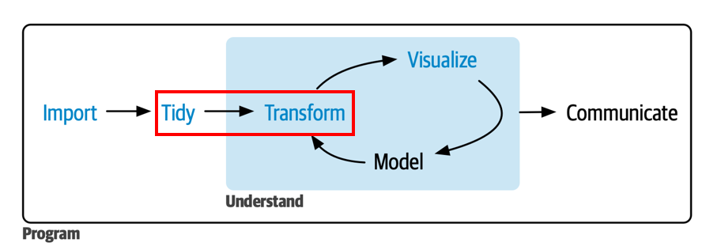



```{r}
#| include: false
library(pacman)
p_load(tidyverse, readxl, janitor, gapminder, forcats, 
       lubridate, stringr, knitr)

theme_set(
  theme_classic(base_size = 16) +
  theme(
    plot.title    = element_text(face = "bold", size = 16, 
                                 color = "black", hjust = 0),
    plot.subtitle = element_text(size = 14, color = "#6B7C93", 
                                 hjust = 0, margin = margin(t = 2, b = 8)),
    plot.caption  = element_text(size = 10, color = "#868e96", 
                                 hjust = 1, face = "italic"),
    legend.title  = element_text(face = "bold")
  )
)

library(MetBrewer)
options(
  ggplot2.discrete.colour = met.brewer("Hiroshige", 3),
  ggplot2.discrete.fill   = met.brewer("Hiroshige", 3)
)
```

# ¡Bienvenid\@s a la Clase 2!

## Resumen Clase 1 {.smaller}

| Función | Paquete | ¿Para qué sirve? |
|-----|-----|------|
| `read_csv()` / `read_csv2()` | readr | Importar archivos `.csv` (separados por `,` o `;`) |
| `read_excel()` | readxl | Importar archivos Excel (`.xlsx` / `.xls`) |
| `read_dta()` | haven | Importar archivos de STATA (`.dta`) |
| `st_read()` | sf | Importar archivos espaciales (`.shp`) |
| `read_parquet()` | arrow | Importar archivos Parquet |
| `clean_names()` | janitor | Estandarizar nombres de columnas |
| `left_join()` | dplyr | Cruzar dos tablas por una llave |

## Resolución Ejercicio Grupal {.smaller}

El ejercicio pedía construir un dataset con la **población censada** y
la **tasa de pobreza** para las 345 comunas del país:

```{r}
#| echo: true
#| eval: false
library(tidyverse)
library(readxl)
library(janitor)

pobreza_2024 <- read_excel("data/SAE_ingresos_2024.xlsx",
                           range = "A3:J348") |>
  clean_names()

poblacion_2024 <- read_excel(
  "data/D1_Poblacion-censada-por-sexo-y-edad-en-grupos-quinquenales.xlsx",
  sheet = "2", skip = 3, n_max = 347) |>
  clean_names()

datos <- left_join(pobreza_2024, poblacion_2024,
                   join_by(codigo == codigo_comuna))
```

## Nuestro dataset de trabajo {.smaller}

A lo largo de esta clase usaremos el dataset `datos` construido en la
Clase 1 (345 comunas con datos de pobreza y población):

```{r}
#| echo: true

datos <- read_excel('data/clean/pobreza_pob_censo_2024.xlsx') |> 
  clean_names()
glimpse(datos)
```

## ¿Qué veremos hoy?

{width="100%"
fig-align="center"}

## Objetivo Clase 2 {.smaller .justify}

En esta segunda clase aprenderemos a **transformar y manipular** bases de
datos utilizando los verbos del paquete `dplyr` y herramientas de
`tidyr`.

Como objetivos específicos se busca:

- Reestructurar datos con `bind_rows()`, `pivot_longer()` y
  `pivot_wider()`
- Ordenar filas con `arrange()`, filtrarlas con `filter()` y
  `filter_out()`, y extraer subconjuntos con la familia `slice()`
- Seleccionar, reubicar, renombrar y crear variables con `select()`,
  `relocate()`, `rename()` y `mutate()`
- Crear variables condicionales con `if_else()`, `case_when()` y las
  nuevas funciones `recode_values()` y `replace_when()`
- Resumir estadísticas por grupos con `group_by()` + `summarise()` y
  `count()`
- Manejar datos especiales: texto, fechas y factores

# [Reestructurar Datos]{style="color:white"} {background-color="#E49B0F"}

## Pegar filas: `bind_rows()` {.smaller}

- `bind_rows()` permite **apilar** dos o más tablas que tienen las
  mismas columnas (o al menos las mismas variables de interés):

. . .

```{r}
#| echo: true
norte <- tibble(region = c("Arica y Parinacota", "Tarapacá", "Antofagasta"),
                comunas = c(4, 7, 9))
sur   <- tibble(region = c("Araucanía", "Los Ríos", "Los Lagos"),
                comunas = c(32, 12, 30))

bind_rows(norte, sur)
```

. . .

::: callout-tip
A diferencia de `left_join()` (que pega **columnas**), `bind_rows()`
pega **filas**: piénsenlo como apilar planillas una debajo de otra. Si
las columnas no coinciden exactamente, `bind_rows()` rellena con `NA`.
:::

## *Tidy data* {.justify .smaller}

::: fragment
Los datos están en formato *tidy* cuando:

- cada **variable** está en su propia **columna**,
- cada **observación** está en su propia **fila**, y
- cada **valor** está en su propia **celda**.
:::

::: fragment
{width="70%"
fig-align="center"}
:::

## Alargar el df: `pivot_longer()` {.medium}

Cuando los nombres de columna son en realidad **valores** de una
variable, necesitamos alargar la tabla. Esto lo podemos hacer mediante la función `pivot_longer()` para **ordenar verticalmente o sumarle filas** a nuestro dataset. Los argumentos principales requeridos son:

1. `cols = "vars"` Las columnas (variables) a pivotear.
2. `names_to = "x"` para indicar el **nombre** de la variable a donde irán las columnas pivote en 1.
3. `values_to = "y"` para indicar el **nombre** de la columna que almacenará los **valores** que contenían las antiguas columnas pivote.

## Ejemplo: `pivot_longer()` {.smaller}

```{r}
#| echo: true
table4a
```

. . .

```{r}
#| echo: true
table4a |>
  pivot_longer(c(`1999`, `2000`),
               names_to  = "year",
               values_to = "cases")
```

## Ensanchar el df: `pivot_wider()` {.smaller}

Cuando una misma observación está repartida en **varias filas**, necesitamos ensanchar la tabla o **agregarle columnas**. Los argumentos principales requeridos son:


1. `names_from = "x"` que indica dónde se almacenan los **nombres de las nuevas columnas** que se generarán a partir del ensanchamiento. 
2. `values_from = "y"` que indica desde dónde se obtendrán los **valores que tomaran** las observaciones de las nuevas columnas.

. . .

:::: columns
::: {.column width="50%" .fragment}
```{r}
#| echo: true
table2 |> head(4)
```
::: 

::: {.column width="50%" .fragment}

```{r}
#| echo: true
table2 |>
  pivot_wider(names_from  = type,
              values_from = count)
```
::: 
::::

## Tipos de variables con `glimpse()` {.smaller}

- Recordar que `glimpse()` muestra la clase de cada columna y algunas observaciones. Las abreviaciones más comunes son:
  
. . .

| Abreviación | Clase | Ejemplo |
|-----|-----|-----|
| `<int>` | Número entero (*integer*) | `1, 2, 3` |
| `<dbl>` | Número real (*double*) | `3.14, 0.05` |
| `<chr>` | Texto (*character*) | `"Santiago"` |
| `<fct>` | Factor (categórico) | `Norte, Centro, Sur` |
| `<date>` | Fecha | `2026-06-16` |
| `<dttm>` | Fecha y hora (*datetime*) | `2026-06-16 09:00` |

# [Transformar Datos con dplyr]{style="color:white"} {background-color="#734B5E"}

## Consideraciones básicas {.smaller .justify}

Las funciones de `dplyr` comparten estas características:

1.  El **primer argumento** es un *dataframe*.
2.  Los argumentos siguientes indican **sobre qué variable** operar
    (generalmente **sin comillas**).
3.  El **resultado** siempre es un *dataframe*.
4.  Se organizan en 3 grandes grupos:
    - **Filas**: `arrange()`, `filter()`, `filter_out()`, `slice()`
    - **Columnas**: `select()`, `relocate()`, `rename()`, `mutate()`
    - **Grupos**: `group_by()` + `summarise()`, `count()`

# [Filas]{style="color:white"} {background-color="#F78764"}

## Ordenar: `arrange()` {.smaller}

- `arrange()` ordena las filas de un *dataframe* por los valores de una
  o más columnas.
- Por defecto ordena de forma **ascendente**. Para ordenar de manera **descendente** se usa
  `desc()` o un `-` antes de la variable numérica.

. . .

```{r}
#| echo: true
#| code-line-numbers: 2
datos |>
  arrange(desc(poblacion_censada)) |>
  select(nombre_comuna, region_x, poblacion_censada) |>
  head(5)
```

## Filtrar filas: `filter()` {.smaller}

- `filter()` conserva las filas que **cumplen todas** las condiciones
  indicadas. Las condiciones se separan por coma (equivale a `&`).

. . .

```{r}
#| echo: true
datos |>
  filter(region_x == "Metropolitana",
         poblacion_censada > 200000) |>
  select(nombre_comuna, poblacion_censada)
```

## Filtrar filas: `filter()`

Operadores y funciones útiles para `filter()`:

| Operador / Función | Descripción | Ejemplo |
|-----|-----|-----|
| `==`, `!=` | Igual / Distinto | `region_x == "Biobío"` |
| `>`, `>=`, `<`, `<=` | Comparaciones | `poblacion_censada > 50000` |
| `%in%` | Pertenece a un conjunto | `region_x %in% c("Biobío", "Ñuble")` |
| `between(x, a, b)` | Rango cerrado | `between(poblacion_censada, 10000, 50000)` |
| `is.na(x)` | Es valor faltante | `filter(!is.na(poblacion_censada))` |

## Errores típicos al usar `filter()` {.smaller}

::::::: columns
:::: {.column width="50%"}
::: {.fragment .fade-in .smaller}
[**Error 1**]{style="color:red"}: usar `=` en vez de `==`

```{r}
#| echo: true
#| eval: true
#| error: true
# ❌ Incorrecto
datos |>
  filter(region_x = "Atacama")
```
```{r}
#| echo: true
#| eval: false
#| error: true
# ✅ Correcto
datos |>
  filter(region_x == "Atacama") 
```
:::
::::

:::: {.column width="50%"}
::: {.fragment .fade-in .smaller}
[**Error 2**]{style="color:red"}: no repetir el nombre de la variable cuando se hacen condiciones adicionales (por ejemplo, con `|`)

```{r}
#| echo: true
#| eval: true
#| error: true
# ❌ Incorrecto
datos |>
  filter(region_x == "Atacama" | "Ñuble")
```
:::
::::
:::::::

## Errores típicos al usar `filter()` {.smaller}

```{r}
#| echo: true
#| eval: true
#| error: false
#| message: false
# ✅ Correcto
datos |>
  filter(region_x == "Atacama" | region_x == "Ñuble") |> 
  head(3)
```

. . .

```{r}
#| echo: true
#| eval: false
#| error: true

# O lo mismo pero más eficiente
datos |>
  filter(region_x %in% c("Atacama", "Ñuble"))
```

## Excluir filas: `filter_out()` {.smaller}

- **Novedad de dplyr 1.2.0**: `filter_out()` es el complemento de
  `filter()`. Mientras `filter()` **conserva** las filas que cumplen la
  condición, `filter_out()` las **descarta**.

- La diferencia clave está en cómo tratan los `NA`: `filter()` los
  descarta, pero `filter_out()` los **conserva**:

. . .

```{r}
#| echo: true
autos <- tibble(clase = c("suv", NA, "sedan"),
                precio = c(30, 25, 20))

# filter() descarta NA también
autos |> filter(clase != "suv")
```

. . .

```{r}
#| echo: true
# filter_out() conserva NA (solo descarta "suv")
autos |> filter_out(clase == "suv")
```

## `filter()` vs `filter_out()` {.smaller}

::::::: columns
:::: {.column width="50%"}
::: {.fragment .fade-in}
**`filter()`** → para **conservar** filas

```{r}
#| echo: true
#| eval: false
datos |>
  filter(poblacion_censada > 100000)
```

- Trata `NA` como `FALSE` → los **descarta**.
- Ideal cuando la intención es "**quedarse** *con las filas que cumplan X"*.
:::
::::

:::: {.column width="50%"}
::: {.fragment .fade-in}
**`filter_out()`** → para **descartar** filas

```{r}
#| echo: true
#| eval: false
datos |>
  filter_out(poblacion_censada < 5000)
```

- Trata `NA` como `FALSE` → los **conserva**.
- Ideal cuando la intención es "**eliminar** *las filas que cumplan X"*.
:::
::::
:::::::

. . .

::: callout-tip
Regla simple: si estás usando `filter()` con `!=` o `!` y además
necesitas agregar `| is.na(...)`, probablemente `filter_out()` sea
más claro y directo.
:::

## 🧠 Pregunta N° 1 {.quiz-question .smaller}

Tenemos un dataset de comunas donde la variable `tasa_pobreza` tiene
algunos valores `NA`. Queremos **eliminar** las comunas con tasa de
pobreza superior al 30%, pero **sin perder** las comunas con `NA`.

::: nonincremental
***¿Cuál es la mejor opción?***

- [`filter(tasa_pobreza <= 0.30)`]{data-explanation="filter() trata NA como FALSE, por lo que también descartaría las comunas con tasa_pobreza NA. Perderíamos datos."}
- [`filter(tasa_pobreza <= 0.30 | is.na(tasa_pobreza))`]{data-explanation="Funciona correctamente, pero es más verboso de lo necesario. Existe una forma más directa con dplyr 1.2.0."}
- [`filter_out(tasa_pobreza > 0.30)`]{.correct data-explanation="Correcto. filter_out() descarta las filas que cumplen la condición (tasa > 30%) y conserva tanto las que no la cumplen como las que tienen NA, que es exactamente lo que queremos."}
- [`filter_out(tasa_pobreza <= 0.30)`]{data-explanation="Esto descartaría las comunas con tasa menor o igual al 30%, que es lo opuesto a lo que queremos."}
:::

## Extraer filas: familia `slice()` {.smaller}

`slice()` selecciona filas por **posición**. Sus variantes más útiles son:

. . .

| Función | Descripción |
|-----|------|
| `slice_head(n = 5)` | Primeras 5 filas |
| `slice_max(x, n = 5)` | 5 filas con mayor valor de `x` |
| `slice_min(x, n = 5)` | 5 filas con menor valor de `x` |
| `slice_sample(n = 5)` | 5 filas al azar |

. . .

```{r}
#| echo: true
datos |>
  slice_max(poblacion_censada, n = 3) |>
  select(nombre_comuna, region_x, poblacion_censada)
```

## `slice()` combinado con `group_by()` {.smaller}

Podemos obtener las comunas más pobladas **por región**:

. . .

```{r}
#| echo: true
datos |>
  group_by(region_x) |>
  slice_max(poblacion_censada, n = 1) |>
  ungroup() |>
  select(region_x, nombre_comuna, poblacion_censada) |>
  head(5)
```

## 💻 Practiquemos: filtrar y ordenar {.smaller}

Usando el dataset `gapminder`, primero resuma la estructura del dataset con `glimpse()` y luego encuentre los **3 países del continente (`continent`) `Americas`** con mayor esperanza de vida (`lifeExp`) en el **año 2007**.

```{webr}
library(gapminder)
library(dplyr)

______(gapminder)
```

```{webr}
library(gapminder)
library(dplyr)

gapminder |>
  filter(______ & ______) |>
  slice_max(______, n = ______) |>
  select(country, lifeExp, gdpPercap)
```

# [Columnas]{style="color:white"} {background-color="#383B53"}

## Seleccionar: `select()` {.smaller}

- `select()` conserva solo las columnas indicadas. Acepta funciones
  auxiliares (*helpers*) para seleccionar por patrón:

. . . 

| Helper | Descripción | Ejemplo |
|-----|-----|-----|
| `starts_with("x")` | Comienza con `"x"` | `starts_with("codigo")` |
| `ends_with("x")` | Termina con `"x"` | `ends_with("comuna")` |
| `contains("x")` | Contiene `"x"` | `contains("pobreza")` |
| `where(is.numeric)` | Por tipo de variable | `where(is.character)` |

. . .

```{r}
#| echo: true
datos |>
  select(nombre_comuna, starts_with("poblacion")) |>
  head(3)
```

## Reubicar y renombrar {.smaller}

::::::: columns
:::: {.column width="50%"}
::: {.fragment .fade-in}
**`relocate()`** — cambiar **posición** de columnas

```{r}
#| echo: true
#| eval: true
datos |>
  select(nombre_comuna, starts_with("poblacion")) |> 
  relocate(poblacion_censada,
           .before = nombre_comuna) |> 
  head(5)
```
:::
::::

:::: {.column width="50%"}
::: {.fragment .fade-in}
**`rename()`** — cambiar **nombre** de columnas con la sintaxis de: `nuevo_nombre = nombre_actual`

```{r}
#| echo: true
#| eval: true
datos |>
  dplyr::select(region_x, nombre_comuna, poblacion_censada, porcentaje_de_personas_en_situacion_de_pobreza_de_ingresos_2024) |> 
  dplyr::rename(
    region   = region_x,
    comuna = nombre_comuna,
    pob_2024 = poblacion_censada,
    tasa_pobreza = porcentaje_de_personas_en_situacion_de_pobreza_de_ingresos_2024
  ) |> 
  head(5)
```

:::
::::
:::::::

## Crear variables: `mutate()` {.smaller}

- `mutate()` crea nuevas columnas o modifica existentes:

. . .

```{r}
#| echo: true
datos |>
  mutate(
    pob_miles = round(poblacion_censada / 1000, 1),
    prop_hombres = round(hombres / poblacion_censada, 3)
  ) |>
  select(nombre_comuna, pob_miles, prop_hombres) |>
  head(4)
```

## Aplicar funciones a múltiples columnas: `across()` {.smaller}

- `across()` permite aplicar una misma función a **varias columnas** a
  la vez, usando los mismos *helpers* de `select()`:

. . .

```{r}
#| echo: true
datos |>
  summarise(
    across(c(poblacion_censada, hombres, mujeres),
           \(x) round(mean(x, na.rm = TRUE)))
  )
```

. . .

::: callout-tip
`across()` se usa dentro de `mutate()` o `summarise()`. Es
especialmente útil cuando necesitas aplicar la misma transformación a
muchas columnas: `across(where(is.numeric), \(x) round(x, 2))`.
:::

## Condiciones binarias: `if_else()` {.smaller}

- `if_else()` evalúa una condición y asigna un valor para `TRUE` y otro
  para `FALSE`:

. . .

```{r}
#| echo: true
datos |>
  mutate(
    tamano = if_else(poblacion_censada > 100000,
                     "Grande", "Pequeña")
  ) |>
  select(nombre_comuna, poblacion_censada, tamano) |>
  head(4)
```

. . .

::: callout-tip
`if_else()` es la opción correcta cuando hay exactamente **dos
categorías**. Para más categorías, usar `case_when()`.
:::

## Múltiples condiciones: `case_when()` {.smaller}

- `case_when()` evalúa condiciones **en orden** y asigna el valor de la
  primera que se cumple:

. . .

```{r}
#| echo: true
datos |>
  mutate(
    tamano = case_when(
      poblacion_censada > 200000 ~ "Metrópoli",
      poblacion_censada > 50000  ~ "Ciudad grande",
      poblacion_censada > 10000  ~ "Ciudad mediana",
      .default = "Pueblo"
    )
  ) |>
  count(tamano)
```

## Recodificar: `recode_values()` {.smaller}

- **Novedad de dplyr 1.2.0**: cuando la recodificación es un mapeo
  directo de valores (como una tabla de búsqueda), `recode_values()` es
  más limpio que `case_when()`:

. . .

```{r}
#| echo: true
#| eval: false
# Con case_when (verboso)
datos |>
  mutate(zona = case_when(
    codigo_region == 15 ~ "Norte",
    codigo_region == 1  ~ "Norte",
    codigo_region == 13 ~ "Centro",
    .default = "Otro"
  ))

# Con recode_values (más directo, usando tabla de búsqueda)
lookup <- tribble(
  ~from, ~to,
  15,    "Norte",
  1,     "Norte",
  13,    "Centro"
)

datos |>
  mutate(zona = recode_values(codigo_region,
                              from = lookup$from,
                              to = lookup$to,
                              default = "Otro"))
```

## Reemplazar parcialmente: `replace_when()` {.smaller}

- `replace_when()` es para **modificar solo algunos valores** de una
  columna existente, manteniendo el resto intacto:

. . .

```{r}
#| echo: true
#| eval: false
# Ejemplo: truncar la población a un máximo de 500.000
datos |>
  mutate(
    poblacion_censada = replace_when(
      poblacion_censada,
      poblacion_censada > 500000 ~ 500000
    )
  )
```

. . .

::: callout-tip
La diferencia con `case_when()` es que `replace_when()` **no necesita un
`.default`**: los valores que no cumplen la condición simplemente se
mantienen como están. Esto es más seguro cuando solo quieres tocar
algunas filas.
:::

## 🧠 Pregunta N° 2 {.quiz-question .smaller}

Queremos crear una nueva variable `zona` que clasifique las comunas
según la región: Norte (regiones 1 a 4 y 15), Centro (5 y 13) y Sur
(el resto). ¿Cuál es el **mejor** enfoque?

::: nonincremental
***¿Qué función usarías?***

- [`if_else()`]{data-explanation="if_else() solo maneja dos categorías (TRUE/FALSE). Aquí necesitamos al menos tres: Norte, Centro y Sur."}
- [`case_when()`]{.correct data-explanation="Correcto. case_when() permite definir múltiples condiciones con distintos valores de salida, evaluándolas en orden. Es ideal para clasificaciones con 3 o más categorías basadas en condiciones lógicas."}
- [`recode_values()`]{data-explanation="recode_values() funciona con un mapeo directo de valor a valor (1 → 'Norte', 2 → 'Norte', etc.). Sería más tedioso porque habría que listar los 16 códigos de región individualmente. case_when() permite agrupar con %in%."}
- [`replace_when()`]{data-explanation="replace_when() está diseñado para modificar parcialmente una columna existente, no para crear una columna nueva con categorías distintas."}
:::

## 💻 Practiquemos: crear y transformar {.smaller}

Usando `gapminder`, filtre el año **2007** y cree una variable
`nivel_desarrollo` que clasifique los países según su PIB per cápita:
"Alto" si supera los 20.000, "Medio" entre 5.000 y 20.000, y "Bajo"
en caso contrario. Luego cuente cuántos países hay en cada nivel.

```{webr}
library(gapminder)
library(dplyr)

gapminder |>
  filter(year == 2007) |>
  mutate(
    nivel_desarrollo = case_when(
      gdpPercap > ___  ~ "___",
      gdpPercap > ___  ~ "___",
      .default = "___"
    )
  ) |>
  count(___)
```

# Agrupamiento

## `group_by()` + `summarise()` {.smaller}

- `group_by()` **prepara** el *dataframe* para realizar operaciones por
  grupo. No cambia los datos por sí solo.
- `summarise()` **calcula** estadísticas de resumen para cada grupo:

. . .

```{r}
#| echo: true
datos |>
  group_by(region_x) |>
  summarise(
    n_comunas   = n(),
    pob_total   = sum(poblacion_censada),
    pob_media   = round(mean(poblacion_censada))
  ) |>
  ungroup() |>
  slice_max(pob_total, n = 5)
```

## `group_by()` + `summarise()`: precauciones {.smaller .justify}

Algunas consideraciones importantes:

- `group_by()` prepara el *dataframe* pero **no** lo modifica
  visualmente.
- `summarise()` reduce el *dataframe* a **una fila por grupo**.
- Si se desea seguir manipulando el resultado **sin agrupación**,
  siempre encadenar `ungroup()` al final. De lo contrario, las operaciones posteriores seguirán una lógica agrupada.
- Es posible agrupar por **más de una variable**:

. . .

```{r}
#| echo: true
datos |>
  group_by(region_x, presencia_de_la_comuna_en_la_muestra_casen) |>
  summarise(n = n(), .groups = "drop") |>
  head(4)
```

## Contar: `count()` {.smaller}

- `count()` es un atajo para `group_by() |> summarise(n = n())`:

. . .

```{r}
#| echo: true
datos |>
  count(region_x, name = "n_comunas") |>
  slice_max(n_comunas, n = 5)
```

## Contar: `count()` {.smaller}

- Con el argumento `wt` podemos **sumar** una variable en vez de contar
  filas:

. . .

```{r}
#| echo: true
datos |>
  count(region_x, wt = poblacion_censada,
        name = "pob_total") |>
  slice_max(pob_total, n = 3)
```

## Ejercicio Grupal (30-40 min) {.smaller}

Trabajarán en **salas pequeñas** usando el dataset
`pobreza_pob_censo_2024.xlsx` y otros datos homicidios. Los detalles están en la
**Guía de Ejercicio Grupal N° 2** disponible en [Webcursos](https://webcursos.uai.cl/).

. . .

::: callout-tip
## Recuerden

- Designen a una persona que comparta pantalla.
- Intenten resolver primero y luego revisen la pauta.
- El profesor y ayudante pasarán por las salas.
:::

# [Datos Especiales]{style="color:white"} {background-color="#CE6C47"}

# Texto

## Extraer partes de texto: `str_sub()` {.smaller}

- `str_sub()` del paquete `stringr` permite extraer una **porción** de
  una cadena de texto según sus posiciones:

. . .

```{r}
#| echo: true
datos |>
  mutate(
    cod_region = str_sub(as.character(codigo), 1, 2)
  ) |>
  select(codigo, nombre_comuna, cod_region) |>
  head(4)
```

. . .

- Argumentos: `str_sub(string, start, end)`. Las posiciones son
  **inclusivas** (1-indexed).

## Aplicación: extraer períodos desde texto {.smaller}

Un caso muy frecuente en datos públicos: variables que codifican
trimestre y año juntos. Notar que también se pueden usar posiciones **negativas** anteponiendo un menos al segundo argumento para contar desde el **final** de la cadena. Por ejemplo `str_sub(periodo, -2)` extrae los últimos 2 caracteres:

```{r}
#| echo: true
trimestres <- tibble(
  periodo = c("tr1_2023", "tr2_2023", "tr3_2023", "tr4_2023"),
  ventas  = c(1500, 2000, 3500, 1750)
)

trimestres |>
  mutate(
    trimestre = str_sub(periodo, 3, 3),
    anio      = str_sub(periodo, -4)
  )
```

# Fechas

## Fechas con `lubridate` {.smaller}

- El paquete `lubridate` (parte del `tidyverse`) facilita el manejo de
  fechas. Las funciones `ymd()`, `dmy()`, `mdy()` convierten texto a
  fecha según el **orden** de los componentes:

. . .

```{r}
#| echo: true
ymd("2026-06-16")
dmy("16-junio-2026")
mdy("June 16, 2026")
```

. . .

::: callout-tip
La norma ISO 8601 ordena las fechas de mayor a menor: `AAAA-MM-DD`.
Usar `ymd()` cuando los datos siguen este formato, `dmy()` cuando están
en formato chileno (día/mes/año).
:::

## Extraer componentes de una fecha {.smaller}

Una vez que la variable es de clase `<date>`, podemos extraer sus partes:

```{r}
#| echo: true
fechas <- tibble(
  fecha = ymd(c("2026-01-15", "2026-06-22", "2026-12-01"))
)

fechas |>
  mutate(
    anio = year(fecha),
    mes  = month(fecha, label = TRUE),
    dia  = day(fecha),
    dia_semana = wday(fecha, label = TRUE)
  )
```

## Convertir texto a fecha: `as_date()` {.smaller}

- Cuando las fechas están almacenadas como texto (clase `<chr>`),
  debemos convertirlas con `as_date()` o las funciones `ymd()`/`dmy()`:

. . .

```{r}
#| echo: true
df_texto <- tibble(
  fecha_texto = c("2026-01-15", "2026-06-22", "2026-12-01")
)
glimpse(df_texto)   # <chr>
```

. . .

```{r}
#| echo: true
df_fecha <- df_texto |>
  mutate(fecha = as_date(fecha_texto))
glimpse(df_fecha)   # ahora <date>
```

## Calcular intervalos de tiempo {.smaller}

- Para calcular la diferencia entre dos fechas:

. . .

```{r}
#| echo: true
inicio  <- ymd("2026-06-09")     # inicio del diplomado
termino <- ymd("2026-07-28")     # última clase
termino - inicio                  # diferencia en días
```

. . .

```{r}
#| echo: true
# Intervalos más expresivos con interval()
intervalo <- interval(inicio, termino)
as.duration(intervalo)
```

## 🧠 Pregunta N° 3 {.quiz-question .smaller}

Tenemos una variable `fecha_texto` con valores como `"15/06/2026"` (en
formato día/mes/año, típico en Chile). ¿Cómo la convertimos
correctamente a fecha?

::: nonincremental
***¿Cuál es la función correcta?***

- [`ymd("15/06/2026")`]{data-explanation="ymd() espera el orden año-mes-día. Con '15/06/2026' interpretaría el 15 como año, lo que produciría un error o una fecha incorrecta."}
- [`dmy("15/06/2026")`]{.correct data-explanation="Correcto. dmy() espera el orden día-mes-año, que es exactamente el formato chileno: 15 (día) / 06 (mes) / 2026 (año)."}
- [`mdy("15/06/2026")`]{data-explanation="mdy() espera el orden mes-día-año (formato estadounidense). Interpretaría el 15 como mes, lo que genera un error porque no existe el mes 15."}
- [`as_date("15/06/2026")`]{data-explanation="as_date() sin argumentos adicionales asume formato ISO (AAAA-MM-DD). Con '15/06/2026' no reconocerá el patrón y devolverá NA."}
:::

# Factores

## Variables categóricas: `factor()` {.smaller}

- Un **factor** es una estructura de datos para representar variables
  categóricas con un número finito de **niveles**:

. . .

```{r}
#| echo: true
tamanos <- c("Grande", "Mediana", "Pequeña", "Grande", "Mediana")
factor(tamanos)
```

. . .

- Por defecto los niveles se ordenan **alfabéticamente**. Podemos
  especificar el orden con `levels`:

. . .

```{r}
#| echo: true
factor(tamanos, levels = c("Pequeña", "Mediana", "Grande"))
```

## Reordenar niveles: `fct_relevel()` {.smaller}

- `fct_relevel()` del paquete `forcats` permite **reordenar** los
  niveles de un factor ya creado:

. . .

```{r}
#| echo: true
f <- factor(tamanos)
levels(f)  # alfabético

f2 <- fct_relevel(f, "Pequeña", "Mediana", "Grande")
levels(f2) # orden personalizado
```

. . .

::: callout-tip
`fct_relevel()` es especialmente útil cuando queremos controlar el
**orden de las categorías en los gráficos** de `ggplot2` (Clase 3).
:::

## 💻 Practiquemos: factores {.smaller}

Usando `gapminder` (año 2007), clasifique los países según su esperanza
de vida en una variable numérica en función de un umbral de 70 años de edad (1 = alta (mayor igual a 70), 0 = baja (menor que 70)) y luego haga un recuento usando un factor con las etiquetas designadas (alta y baja).

```{webr}
library(gapminder)
library(dplyr)
library(forcats)


gapminder |>
  filter(year == 2007) |>
  mutate(
    nivel_vida = ______(lifeExp >= 70, 1, 0),
    nivel_vida = factor(______, levels = c(0, 1), labels = c("______", "______"))
  ) |>
  count(nivel_vida)
```

# Recapitulación

## ¿Qué aprendimos hoy? {.smaller}

| Grupo | Funciones |
|-----|------|
| **Reestructurar** | `bind_rows()`, `pivot_longer()`, `pivot_wider()` |
| **Filas** | `arrange()`, `filter()`, `filter_out()`, `slice_max/min/sample()` |
| **Columnas** | `select()`, `relocate()`, `rename()`, `mutate()`, `across()` |
| **Condicionales** | `if_else()`, `case_when()`, `recode_values()`, `replace_when()` |
| **Grupos** | `group_by()` + `summarise()`, `count()` |
| **Texto** | `str_sub()` |
| **Fechas** | `ymd()`, `dmy()`, `as_date()`, `year()`, `month()`, `interval()` |
| **Factores** | `factor()`, `fct_relevel()` |

::: fragment
La próxima clase aprenderemos a **visualizar** estos datos con
`ggplot2` para comunicar patrones y resultados.
:::

