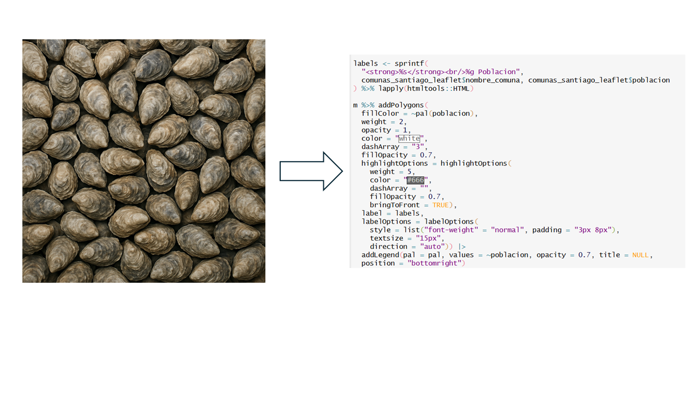
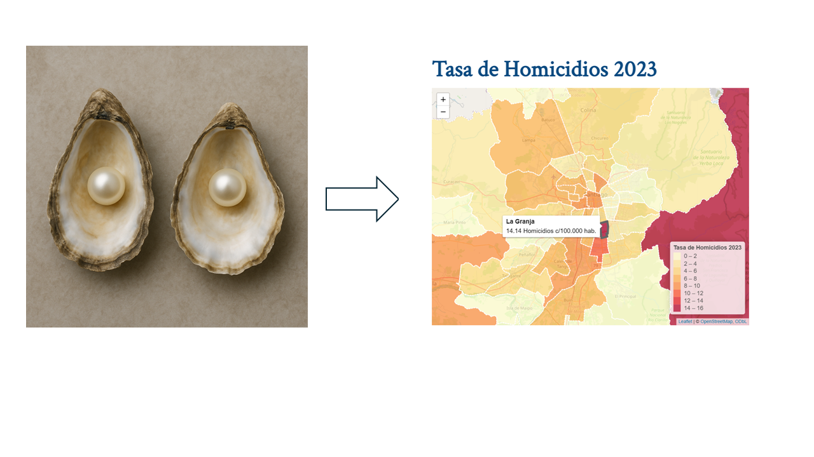
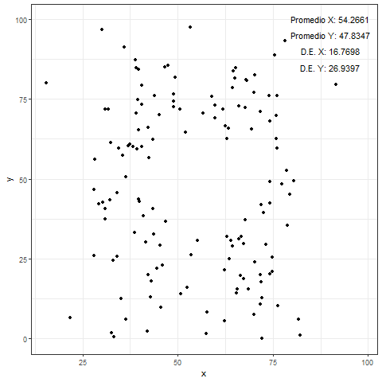
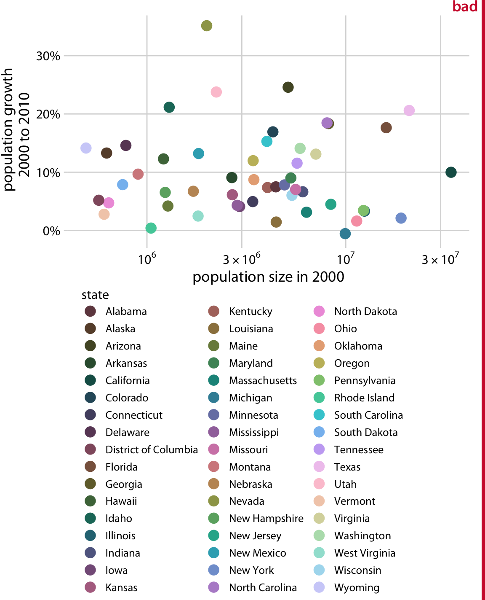



```{r}
#| include: false
library(pacman)
p_load(tidyverse, gapminder, ggthemes, scales, gghighlight,
       readxl, sf, ggspatial, knitr, maplibre)

theme_set(
  theme_classic(base_size = 16) +
  theme(
    plot.title    = element_text(face = "bold", size = 16, 
                                 color = "black", hjust = 0),
    plot.subtitle = element_text(size = 14, color = "#6B7C93", 
                                 hjust = 0, margin = margin(t = 2, b = 8)),
    plot.caption  = element_text(size = 10, color = "#868e96", 
                                 hjust = 1, face = "italic"),
    legend.title  = element_text(face = "bold")
  )
)

gap_2007 <- gapminder |> filter(year == 2007)
```

# ¡Bienvenid\@s a la Clase 3!

## Objetivo Clase 3 {.smaller .justify}

Esta clase tiene como objetivo aprender los principios fundamentales de
la **visualización de datos** y aplicarlos mediante el paquete `ggplot2`
de R [@wickham2015].

Como objetivos específicos se busca:

- Comprender la importancia de una buena visualización y los errores más
  comunes a evitar.
- Construir visualizaciones con la **gramática de gráficos** (*grammar
  of graphics*): datos, estéticas, geometrías, escalas y temas.
- Aplicar distintos tipos de gráficos según el tipo de variable:
  `geom_bar()`, `geom_histogram()`, `geom_col()`, `geom_line()`,
  `geom_point()`, entre otros.
- Controlar los elementos de un gráfico: etiquetas, escalas y temas.
- Conocer extensiones: `gghighlight`, heatmaps y mapas geográficos.

# [La importancia de una buena visualización]{style="color:white"} {background-color="#173277"}

## ¿Por qué visualizar? {.medium}

> El mayor valor de una imagen está en que nos obliga a notar algo que
> nunca esperamos ver [@tukey1977].

::: fragment
1.  **Explorar**: entender los datos para guiar análisis posteriores.
    Una visualización exploratoria es una forma de pensar y de usar
    gráficos como herramientas cognitivas para descubrir patrones
    (Wilke, 2019). → *Análisis exploratorio*.

2.  **Comunicar**: contar una historia con propósito, simplificando lo
    complejo y guiando la atención del público hacia el mensaje clave. →
    *Análisis aclaratorio*.
:::

## Comunicar: foco en las perlas, no en las ostras

{width="80%" fig-align="center"}

## Comunicar: foco en las perlas, no en las ostras

{width="80%" fig-align="center"}

## La importancia de entender los datos {.smaller .justify}

El Cuarteto de Anscombe (1973) es un conjunto de cuatro datasets con
**estadísticas descriptivas idénticas** (media, varianza, correlación)
que al graficarse revelan patrones completamente distintos.

{width="55%" fig-align="center"}

## El cuarteto de Anscombe {.smaller}

::: panel-tabset
### Gráficos

```{r}
#| fig-height: 6
#| out-width: "60%"
plots <- list()
for (i in c("1", "2", "3", "4")) {
  plots[[i]] <- ggplot(anscombe, aes(.data[[paste0("x", i)]],
                                      .data[[paste0("y", i)]])) +
    geom_point(color = "steelblue", size = 1.5) +
    geom_smooth(se = FALSE, method = "lm", color = "#FE514B") +
    labs(x = paste0("x", i), y = paste0("y", i),
         title = paste0("Dataset ", i)) +
    theme_bw()
}
do.call(gridExtra::grid.arrange, c(plots, ncol = 2))
```

### Datos

```{r}
knitr::kable(anscombe)
```
:::

## Lección principal {.justify}

::: callout-tip
## Mensaje principal

¡Confiar únicamente en medidas estadísticas resumidas sin una
visualización adecuada puede conducir a conclusiones erróneas o
incompletas!
:::

Por eso **es importante visualizar los datos antes de empezar a
modelar**.

## Lo que deberíamos buscar

- Mostrar los datos y no mentir con estos.
  - Contar una historia (¿una relación? ¿causalidad? ¿un patrón? ¿un
    quiebre?).
  - Transmitir y convencer. No hacer *cherry picking*.
- Minimizar aspectos innecesarios que desvían la atención del público.
- Las visualizaciones deben complementar el texto y tener suficiente
  información para "sobrevivir por sí mismas".

## Atributos preatentivos {.smaller}

- El cerebro solo puede procesar un cierto número de atributos de forma
  instantánea (*pre-attentive attributes*). Los principales son:
  **forma**, **posición**, **color** y **tamaño**.

- Queremos buscar la variación justa en estos atributos para enfocarnos
  en lo que importa.

. . .

![[@nussbaumerknaflic2025]](img/atributos-preatentivos.png){width="70%"
fig-align="center"}

## ¿Cuántos 3 hay? {.nostretch auto-animate="true"}

![[@nussbaumerknaflic2025]](img/contar-3.png)

## ¿Y ahora? {.nostretch}

![[@nussbaumerknaflic2025]](img/contar-3-resuelto.png)

## Error #1: Violar el principio de proporcionalidad {.smaller}

::: callout-tip
## *The principle of proportional ink*

Los tamaños de las áreas sombreadas en una visualización deben ser
proporcionales a los valores de datos que representan.
:::

En particular, este principio **no se cumple** en los gráficos de barra
cuyo **eje y no parte en 0**.

. . .

](img/mal_grafico_base1.webp){width="400px"
fig-align="center"}

## Error #2: No entregar contexto {.smaller}

- Cuando mostramos una evolución, es importante preguntarse:
  **¿comparado con qué?**

. . .

:::::: columns
::: {.column width="50%"}
![[@tufte2001]](img/contexto1.png){width="100%"}
:::

:::: {.column width="50%"}
::: fragment
![Posibles tendencias [@tufte2001]](img/contexto2.png){width="100%"}
:::
::::
::::::

## Error #2: No entregar contexto {.smaller}

![[@tufte2001]](img/contexto3.png){width="100%"}

## Error #3: Mostrar demasiada información {.smaller}

:::::: columns
::: {.column width="50%"}
{width="100%"}

[@wilke2019]
:::

:::: {.column width="50%"}
::: fragment
{width="100%"}

Reducir las categorías de color y etiquetar directamente mejora
significativamente la legibilidad [@wilke2019].
:::
::::
::::::

# [Construyendo visualizaciones con ggplot2]{style="color:white"} {background-color="#173277"}

## `ggplot2` {.smaller .justify}

[**¿Qué es?**]{style="color:#E69F00"}

- Un paquete de R para producir gráficos estadísticos basado en la
  *grammar of graphics*, que permite componer gráficas combinando
  componentes **independientes**.

. . .

[**¿Cuál es su ventaja?**]{style="color:#90BE6D"}

- Permite trabajar **iterativamente**, añadiendo *capas* al gráfico,
  haciendo más fácil la transición entre una idea a un gráfico real.

## *Grammar of Graphics* {.smaller .justify}

::::: columns
::: {.column width="40%"}

:::

::: {.column .incremental width="60%"}
- **Data**: los datos a graficar.
- **Aesthetics (`aes`)**: mapean variables a atributos visuales
  (posición x/y, color, forma, tamaño).
- **Geoms (`geom_`)**: los objetos geométricos que se dibujan (puntos,
  líneas, barras).
- **Scales (`scale_`)**: controlan los ejes y leyendas.
- **Facets (`facet_`)**: dividen el gráfico por subgrupos.
- **Theme (`theme_`)**: controlan los aspectos estéticos del fondo.
:::
:::::

## La estructura básica en 3 pasos {.smaller}

1.  **Especificar los datos**: `ggplot(data = datos)`
2.  **Especificar los aesthetics**: `aes(x = ..., y = ...)`
3.  **Agregar un geom**: `+ geom_point()`

. . .

```{r}
#| echo: true
#| fig-height: 5
#| out-width: "60%"
gap_2007 <- gapminder |> filter(year == 2007)

ggplot(gap_2007, aes(x = gdpPercap, y = lifeExp)) +
  geom_point()
```

## Construyendo capa por capa {.smaller}

```{r}
#| echo: true
ggplot(gap_2007, aes(x = gdpPercap, y = lifeExp)) +
  geom_point(aes(color = continent)) +
  geom_smooth(se = FALSE, method = "lm", color = "#E69F00") +
  theme_bw()
```

## 💻 Ejercicio 1: Histograma {.smaller}

Usando `gapminder` (año 2007), construya un histograma de la esperanza
de vida (`lifeExp`). Rellene las barras de azul y use 10 intervalos.

```{webr}
library(gapminder)
library(ggplot2)
library(dplyr)

gap_2007 <- gapminder |> filter(year == 2007)

ggplot(gap_2007, aes(x = ___)) +
  geom_histogram(fill = "___", color = "black", bins = ___) +
  labs(x = "Esperanza de vida", y = "Frecuencia") +
  theme_minimal()
```

## Visualizaciones según el tipo de dato {.smaller}

| Nº Variables | Tipo | Geom recomendado |
|----|----|----|
| 1 | Categórica | `geom_bar()` |
| 1 | Cuantitativa | `geom_histogram()`, `geom_density()` |
| 2 | Categórica + Categórica | `geom_bar(position = "dodge")` |
| 2 | Cuantitativa + Cuantitativa | `geom_point()`, `geom_line()` |
| 2 | Categórica + Cuantitativa | `geom_col()`, `geom_boxplot()` |

# [Aplicaciones: tipos de objetos geométricos (geom_*)]{style="color:white"} {background-color="#173277"}

## Barras para datos categóricos: `geom_bar()` {.smaller}

- `geom_bar()` **cuenta** las observaciones por categoría de manera automática, por lo que **no necesita** especificar en `aes()` el eje y:

. . .

```{r}
#| echo: true
#| out-width: "50%"
ggplot(gap_2007, aes(x = continent)) +
  geom_bar(fill = "steelblue") +
  labs(x = "Continente", y = "N° de países") +
  theme_clean(base_size = 14)
```

## Barras agrupadas y apiladas {.smaller}

::::: columns
::: {.column width="50%" .fragment}

Con `position = "dodge"` dentro de `geom_bar()` podemos **agrupar las barras** (ponerlas juntas) en función de una segunda categoría indicada en `fill`:

```{r}
#| echo: true
#| fig-height: 5
ggplot(gap_2007, aes(x = continent,
  fill = if_else(lifeExp > 70,
    "Alta", "Baja"))) +
  geom_bar(position = "dodge") +
  labs(fill = "Esp. de vida") +
  theme_clean(base_size = 12)
```
:::

::: {.column width="50%" .fragment}

Con `position = "fill"` dentro de `geom_bar()` podemos **apilar las barras** (una encima de otra) en función de una segunda categoría indicada en `fill`:

```{r}
#| echo: true
#| fig-height: 5
ggplot(gap_2007, aes(x = continent,
  fill = if_else(lifeExp > 70,
    "Alta", "Baja"))) +
  geom_bar(position = "fill") +
  labs(y = "Proporción", fill = "Esp. de vida") +
  theme_clean(base_size = 12)
```
:::
:::::

## Distribuciones: `geom_histogram()` {.smaller}

```{r}
#| echo: true
ggplot(gap_2007, aes(x = lifeExp)) +
  geom_histogram(fill = "steelblue", color = "white", bins = 15) +
  labs(x = "Esperanza de vida", y = "Frecuencia") +
  theme_clean(base_size = 14)
```

## Distribuciones: `geom_density()` y `geom_boxplot()` {.smaller}

::::: columns
::: {.column width="50%" .fragment}

`geom_density()` es útil para ver la **forma** de la distribución de una variable y compararla con otras distribuciones:

```{r}
#| echo: true
#| fig-height: 5
ggplot(gap_2007,
  aes(x = lifeExp,
      fill = continent)) +
  geom_density(alpha = 0.5) +
  labs(x = "Esperanza de vida",
       fill = "Continente") +
  theme_clean(base_size = 12)
```
:::

::: {.column width="50%" .fragment}

`geom_boxplot()` es útil para visualizar las estadísticas descriptivas de posición más importantes de una variable (Q1 o p25, mediana, Q3 o p75 y outliers) y permite compararla entre distintos grupos:

```{r}
#| echo: true
#| fig-height: 4.5
ggplot(gap_2007,
  aes(x = continent,
      y = lifeExp)) +
  geom_boxplot(fill = "cornflowerblue",
               alpha = 0.7) +
  labs(x = "", y = "Esp. de vida") +
  theme_clean(base_size = 12)
```
:::
:::::

## 🧠 Pregunta N° 1 {.quiz-question .smaller}

Queremos mostrar la **distribución** de la esperanza de vida en 2007,
comparando visualmente **África vs. América** en el mismo gráfico.

::: nonincremental
***¿Cuál es la combinación más adecuada?***

- [`geom_bar(fill = continent)`]{data-explanation="geom_bar() cuenta observaciones por categoría. Para mostrar la distribución de una variable continua como lifeExp se necesita un histograma o un density plot."}
- [`geom_histogram(fill = continent)`]{data-explanation="Funciona, pero al superponer dos histogramas las barras se tapan entre sí y dificultan la comparación. Un density plot es más adecuado para superponer distribuciones."}
- [`geom_density(fill = continent) + alpha`]{.correct
  data-explanation="Correcto. geom_density() con transparencia (alpha) permite superponer las distribuciones de ambos continentes sin que se tapen, facilitando la comparación visual."}
- [`geom_boxplot(x = continent, y = lifeExp)`]{data-explanation="El boxplot muestra la mediana y los cuartiles, pero pierde la forma de la distribución (bimodalidad, asimetría). Para comparar distribuciones completas, el density plot es más informativo."}
:::

## Columnas numéricas: `geom_col()` {.smaller}

- A diferencia de `geom_bar()` (que cuenta), `geom_col()` usa
  directamente el valor de `y` como altura de la barra:

. . . 

```{r}
#| echo: true
#| output-location: column
#| fig-height: 6
gap_2007 |>
  group_by(continent) |>
  summarise(media_vida = mean(lifeExp)) |>
  ggplot(aes(
    x = reorder(continent, media_vida),
    y = media_vida)
    ) +
  geom_col(fill = "steelblue") +
  geom_text(aes(
    label = round(media_vida, 1)),
    hjust = -0.2
    ) +
  coord_flip() +
  labs(x = "", y = "Esperanza de vida promedio") +
  theme_clean(base_size = 14)
```
## Series de tiempo: `geom_line()` {.smaller}

Con `geom_line()` podemos generar líneas, las cuales son muy útiles para mostrar evoluciones de indicadores a lo largo del **tiempo**:

. . . 

```{r}
#| echo: true
#| output-location: column
#| code-line-numbers: "4-6"
gapminder |>
  filter(country == "Chile") |>
  ggplot(aes(x = year, y = lifeExp)) +
  geom_line(linewidth = 1.5, color = "steelblue") +
  geom_point(size = 2, color = "gray30", alpha = 0.8) +
  scale_y_continuous(limits = c(0, 80)) +
  labs(title = "Evolución de la esperanza de vida en Chile",
       subtitle = "1952–2007",
       x = "Año", y = "Esperanza de vida",
       caption = "Fuente: Gapminder") +
  theme_classic(base_size = 15)
```

## 💻 Ejercicio 2: Gráficos de línea {.smaller}

Complete el código para graficar la evolución de la esperanza de vida
**promedio por continente**, coloreando cada línea por continente:

```{webr}
library(gapminder)
library(ggplot2)
library(dplyr)

gapminder |>
  group_by(continent, year) |>
  summarise(lifeExp = mean(lifeExp), .groups = "drop") |>
  ggplot(aes(x = year, y = lifeExp, color = ___)) +
  geom_line(linewidth = 1.5) +
  geom_point(size = 2, alpha = 0.9) +
  scale_y_continuous(limits = c(0, NA)) +
  labs(title = "Esperanza de vida por continente",
       x = "Año", y = "Esperanza de vida",
       color = "Continente") +
  theme_minimal(base_size = 14)
```

## Scatterplot: `geom_point()` {.smaller}

Con `geom_point()` y dos variables cuantitativas en x e y podemos hacer un gráfico de dispersión o *scatterplot*, el cual es muy útil para mostrar la **relación entre dos variables numéricas**. Adicionalmente, con `geom_smooth()` podemos ajustar una recta o curva para entender el patrón que hay en los datos:

```{r}
#| echo: true
#| output-location: column
#| code-line-numbers: "2-7"
ggplot(gap_2007, aes(x = gdpPercap, y = lifeExp)) +
  geom_point(aes(color = continent), #Color por continente
             alpha = 0.7, #Transparencia
             size = 2.5) + #Tamaño de los puntos
  geom_smooth(se = FALSE, #Sin intervalo de confianza
              method = "lm", #Recta ajusta por MCO
              color = "#E69F00") + #Color de la recta
  labs(x = "PIB per cápita", y = "Esperanza de vida",
       color = "Continente") +
  theme_clean(base_size = 14)
```

## Entendiendo el nivel del `aes()` {.smaller}

En qué nivel del `aes` se fija el `color` determina **qué capas** lo heredan:

::::::: columns
:::: {.column width="50%"}
::: fragment
```{r}
#| echo: true
#| fig-height: 5
#| code-line-numbers: "5"
# Color SOLO en los puntos
ggplot(gap_2007,
  aes(x = gdpPercap,
      y = lifeExp)) +
  geom_point(aes(color = continent)) +
  geom_smooth(method = "lm",
    se = FALSE, color = "#E69F00") +
  theme_bw()
```
:::
::::

:::: {.column width="50%"}
::: fragment
```{r}
#| echo: true
#| fig-height: 5
#| code-line-numbers: "1-5"
# Color en puntos + líneas
ggplot(gap_2007,
  aes(x = gdpPercap,
      y = lifeExp,
      color = continent)) +
  geom_point() +
  geom_smooth(method = "lm",
    se = FALSE) +
  theme_bw()
```
:::
::::
:::::::

# [Controlando elementos]{style="color:white"} {background-color="#173277"}

## Etiquetas: `labs()` {.smaller}

- `labs()` permite definir **todos** los textos del gráfico en un solo lugar:

. . . 

```{r}
#| echo: true
#| eval: false
ggplot(gap_2007, aes(x = gdpPercap, y = lifeExp)) +
  geom_point() +
  labs(
    title    = "Relación entre PIB y esperanza de vida",
    subtitle = "Año 2007",
    x        = "PIB per cápita (USD)",
    y        = "Esperanza de vida (años)",
    color    = "Continente",
    caption  = "Fuente: Gapminder"
  )
```

## Escalas: `scale_*()` {.smaller}

Las funciones `scale_*()` controlan los **ejes y leyendas**. Por ejemplo, con `scale_x_continuous()` indicamos que el eje x es una variable continua y con sus argumentos de `labels`y `breaks` podemos especificar el formato en que se muestran las etiquetas y los quiebres o cantidad de etiquetas que aparezcan. Por último, si se ha fijado un `color` o `fill` dentro de un `aes()`, las funciones `scale_color_*()` o `scale_fill_*()` permiten usar [paletas de colores predefinidas](https://ggplot2-book.org/scales-colour.html#brewer-scales):

. . . 

```{r}
#| echo: true
#| output-location: column
ggplot(gap_2007, aes(
  x = gdpPercap,
  y = lifeExp)
  ) +
  geom_point(aes(color = continent)) +
  scale_x_continuous(
    labels = label_number(
      big.mark = ".",
      decimal.mark = ","
      ),
    breaks = seq(0, 50000, 10000)
  ) +
  scale_color_brewer(palette = "Set2") +
  labs(x = "PIB per cápita",
       y = "Esperanza de vida",
       color = "Continente") +
  theme_bw(base_size = 14)
```

## Temas: `theme_*()` {.medium}

Los temas controlan los aspectos **no relacionados con los datos**:
fondo, grillas, fuentes, etc. Algunos temas populares:

::::: columns
::: {.column width="50%"}
- `theme_minimal()` — limpio, sin bordes
- `theme_classic()` — solo ejes, sin grilla
- `theme_bw()` — fondo blanco con bordes
:::

::: {.column width="50%"}
- `theme_clean()` (ggthemes) — minimalista
- `theme_economist()` (ggthemes) — estilo The Economist
:::
:::::

. . .

::: callout-tip
Pueden personalizar cualquier elemento con `theme()`. Por ejemplo,
`theme(legend.position = "bottom")` mueve la leyenda abajo, y
`theme(plot.title = element_text(face = "bold"))` pone el título en
negrita.
:::

## 🧠 Pregunta N° 2 {.quiz-question .smaller}

Tenemos el siguiente gráfico y queremos que el eje x muestre los valores
del PIB per cápita con **punto como separador de miles** (convención
chilena). ¿Qué función usamos?

::: nonincremental
***¿Cuál es la opción correcta?***

- [`labs(x = label_number(big.mark = "."))`]{data-explanation="labs() define el texto de la etiqueta del eje ('PIB per cápita'), no el formato de los números en las marcas del eje."}
- [`scale_x_continuous(labels = label_number(big.mark = '.', decimal.mark = ','))`]{.correct
  data-explanation="Correcto. scale_x_continuous(labels = ...) controla el formato de los números que aparecen en las marcas del eje x. label_number() de scales permite especificar el separador de miles y decimales."}
- [`theme(axis.text.x = element_text(big.mark = '.'))`]{data-explanation="theme() controla los aspectos estéticos del texto (tamaño, color, ángulo), no el formato numérico de los valores."}
- [`geom_text(aes(label = format(gdpPercap, big.mark = '.')))`]{data-explanation="geom_text() añade texto encima de los puntos del gráfico, no formatea las marcas del eje."}
:::

## Subgráficos por grupo: `facet_wrap()` {.smaller}

La función `facet_wrap()` crea una cuadrícula de gráficos, uno por cada grupo de una variable, permitiendo comparar visualmente los datos entre categorías de forma rápida y ordenada. Con la función `vars` como primer argumento se pueden especificar las variables por las cuales se quieren generar las combinaciones de subgráficos. Con el argumento `scales` es posible dejar que la escala de los ejes x e y se ajusten automáticamente a partir de la distribución de datos en cada subgrupo:

. . . 

```{r}
#| echo: true
#| output-location: column
#| code-line-numbers: "8-9"
ggplot(gap_2007,
       aes(x = gdpPercap,
           y = lifeExp)) +
  geom_point() +
  geom_smooth(se = FALSE,
              method = "lm",
              color = "#E69F00") +
  facet_wrap(vars(continent),
             scales = "free") +
  labs(x = "PIB per cápita", y = "Esperanza de vida") +
  theme_bw(base_size = 12)
```

## Exportar gráficos: `ggsave()` {.smaller}

- `ggsave()` guarda el **último gráfico** producido en un archivo:

. . .

```{r}
#| echo: true
#| eval: false
ggsave("output/gapminder_continente.png",
       width  = 10,
       height = 10,
       dpi    = 300,
       bg     = "white")
```

. . .

::: callout-tip
`dpi = 300` asegura resolución de impresión. `bg = "white"` fuerza fondo
blanco cuando el tema tiene fondo transparente (como `theme_minimal()`).
:::

## 💻 Ejercicio 3: Scatterplot y tendencia {.smaller}

Construya un scatterplot con PIB per cápita vs esperanza de vida,
coloreado por continente, con una recta de tendencia **por continente**,
títulos en español y un tema limpio:

```{webr}
library(gapminder)
library(ggplot2)
library(dplyr)

gap_2007 <- gapminder |> filter(year == 2007)

ggplot(gap_2007, aes(x = gdpPercap, y = lifeExp,
                     color = ___)) +
  geom_point(alpha = 0.7, size = 2.5) +
  geom_smooth(se = FALSE, method = "___") +
  labs(
    title = "___",
    x = "PIB per cápita (USD)",
    y = "Esperanza de vida (años)",
    color = "Continente"
  ) +
  theme_minimal(base_size = 14)
```

## Ejercicio Grupal (25-30 min) {.smaller}

Trabajarán en **salas pequeñas** con los datos de homicidios y pobreza
preprocesados. Los detalles están en la **Guía de Ejercicio Grupal N°
3** disponible en el sitio del curso.

. . .

::: callout-tip
## Recuerden

- Designen a una persona que comparta pantalla.
- Intenten resolver primero y luego revisen la pauta.
- El profesor y ayudante pasarán por las salas.
:::

# [Extensiones]{style="color:white"} {background-color="#173277"}

## Resaltar objetos: `gghighlight` {.smaller}

Cuando hay **muchas categorías** en un gráfico, una leyenda cada elemento desvía la atención del gráfico (recordar el error #3). Una solución directa es usar `gghighlight()` para resaltar solo lo que nos importa comunicar. Por ejemplo, veamos la evolución de la esperanza de vida en Chile dentro del continente Americano

. . .

```{r}
#| echo: true
#| code-line-numbers: "4"
#| output-location: column
library(gghighlight)
ggplot(gapminder |> filter(continent == "Americas")) +
  geom_line(aes(year, lifeExp, color = country), linewidth = 2) +
  gghighlight(country == "Chile") +
  labs(x = "Año", y = "Esperanza de vida",
       title = "Chile en el contexto Americano") +
  theme_minimal(base_size = 14)
```

## Resaltar con múltiples condiciones {.smaller}

::::: columns
::: {.column width="50%"}

- También podemos especificar que elementos resaltar explícitamente, generar una leyenda con `use_direct_label` y muchas otras opciones revisando la [documentación](https://yutannihilation.github.io/gghighlight/articles/gghighlight.html):

::: {.fragment}
```{r}
#| echo: true
#| code-line-numbers: "3"
ggplot(gapminder |> filter(continent == "Americas")) +
  geom_line(aes(year, lifeExp, color = country), linewidth = 1.5) +
  gghighlight(country %in% c("Chile", "Argentina", "Brazil")) +
  labs(x = "Año", y = "Esperanza de vida") +
  theme_minimal(base_size = 14)
```
:::
:::

::: {.column width="50%"}
- Por último, podemos filtrar por valores usando condiciones o el argumento `max_highlight` para resaltar un número específico de objetos:

::: {.fragment}
```{r}
#| echo: true
#| code-line-numbers: "4"
ggplot(gapminder |>
         filter(continent == "Americas")) +
  geom_line(aes(year, lifeExp, color = country), linewidth = 1.5) +
  gghighlight(max(lifeExp), max_highlight = 5L) +
  labs(x = "Año", y = "Esperanza de vida") +
  theme_minimal(base_size = 14)
```
:::
:::
::::

## Heatmaps: `geom_tile()` {.smaller}

Un *heatmap* muestra la intensidad de una variable en una cuadrícula de dos categóricas y se puede crear mediante `geom_tile()`

. . .

```{r}
#| echo: true
#| output-location: column
#| code-line-numbers: "6-10"
gapminder |>
  filter(continent == "Americas") |>
  ggplot(aes(x = year,
             y = reorder(country, lifeExp),
             fill = lifeExp)) +
  geom_tile(color = "white",
            linewidth = 0.2) +
  scale_fill_distiller(
    palette = "YlOrRd",
    direction = 1) +
  labs(x = "Año",
       y = "",
       fill = "Esp. de vida",
       title = "Esperanza de vida en América") +
  theme_minimal(base_size = 11) +
  theme(axis.text.y = element_text(size = 7))
```

## 🧠 Pregunta N° 3 {.quiz-question .smaller}

Tenemos un gráfico de línea con la evolución de la esperanza de vida de
**25 países de América** y queremos destacar solo Chile. ¿Cuál es la
mejor estrategia?

::: nonincremental
***¿Qué haría?***

- [Asignar un color distinto a cada país con
  `aes(color = country)`]{data-explanation="Con 25 países, la leyenda tendría 25 entradas con colores difíciles de distinguir. Es exactamente el Error #3 de la clase: mostrar demasiada información."}
- [Filtrar solo Chile con `filter(country == 'Chile')` y
  graficar]{data-explanation="Esto eliminaría el contexto de los demás países. Perdemos la comparación, que es justamente el valor del gráfico."}
- [Usar `gghighlight(country == 'Chile')` para resaltar Chile y dejar el
  resto en gris]{.correct
  data-explanation="Correcto. gghighlight() mantiene todos los países como referencia visual en gris y destaca solo Chile en color, combinando contexto con foco."}
- [Usar `facet_wrap(vars(country))` para separar cada
  país]{data-explanation="Con 25 paneles, cada uno quedaría demasiado pequeño para apreciar las tendencias. Además, se pierde la comparación directa entre países."}
:::

## Mapas geográficos: `geom_sf()` {.smaller}

Para datos espaciales, `geom_sf()` dibuja polígonos desde un objeto `sf`. Si se combina con `scale_fill_distiller()`, es posible dibujar mapas temáticos coropléticos (*choropleth maps*) que pintan regiones geográficas en función de una variable numérica:

::::: columns
::: {.column .fragment width="50%"}
```{r}
#| echo: true
#| eval: false
homicidios_rm_sf <- read_rds("data/clean/homicidios_rm_sf.rds")

ggplot(homicidios_rm_sf |> filter(provincia == "Santiago")) +
  geom_sf(aes(fill = tasa_hom_2024), color = "grey100",
          linewidth = 0.05) +
  scale_fill_distiller(palette = "RdBu", direction = -1) +
  labs(title = "Tasa de Homicidios Comunal 2024",
       subtitle = "Provincia de Santiago",
       fill = str_wrap("Tasa Víctimas\nde Homicidio", 15)) +
  annotation_scale() + #Escala del mapa
  annotation_north_arrow(location = "tl") + #Flecha de orientación. tl = top left
  theme_minimal()
```
:::

::: {.column .fragment width="50%"}
```{r}
#| echo: false
#| eval: true
library(ggspatial) #Para añadir objetos espaciales como escalas y flechas
homicidios_rm_sf <- read_rds("data/clean/homicidios_rm_sf.rds")

ggplot(homicidios_rm_sf |> filter(provincia == "Santiago")) +
  geom_sf(aes(fill = tasa_hom_2024), color = "grey100",
          linewidth = 0.05) +
  scale_fill_distiller(palette = "RdBu", direction = -1) +
  labs(title = "Tasa de Homicidios Comunal 2024",
       subtitle = "Provincia de Santiago",
       fill = str_wrap("Tasa Víctimas\nde Homicidio", 15)) +
  annotation_scale() +
  annotation_north_arrow(location = "tl") +
  theme_minimal()
```
:::
:::::

## Mapas Interactivos {.smaller}

Con la librería `mapgl` es posible realizar mapas interactivos modernos y con una sintaxis moderna (también existen otros paquetes como `leaflet` o `mapview`)

. . .

```{r}
#| out-height: "400px"
#| echo: true
library(mapgl)
manzanas_ind <- read_rds('data/clean/manzanas_independencia.rds') |>
  select(comuna, manzent, n_per, n_inmigrantes, pct_inm_num) |> 
  rename(`% Inmigrantes` = pct_inm_num)

maplibre_view(manzanas_ind, column = "% Inmigrantes")
```

## Resumen y Recomendaciones {.smaller}

1. Recuerden que los 3 elementos básicos para mostrar un gráfico en ggplot2 son:
    i) Datos (`data`): `ggplot(data)`
    i) Aesthetics (`aes`): `aes(x = variable_x, y= variable_y` 
    i) Objeto Geométrico (`geom_*`): Por ejemplo `geom_line()`
1. La lógica de ggplot2 es ir **añadiendo capas** a la estructura definida previamente. Para añadir capas usamos `+` **no** el pipe `|>`
1. Al momento de construir una visualización siempre piensen en la historia que quieren contar (o el **mensaje** que quieren transmitir) y quién es su **audiencia**. A veces *menos es más* o lo *simple* es más efectivo que lo *complejo*.
1. [Awesome ggplot2](https://github.com/erikgahner/awesome-ggplot2) resume más de 100 paquetes relacionados con `ggplot2`. En función del objetivo que tengan, pueden encontrar paquetes que facilitan la visualización de información o ejecución de análisis específicos. 

## Y muchos recursos más

- [The R Graph Gallery](https://r-graph-gallery.com/)
- [Modern Data Visualization with R](https://rkabacoff.github.io/datavis/)
- [R CHARTS](https://r-charts.com/es/)
- Publicaciones de [#TidyTuesday](https://shiny.posit.co/r/gallery/miscellaneous/tidy-tuesday/) en donde la comunidad aporta soluciones a desafíos semanales con diversos datasets.

# Recapitulación

## ¿Qué aprendimos hoy? {.smaller}

| Sección | Contenido y Funciones |
|---------------------------------|---------------------------------------|
| **Principios** | Explorar vs comunicar, Anscombe, errores de proporcionalidad/contexto/exceso de info |
| **Grammar of graphics** | `data` → `aes()` → `geom_*()` → `scale_*()` → `theme_*()` |
| **Geoms** | `geom_bar()`, `geom_histogram()`, `geom_density()`, `geom_boxplot()`, `geom_col()`, `geom_line()`, `geom_point()` |
| **Control** | `labs()`, `scale_x/y_continuous()`, `scale_color_brewer()`, `facet_wrap()` |
| **Extensiones** | `gghighlight()`, `geom_tile()` (heatmap), `geom_sf()` (mapas) |
| **Exportar** | `ggsave()` |

::: fragment
La próxima clase aprenderemos a integrar estas visualizaciones, tablas y
análisis en **documentos reproducibles** usando Quarto.
:::

## Bibliografía