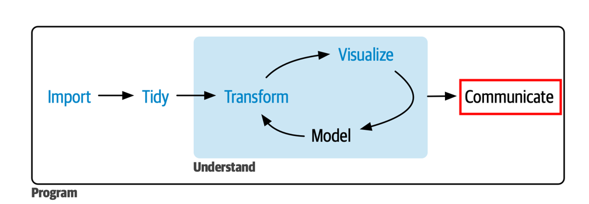
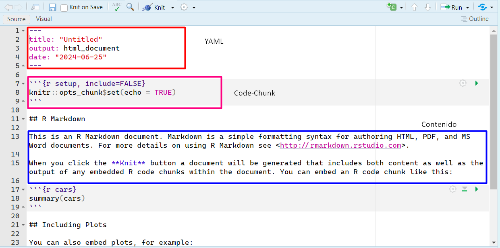
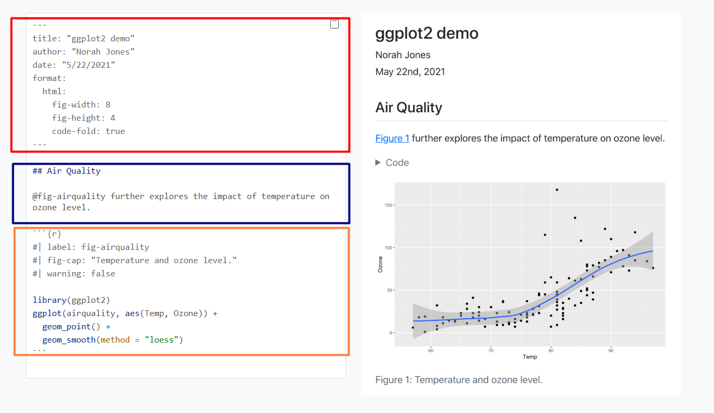



```{r}
#| include: false
library(pacman)
p_load(tidyverse, gapminder, knitr)
```

# ¡Bienvenid\@s a la Clase 4!

## Cierre de la Unidad I {.smaller .justify}

Esta es la **última clase** de la Unidad I: *Herramientas de Ciencia de
Datos con R*. El objetivo es cerrar el ciclo de trabajo con datos
aprendiendo a **comunicar** resultados de forma reproducible y a
**acelerar** nuestro flujo de trabajo con herramientas de IA generativa.

Los contenidos específicos de la clase son:

- Principios básicos para contar historias con datos.
- Qué son R Markdown y Quarto, y por qué preferimos Quarto.
- Estructura de un documento Quarto: YAML, chunks y texto.
- Aplicaciones de IA generativa para programar en R.

## Resumen Unidad I {.smaller}

| Clase | Contenido |
|----|----|
| **Clase 1** | Importar datos: `read_csv`, `read_excel`, `read_dta`, `left_join` |
| **Clase 2** | Transformar datos: `dplyr`, `tidyr`, `lubridate`, `forcats` |
| **Clase 3** | Visualizar datos: `ggplot2`, gramática de gráficos, extensiones |
| **Clase 4** | Comunicar: documentos reproducibles + IA generativa |

. . .

{width="80%" fig-align="center"}

# [Contar historias con datos]{style="color:white"} {background-color="#173277"}

## ¿Por qué contar una historia?

- La mayor parte de la visualización y el análisis de datos se realiza
  con el fin de **comunicar** algo a alguien [@schimel2012].
- Una historia es un conjunto de observaciones o hechos presentados en
  un orden que genera una **reacción** en la audiencia: curiosidad,
  sorpresa, convicción.
- La clave es construir un *arco narrativo* claro: ir de la **tensión**
  (el problema o la pregunta) hacia la **resolución** (el hallazgo o la
  recomendación).

## El marco SUCCES {.smaller}

Una buena historia con datos cumple seis principios [@heath2013]:

| Principio | ¿Qué significa? |
|----|----|
| **S**imple | El mensaje principal es claro y compacto |
| **U**nexpected | Presenta algo novedoso que genera curiosidad |
| **C**oncrete | Combina lo abstracto de las ideas con lo concreto de los datos |
| **C**redible | Se sustenta en datos y metodología robusta |
| **E**motional | Motiva a la audiencia: no solo informa, sino que genera conexión |
| **S**tories | Tiene una estructura interna coherente |

## Un plan para construir una historia con datos {.medium}

A continuación, se propone un plan de acción para construir una historia
con datos [@alexander2023]

1.  **Planifiquen** el punto final: ¿qué quieren que la audiencia
    recuerde o haga?
2.  **Exploren** los datos buscando patrones y hallazgos relevantes.
3.  **Diseñen** las visualizaciones que mejor comunican esos hallazgos.
4.  **Estructuren** la narrativa: contexto → hallazgo → implicancia.
5.  **Compartan** usando un formato reproducible (Quarto, R Markdown).

. . .

::: callout-tip
Piensen en el gráfico como el **punto focal** de la historia: si alguien
ve solo el gráfico sin leer el texto, ¿entiende el mensaje principal?
[@nussbaumerknaflic2025]
:::

# [Documentos reproducibles]{style="color:white"} {background-color="#173277"}

## ¿Por qué usar Quarto o R Markdown? {.medium}

El flujo tradicional implica:

1.  Analizar en R → copiar resultados → pegar en Word → formatear →
    exportar.
2.  Si los datos cambian → **repetir todo desde el paso 1**.

. . .

**R Markdown** y **Quarto** resuelven esto: integran código, resultados
y texto en **un solo archivo** que se compila automáticamente.

## ¿Qué es R Markdown? {.smaller}

- Entorno para crear documentos reproducibles que combinan **código R**,
  **resultados** (tablas, gráficos) y **texto narrativo** en un solo
  archivo `.Rmd`.
- Permite compilar (*knit*) a múltiples formatos: HTML, PDF, Word,
  PowerPoint.
- Fue creado por Yihui Xie (2014) y es mantenido por Posit (ex RStudio).

. . .

{width="70%" fig-align="center"}

::: aside
[@xie2019]
[bookdown.org/yihui/rmarkdown](https://bookdown.org/yihui/rmarkdown/)
:::

## ¿Qué es Quarto? {.smaller}

- **Quarto** (`.qmd`) es el sucesor de R Markdown: un sistema de
  publicación científica de **código abierto** construido sobre Pandoc
  [@quarto].
- Ventajas sobre R Markdown:
  - **Multilingüe**: funciona con R, Python y Julia.
  - **Todo en uno**: no necesita paquetes adicionales (bookdown,
    blogdown, xaringan) — todo está integrado.
  - **Herramientas modernas**: callouts, paneles con tabs, cross-
    references, layout avanzado, interactividad.
  - **Independiente de RStudio**: funciona desde VS Code, terminal,
    Jupyter.

::: {.aside .fragment}
Quarto (2022). [quarto.org](https://quarto.org/)
:::

## Características de cada uno {.smaller}

|   | R Markdown (`.Rmd`) | Quarto (`.qmd`) |
|----|----|----|
| **Lenguaje** | Solo R | R, Python, Julia |
| **Ecosistema** | Muchos paquetes separados | Todo integrado |
| **Funcionalidades** | Depende del paquete | Callouts, tabs, layouts nativos |
| **Recomendación de uso** | Proyectos existentes en `.Rmd` | **Proyectos nuevos** |

. . .

::: callout-tip
Para este curso y la **Tarea 1** podremos usar **Quarto** (`.qmd`) o **R
Markdown** (.Rmd). La sintaxis es casi idéntica a R Markdown, por lo que
si ya saben `.Rmd`, la transición es inmediata.
:::

. . .

::: callout-warning
## Atención

Aunque **Quarto** y **R Markdown** cumplen funciones similares, la sintaxis del encabezado YAML no es exactamente la misma.

Por ejemplo, para generar un documento HTML:

```yaml
# R Markdown
output: html_document
```

```yaml
# Quarto
format: html
```

Si copian código desde internet o utilizan IA generativa, verifiquen siempre si el ejemplo fue escrito para **R Markdown** o para **Quarto**, ya que algunos argumentos y opciones cambian entre ambos formatos.
:::

## Estructura de un documento Quarto {.smaller}

Un archivo `.qmd` tiene **tres componentes**:

{width="70%" fig-align="center"}

## 1. YAML (*Yet Another Markup Language*) {.smaller}

- Va al **inicio** del documento, delimitado por `---`.
- Define **metadatos** y opciones de configuración: título, autor,
  fecha, formato de salida, tabla de contenidos, tema, etc.

. . .

``` yaml
---
title: "Análisis de Homicidios en la RM"
author: "Gabriel Duarte"
date: "2026-06-20"
format:
  html:
    toc: true
    theme: flatly
    code-fold: true
execute:
  echo: true
  warning: false
---
```

## 2. Chunks de código {.smaller}

- Bloques delimitados por ```` ```{r} ```` y ```` ``` ```` que contienen
  código R ejecutable.
- Atajo para insertar: **Ctrl + Alt + I** (Mac: **Cmd + Option + I**).
- Se configuran con opciones `#|` al inicio del chunk:

. . .

```` markdown
```{{r}}
#| echo: true
#| eval: true
#| warning: false
#| fig-width: 8

library(ggplot2)
ggplot(mtcars, aes(x = wt, y = mpg)) +
  geom_point()
```
````

## Opciones más comunes de los chunks {.smaller}

| Opción                     | Efecto                                         |
|----------------------------|------------------------------------------------|
| `echo: true/false`         | ¿Muestra el código en el documento?            |
| `eval: true/false`         | ¿Ejecuta el código?                            |
| `warning: false`           | Oculta warnings                                |
| `message: false`           | Oculta mensajes                                |
| `include: false`           | Ejecuta pero no muestra ni código ni resultado |
| `fig-width` / `fig-height` | Tamaño del gráfico                             |
| `code-fold: true`          | Código colapsable (solo HTML)                  |

## 3. Texto en Markdown {.smaller}

- Todo lo que no es YAML ni chunk es **texto narrativo** escrito en
  Markdown:

. . .

| Sintaxis       | Resultado          |
|----------------|--------------------|
| `# Título`     | Encabezado nivel 1 |
| `## Subtítulo` | Encabezado nivel 2 |
| `**negrita**`  | **negrita**        |
| `*cursiva*`    | *cursiva*          |
| `` `código` `` | `código`           |
| `[texto](url)` | Hipervínculo       |
| `` | Imagen             |

## Compilar (*Render*) {.smaller}

- Para generar el documento final: **Ctrl + Shift + K** (Mac: **Cmd +
  Shift + K**), o hacer clic en el botón **Render**.
- Quarto convierte el `.qmd` → ejecuta el código → genera el
  HTML/PDF/Word.

. . .

::: callout-warning
Para generar documentos **PDF** se necesita una distribución de LaTeX.
La más sencilla es TinyTeX:

``` r
install.packages("tinytex")
tinytex::install_tinytex()
```
:::

# Demostración en vivo {background-color="#f8f9fa"}

## Crear un documento Quarto y R Markdown {.smaller}

::: {.callout-note style="font-size: 1.3em; text-align: center; padding: 2em;"}
## 🖥️ Demo: Crear un documento Quarto

1.  **File → New File → Quarto Document**
2.  Elegir título, autor y formato (HTML)
3.  Explorar la estructura: YAML, chunks, texto
4.  Insertar un chunk con un gráfico (`Ctrl + Alt + I`)
5.  Compilar con **Render** y ver el resultado

. . .

*(También veremos cómo crear un archivo R Markdown para comparar la
diferencia)*
:::

## Recursos útiles {.smaller}

- [Quarto — Get Started](https://quarto.org/docs/get-started/) — guía
  oficial de instalación y primeros pasos.
- [R for Data Science, Cap. 28: Quarto](https://r4ds.hadley.nz/quarto) —
  el libro de referencia del curso (Wickham & Grolemund).
- [R Markdown: The Definitive
  Guide](https://bookdown.org/yihui/rmarkdown/) — referencia completa de
  R Markdown (Xie et al., 2018).
- [Quarto Cheat Sheet](https://rstudio.github.io/cheatsheets/quarto.pdf)
  — resumen de una página.
- [Get started with Quarto — Mine
  Çetinkaya-Rundel](https://www.youtube.com/watch?v=_f3latmOhew) —
  tutorial en video (recomendado).

# [IA Generativa para programar en R]{style="color:white"} {background-color="#173277"}

## ¿Qué es la IA generativa? {.smaller}

- Es un tipo de Inteligencia Artificial capaz de **crear contenido nuevo**
  (texto, código, imágenes, audio, video) a partir de instrucciones en
  **lenguaje natural**.

- Su gran salto fue justamente ese: **añadir una capa de lenguaje
  natural**, de modo que ya no necesitamos ser expertos para "conversar"
  con la herramienta y pedirle lo que necesitamos.

- En el contexto de **ciencia de datos con R**, herramientas como
  **ChatGPT** (OpenAI), **Claude** (Anthropic), **Gemini** (Google) o
  **Copilot** (GitHub) pueden generar, explicar y corregir código.

. . .

::: callout-note
Esta clase no busca que deleguen el trabajo en la IA, sino que la usen
como una **extensión de sus capacidades** para programar mejor y más
rápido.
:::

## Ventajas y riesgos en programación {.smaller}

::: columns
::: {.column width="50%"}
::: {.fragment}
[**Ventajas** ✅]{style="color:green"}

- **Acelera** tareas repetitivas y código rutinario.
- Ayuda a **aprender** funciones y paquetes nuevos.
- Facilita **depurar** errores difíciles de leer.
- Permite **traducir** una idea en lenguaje natural a código.
:::
:::

::: {.column width="50%"}
::: {.fragment}
[**Riesgos** ⚠️]{style="color:red"}

- Puede generar código **incorrecto** o ineficiente.
- Riesgo de **no entender** lo que se copia y pega.
- Riesgos éticos en la producción de información y su uso en la toma de decisiones.
- **Privacidad**: Incumplimientos legales de privacidad de los datos.
:::
:::
:::

. . .

::: callout-tip
La regla de oro: **nunca usen código que no puedan explicar**. La IA
propone, pero ustedes deciden, verifican y entienden.
:::

## Herramientas que pueden usar {.smaller}

| Herramienta | Fortalezas principales |
|------------|------------------------|
| [Google Gemini](https://gemini.google.com/) | Integración con Google Colab, análisis de documentos extensos, programación y ciencia de datos. |
| [ChatGPT](https://chat.openai.com/) | Programación, estadística, generación y corrección de código, explicación de conceptos y apoyo al aprendizaje. |
| [Claude](https://claude.ai/) | Explicaciones detalladas, revisión de código largo, documentación y redacción técnica. |

Todas son **gratuitas** (con límites de uso) y requieren únicamente crear una cuenta.

::: callout-tip
Para este curso recomendamos **Google Gemini** porque permite ejecutar
código R directamente en **Google Colab** sin mayores requisitos.
:::

## Ingeniería de prompts: la clave {.smaller .justify}

Un **prompt** es la instrucción que le damos a la IA. La calidad de la
respuesta depende directamente de la calidad del prompt.

::: fragment
Un buen prompt tiene **4 componentes** [@white]:

1.  **Rol**: quién es la IA en este contexto.
2.  **Contexto**: qué datos tenemos, qué paquetes usamos.
3.  **Tarea**: qué queremos que haga, de forma específica.
4.  **Formato**: cómo queremos la respuesta.
:::

## Estructura de un buen prompt {.smaller}

::::::: columns
:::: {.column width="50%"}
::: {.fragment .fade-in}
[**Prompt vago**]{style="color:red"} ❌

*"Hazme un gráfico de barras en R"*

→ La IA no sabe qué datos usar, qué variable graficar ni qué estilo
aplicar.
:::
::::

:::: {.column width="50%"}
::: {.fragment .fade-in}
[**Prompt estructurado**]{style="color:green"} ✅

*"Eres un experto en R, tidyverse y visualización de datos con ggplot2.
Estoy trabajando con el dataset gapminder en R. Quiero analizar únicamente los datos correspondientes al año 2007. Genera un gráfico de dispersión entre PIB per cápita (gdpPercap) y esperanza de vida (lifeExp). Requisitos:
- Colorea los puntos según continente.
- Agrega una línea de tendencia lineal.
- Utiliza ggplot2.
- Utiliza sintaxis moderna con pipes (|>).
- Incluye comentarios breves en español.
Entrega únicamente el código en R."*
:::
::::
:::::::

## Anatomía de un buen prompt {.smaller}

Un buen prompt para programar combina **cuatro elementos**:

::: callout-tip
## Elementos para un buen prompt

**ROL**:
Eres un experto en R, tidyverse y visualización de datos con ggplot2.

**CONTEXTO:**
Estoy trabajando en R con el dataset `gapminder`. Ya filtré los datos para el año 2007 y la base contiene las variables `gdpPercap`, `lifeExp` y `continent`.

**TAREA:**
Necesito crear un gráfico de dispersión entre PIB per cápita y esperanza de vida, con los puntos coloreados por continente y una línea de tendencia lineal.

**FORMATO:**
Dame solo el código en R usando tidyverse y ggplot2. Incluye comentarios breves en español para explicar cada paso.
:::

. . .

::: callout-tip
Mientras más específico sea el contexto, más útil será la respuesta. La IA no solo necesita saber **qué quieres hacer**, sino también **con qué datos, paquetes y formato de salida**.
:::

# [Aplicaciones concretas]{style="color:white"} {background-color="#173277"}

<!-- ## Propuesta de plantilla {.smaller} -->

<!-- La mayoría de los prompts que utilizaremos seguirán la misma estructura: -->

<!-- 1. **Rol:** quién queremos que sea la IA. -->
<!-- 2. **Contexto:** qué datos o información tiene disponible. -->
<!-- 3. **Tarea:** qué queremos que haga. -->
<!-- 4. **Formato:** cómo queremos recibir la respuesta. -->

<!-- . . . -->

<!-- > [ROL: Eres un experto en R, tidyverse y visualización de datos]{style="color:red"}. [CONTEXTO: Estoy trabajando con el dataset gapminder en R]{style="color:blue"}. [TAREA: Describe exactamente lo que necesitas]{style="color:green"}. [FORMATO: -->
<!-- Dame únicamente código en R utilizando tidyverse. Incluye comentarios breves en español]{style="color:orange"}. -->

## Aplicación 1: Entender código existente {.smaller}

> Eres un experto en R y tidyverse.
Estoy aprendiendo análisis de datos con R y estoy trabajando con el dataset gapminder.
Explícame paso a paso qué hace el siguiente código y cuál es el resultado esperado. No modifiques el código.
gapminder |>
  filter(year == 2007) |>
  group_by(continent) |>
  summarise(
    esperanza_vida = mean(lifeExp)
  ).
Utiliza un lenguaje sencillo y explica cada función por separado antes de interpretar el resultado final.

. . .

::: callout-tip
Este uso es especialmente valioso para **aprender**: en vez de buscar
cada función por separado, obtienen una explicación contextualizada del
flujo completo.
:::

## Aplicación 2: Generar código {.smaller}

> Eres un experto en R, tidyverse y visualización de datos con ggplot2.
Estoy trabajando con el dataset gapminder en R. Quiero analizar únicamente los datos correspondientes al año 2007.
Genera un gráfico de dispersión entre PIB per cápita (gdpPercap) y esperanza de vida (lifeExp).
Requisitos:
- Colorea los puntos según continente.
- Agrega una línea de tendencia lineal.
- Utiliza ggplot2.
- Utiliza sintaxis moderna con pipes (|>).
- Incluye comentarios breves en español.
Entrega únicamente el código en R.

## Aplicación 3: Mejorar un resultado {.smaller}

Una vez obtenido el gráfico, podemos iterar:

> Mantén la lógica del gráfico anterior y realiza las siguientes mejoras:
- Agrega un título descriptivo.
- Agrega etiquetas para ambos ejes.
- Utiliza otro tema distinto sugerido.
- Mueve la leyenda a la parte inferior.
- Aumenta ligeramente el tamaño de los puntos.
Entrega únicamente el código actualizado en R.

. . .

::: callout-tip
La ventaja de este enfoque es que **ustedes mantienen el control**:
parten de código que ya entienden y le piden mejoras incrementales,
verificando cada resultado.
:::

## Un mal prompt {.smaller}


> Hazme un gráfico con gapminder.


¿Por qué es problemático?

- No especifica qué variables usar.
- No indica qué análisis realizar.
- No define el formato de salida.
- Distintas IA producirán resultados distintos.

. . .

Mientras más específico sea el prompt, más útil será la respuesta.

## Ejemplo en vivo con Gemini en Google Colab {.smaller}

::: {.callout-note style="font-size: 1.2em; text-align: center; padding: 2em;"}
## 🤖 Demo: IA generativa en acción

1.  Abrir [Google Colab](https://colab.research.google.com/) con R
2.  Usar Gemini integrado para:
    - **Explicar** un bloque de código
    - **Generar** un gráfico paso a paso
    - **Iterar** pidiendo mejoras al gráfico
3.  Ejecutar el resultado (ya sea en colab o en Rstudio)
:::

## Buenas prácticas con IA {.smaller}

- **Siempre verificar** el código generado: ejecutarlo, revisar el
  resultado, entender qué hace cada línea.
- **No copiar sin entender**: si no pueden explicar qué hace el código,
  no lo usen. La Tarea 1 requiere **justificación escrita**.
- **Iterar**: si la primera respuesta no es perfecta, refinan el prompt.
  La conversación es un ida y vuelta.
- **Citar**: si usaron IA para generar código, indíquenlo. La
  transparencia es parte de la integridad académica.
- **Aprender**: usen la IA como **tutor**, no como atajo. Pedir
  explicaciones es más valioso que pedir soluciones.

## 🧠 Pregunta N° 1 {.quiz-question .smaller}

Un alumno le pide a la IA: *"Hazme la tarea 1 del curso"*. ¿Cuál es el
principal problema con este prompt?

::: nonincremental
***¿Qué falla?***

- [Falta especificar el formato de
  salida]{data-explanation="El formato es un problema menor. El problema principal es que la IA no tiene contexto sobre qué es 'la tarea 1': no conoce los datos, los requisitos ni los criterios de evaluación."}
- [La IA no sabe programar en
  R]{data-explanation="Los LLMs actuales son bastante competentes en R. El problema no es la capacidad de la IA."}
- [Falta contexto, datos y una tarea específica]{.correct
  data-explanation="Correcto. Sin especificar qué datos usar, qué análisis hacer, qué paquetes emplear y qué formato de respuesta se espera, la IA no puede generar algo útil. Además, copiar sin entender viola la integridad académica."}
- [Debería usar Python en vez de
  R]{data-explanation="El lenguaje no es el problema. El prompt falla por falta de estructura, no por la elección de herramienta."}
:::

# Cierre de la Unidad I

## Tarea 1 {.smaller}

- **Fecha de entrega**: 28 de junio de 2026.
- **Formato**: documento Quarto (`.qmd`) o R Markdown (.Rmd) compilado a
  **HTML**.
- **Contenido**: manejo, transformación y visualización de datos con R.
- **Entrega**: a través de **webcursos** en el buzón correspondiente.

. . .

::: callout-important
## Recordatorio

La tarea es **individual**. El código debe estar completo y documentado
con comentarios. Se permite herramientas de IA generativa solo como
apoyo. Si usan funciones distintas a las vistas en clases o
explicitadas, deben justificarlo. La IA **no** reemplaza su trabajo,
solo lo puede potenciar y ayudar a entender mejor lo que hacen.
:::

## Próxima clase: Unidad II {.smaller}

A partir de la **Clase 5** comenzamos la Unidad II: *Estadística
Aplicada con R*, donde aprenderemos a:

- Realizar **inferencia estadística**: intervalos de confianza y pruebas
  de hipótesis.
- Construir modelos de **regresión lineal**.
- Usar el paquete `infer` para inferencia tidy.

. . .

::: callout-note
## Referencia principal Unidad II

[**ModernDive**](https://moderndive.com/v2/) — Ismay, Kim & Valdivia
(2025). *Statistical Inference via Data Science: A ModernDive into R and
the Tidyverse* (2ª ed.).
:::

## Recapitulación {.smaller}

| Tema | Contenido clave |
|----|----|
| **Comunicar** | Marco SUCCES, arco narrativo, estructura contexto → hallazgo → implicancia |
| **R Markdown** | Archivo `.Rmd`, compilar con *knit*, múltiples formatos de salida |
| **Quarto** | Archivo `.qmd`, sucesor de R Markdown, multilingüe, todo integrado |
| **Estructura** | YAML (metadatos) + Chunks (código) + Texto (Markdown) |
| **IA generativa** | Prompt = Rol + Contexto + Tarea + Formato |
| **Aplicaciones** | Explicar código, buscar funciones, modificar gráficos |

## Bibliografía {.smaller}
