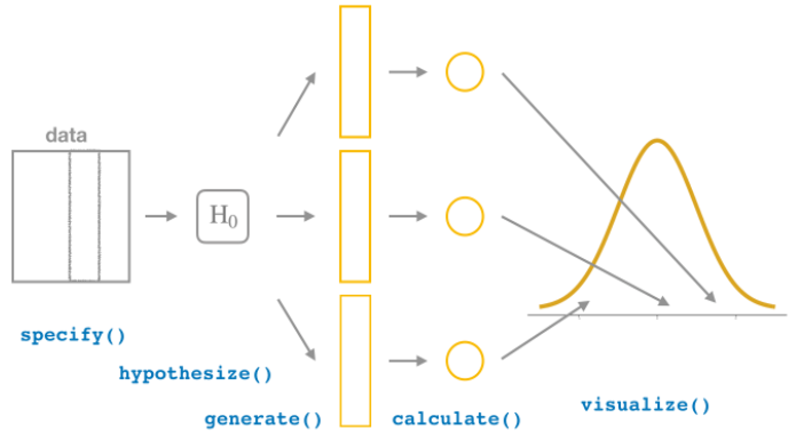
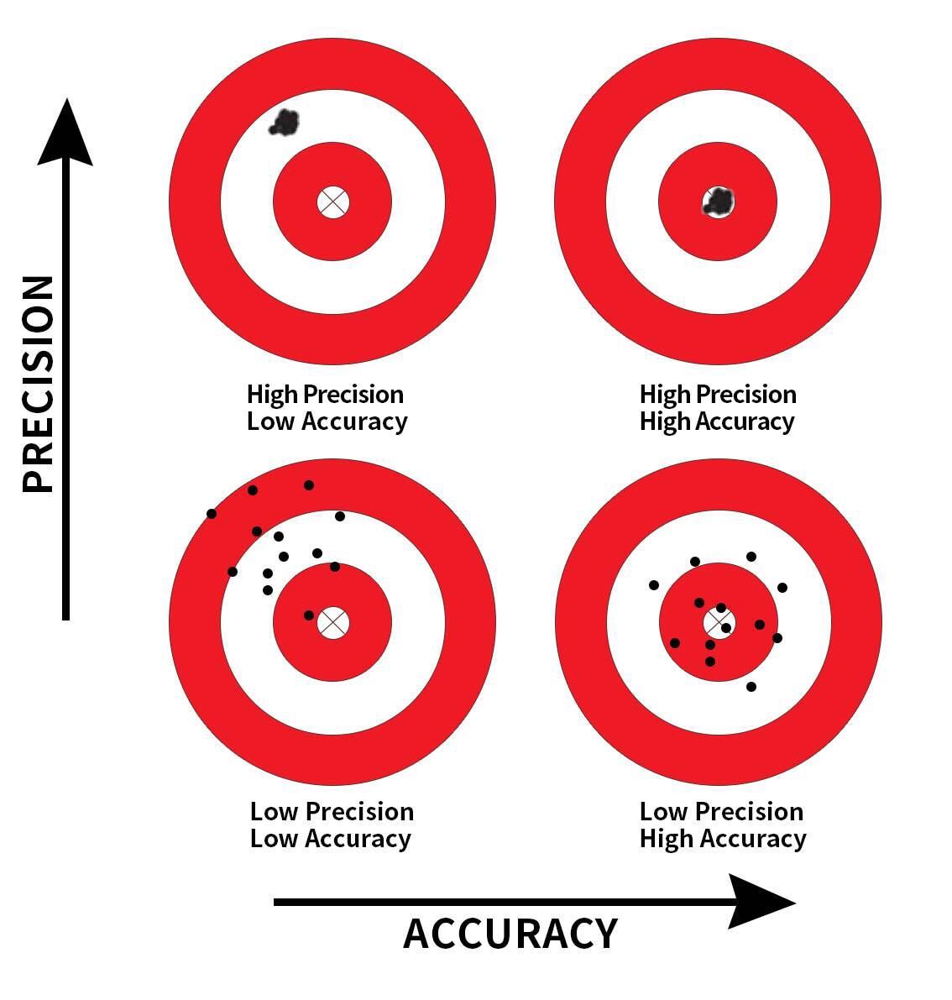



```{r}
#| include: false
library(pacman)
p_load(tidyverse, infer, moderndive, knitr)

theme_set(
  theme_classic(base_size = 16) +
  theme(
    plot.title    = element_text(face = "bold", size = 16, hjust = 0),
    plot.subtitle = element_text(size = 14, color = "#6B7C93", hjust = 0),
    legend.title  = element_text(face = "bold")
  )
)
```

# ¡Bienvenid\@s a la Clase 5!

## Inicio de la Unidad II {.smaller}

Comenzamos la **Unidad II: Estadística Aplicada con R**. Hasta ahora
describimos y visualizamos datos; ahora aprenderemos a **sacar
conclusiones** sobre una población a partir de una muestra.

Los objetivos de esta clase son:

- Distinguir entre **describir** e **inferir**.
- Entender el concepto de **parámetro** y **estimador**.
- Construir **intervalos de confianza** con *bootstrap*.
- Realizar **pruebas de hipótesis** y entender el **p-value**.
- Reconocer los **errores tipo I y tipo II**.

. . .

Usaremos el paquete **`infer`** [@ismay2025], que implementa la
inferencia de forma ordenada (*tidy*). También usaremos el paquete de la
referencia guía de la segunda unidad de este curso: `moderndive`

## Describir vs Inferir {.smaller}

::::::: columns
:::: {.column width="50%"}
::: fragment
[**Describir**]{style="color:steelblue"}

- Resume la información de los datos que **tenemos**.
- No conlleva incertidumbre: no hacemos una predicción sobre un
  resultado numérico.
- Ej: "el promedio de edad de **esta muestra** es 38 años".
:::
::::

:::: {.column width="50%"}
::: fragment
[**Inferir**]{style="color:#E49B0F"}

- Saca conclusiones sobre una **población** a partir de una **muestra**.
- Sí conlleva incertidumbre: sí hacemos predicciones numéricas.
- Ej: "el promedio de edad de **Chile** está entre 37 y 39 años".
:::
::::
:::::::

. . .

Las dos herramientas centrales de la inferencia son los **intervalos de
confianza** y las **pruebas de hipótesis** [@çetinkaya-rundel2024].

# [Población, muestra y parámetros]{style="color:white"} {background-color="#173277"}

## Población vs Muestra {.smaller}

- **Población** ($N$): el grupo completo que queremos estudiar (ej.
  todos los habitantes de Chile).
- **Muestra** ($n$): un subconjunto de la población obtenido mediante
  algún procedimiento de muestreo (ej. muestreo aleatorio).

. . .

![[@bruce2020]](img/pop_sample.png){width="60%" fig-align="center"}

## Parámetro vs Estimador {.smaller}

|   | Población | Muestra |
|------------------------|------------------------|------------------------|
| **Nombre** | Parámetro | Estimador (estadístico) |
| **¿Se conoce?** | Casi nunca (es lo que buscamos) | Sí, lo calculamos a partir de los datos |
| **Media** | $\mu$ | $\bar{x}$ |
| **Proporción** | $p$ | $\hat{p}$ |
| **Desv. estándar** | $\sigma$ | $s$ |

. . .

::: callout-tip
El objetivo de la inferencia es **estimar un parámetro desconocido**
(como $p$) usando un **estadístico** que sí podemos calcular (como
$\hat{p}$).
:::

## Nuestro ejemplo de hoy {.smaller}

Queremos estimar el **porcentaje de personas en Chile que se identifican
con un pueblo originario**.

- El verdadero valor de esa proporción (**parámetro** $p$) es
  desconocido.
- Para fines de esta clase, trabajaremos con una **población simulada**   en la que sí conocemos el valor real: $p = 0.30$ (29%).
- Esto nos permitirá **evaluar** si los métodos de inferencia que
  usaremos funcionan (son capaces de recuperar ese valor).

## Nuestro ejemplo de hoy {.smaller}
  
```{r}
#| echo: true
set.seed(2026)
# Población simulada: proporción real de pertenencia a pueblos originarios
# (valor poblacional conocido para fines pedagógicos)
poblacion <- tibble(
  p_originario = sample(c("si", "no"), size = 100745,
                        replace = TRUE, prob = c(0.3, 0.7))
)

# El parámetro poblacional (que en la vida real NO conoceríamos)
poblacion |>
  count(p_originario) |>
  mutate(prop = n / sum(n))
```

## Tomamos una muestra {.smaller}

En la práctica solo tenemos **una muestra** de esta población. Por
ejemplo, consideremos una muestra de 300 personas:

```{r}
#| echo: true
# Una única muestra de 300 personas
muestra <- poblacion |> slice_sample(n = 300)

muestra |>
  count(p_originario) |>
  mutate(prop = n / sum(n))
```

. . .

::: callout-warning
El estimador $\hat{p}$ de nuestra muestra **no es exactamente** 0.30. Y
si hiciéramos nuevos "muestreos", cada muestra nos entregaría un valor
distinto de $\hat{p}$. A esa variabilidad la llamamos **error
muestral**, y es precisamente lo que la inferencia busca cuantificar.
:::

## La pregunta clave {.smaller .justify}

::: {.callout-note style="font-size:1.2em"}
Si solo tenemos **una** muestra y su estimador $\hat{p}$...

¿cómo sabemos **qué tan lejos** puede estar del verdadero parámetro $p$?
:::

. . .

La respuesta está en entender cómo **variaría** nuestro estimador si
pudiéramos tomar muchas muestras. Para eso usaremos el **bootstrap**.

# [Intervalos de confianza]{style="color:white"} {background-color="#173277"}

## La idea del Bootstrap {.smaller .justify}

- **Problema**: solo tenemos una muestra, y no podemos volver a extraer
  más muestras de la población para estudiar la variabilidad de nuestras
  estimaciones.
- **Solución (*bootstrap*)**: tratamos nuestra primera muestra como si
  fuera la población y extraemos **nuevas muestras ("remuestreo") con
  reemplazo**, del mismo tamaño.

. . .

](img/bootstrap.png){width="60%"
fig-align="center"}

## ¿Por qué con reemplazo? {.smaller .justify}

- Si remuestreáramos **sin** reemplazo, siempre obtendríamos exactamente
  la misma muestra (los mismos 300 casos) por lo que todas las muestras
  serían idénticas.
- Con **reemplazo**, una misma persona puede ser seleccionada más de una
  vez, mientras que otras pueden no aparecer, generando muestras
  ("remuestras") **similares, pero no iguales**.
- Como cada remuestra es distinta, cada una produce un $\hat{p}$
  distinto → Al repetir este proceso muchas veces, podemos simular la
  **variabilidad** de nuestro estimador.

. . .

::: callout-tip
La distribución de los $\hat{p}$ de las remuestras se llama
**distribución bootstrap**, y aproxima cómo variaría nuestro estimador
entre muestras.
:::

## El paquete `infer`: la idea central {.smaller .justify}

Independientemente del test que usemos, siempre nos estamos haciendo la
**misma pregunta**:

::: {.callout-note style="font-size:1.1em"}
¿El efecto que observo en mis datos es **real**, o se explica simplemente
por el **azar** del muestreo?
:::

::: fragment
Para responderla, partimos asumiendo que **"el efecto observado se debió simplemente al azar."** (la hipótesis
nula $H_0$), y simulamos cómo se verían los datos en ese mundo. Si nuestro resultado observado es muy raro en ese mundo simulado, entonces rechazamos $H_0$.
:::

. . .

`infer` organiza esta lógica en **4 funciones** que se encadenan con `|>`:

```{r}
#| echo: true
#| eval: false
datos |>
  specify()    |>   # 1. ¿Qué variable(s) me interesan?
  hypothesize() |>  # 2. ¿Cuál es la hipótesis nula?
  generate()   |>   # 3. Simular datos bajo H₀
  calculate()       # 4. Calcular el estadístico en cada simulación
```

. . . 

::: {.aside .fragment}
Basado en la viñeta oficial de `infer`:
[infer.netlify.app](https://infer.netlify.app/articles/infer)
:::

## `specify()` y `hypothesize()` {.smaller}

::: columns
::: {.column width="50%"}
::: {.fragment}
[**`specify()`**]{style="color:#173277"} — *¿Qué quiero analizar?*

Define la variable de interés y, para proporciones, cuál es el "éxito":

```{r}
#| echo: true
#| eval: false
# Una proporción
gss |>
  specify(response = college,
          success = "degree")

# Una media
gss |>
  specify(response = hours)

# Relación entre dos variables
gss |>
  specify(age ~ partyid)
```

| Argumento | ¿Cuándo? |
|-----|------|
| `response` | Siempre |
| `success` | Si `response` es categórica (proporción) |
| `explanatory` | Si hay una segunda variable |
:::
:::

::: {.column width="50%"}
::: {.fragment}
[**`hypothesize()`**]{style="color:#173277"} — *¿Cuál es $H_0$?*

Declara la hipótesis nula. Solo tiene **un argumento** (`null`) con dos opciones:

```{r}
#| echo: true
#| eval: false
# H₀: la proporción es 0.30
gss |>
  specify(response = college,
          success = "degree") |>
  hypothesize(null = "point", p = 0.30)

# H₀: no hay relación entre variables
gss |>
  specify(college ~ partyid,
          success = "degree") |>
  hypothesize(null = "independence")
```

| `null =` | Significado | Parámetro extra |
|-----|------|-----|
| `"point"` | El valor es X | `p`, `mu`, `med`, `sigma` |
| `"independence"` | No hay relación | — |
:::
:::
:::

## `generate()` y `calculate()` {.smaller}

::: columns
::: {.column width="50%"}
::: {.fragment}
[**`generate()`**]{style="color:#173277"} — *Simular datos*

Genera `reps` repeticiones. El argumento `type` define **cómo** simula:

```{r}
#| echo: true
#| eval: false
generate(reps = 1000, type = "...")
```

| `type =` | ¿Qué hace? | ¿Cuándo usarlo? |
|-----|------|------|
| `"bootstrap"` | Remuestra **con reemplazo** de la muestra original | Intervalos de confianza |
| `"draw"` | Genera datos **desde $H_0$** con los parámetros de `hypothesize()` | Prueba de hipótesis (un parámetro) |
| `"permute"` | Reordena aleatoriamente la variable explicativa | Prueba de independencia |
:::
:::

::: {.column width="50%"}
::: {.fragment}
[**`calculate()`**]{style="color:#173277"} — *Resumir cada simulación*

Calcula un estadístico en cada una de las `reps` repeticiones:

```{r}
#| echo: true
#| eval: false
calculate(stat = "...")
```

| `stat =` | ¿Qué calcula? |
|-----|------|
| `"prop"` | Proporción |
| `"mean"` | Media |
| `"diff in props"` | Diferencia de proporciones |
| `"diff in means"` | Diferencia de medias |
| `"slope"` | Pendiente de regresión |
| `"Chisq"`, `"t"`, `"F"` | Estadísticos clásicos |

El resultado es un tibble con 1.000 filas (una por simulación), listo
para `visualise()`, `get_p_value()` o `get_confidence_interval()`.
:::
:::
:::

## Resumen `infer` {.smaller .justify}

`infer` implementa la inferencia en **pasos ordenados** que se leen como una receta:

| Función                     | ¿Qué hace?                                   |
|----------------------------|--------------------------------------------|
| `specify()`                 | Define la variable de respuesta y el "éxito" |
| `generate()`                | Genera las remuestras (bootstrap)            |
| `calculate()`               | Calcula el estadístico en cada remuestra     |
| `get_confidence_interval()` | Construye el intervalo de confianza          |
| `visualise()`               | Grafica la distribución                      |

## Resumen `infer` {.smaller .justify}



## Paso 1: `specify()` {.smaller}

Especificamos cuál es la variable y qué valor es el "éxito":

```{r}
#| echo: true
muestra |>
  specify(response = p_originario, success = "si")
```

. . .

Esto le dice a `infer`: *"voy a trabajar con la variable `p_originario`
y me interesa la proporción de `si`"*.

## Paso 2 y 3: `generate()` + `calculate()` {.smaller}

Generamos 1.000 remuestras *bootstrap* y calculamos la proporción en
cada una:

```{r}
#| echo: true
distribucion_bootstrap <- muestra |>
  specify(response = p_originario, success = "si") |>
  generate(reps = 1000, type = "bootstrap") |>
  calculate(stat = "prop")

head(distribucion_bootstrap, 4)
```

. . .

Obtenemos 1.000 valores de $\hat{p}$, uno por remuestra.

## Visualizar la distribución bootstrap {.smaller}

```{r}
#| echo: true
#| fig-height: 4
distribucion_bootstrap |>
  visualise()
```

. . .

La distribución está **centrada en nuestro estimador** y tiene forma
acampanada (aproximadamente normal).

## 💻 Practiquemos: distribución bootstrap {.smaller}

Usando el dataset `bootstrap_props` ya cargado, complete el código para
generar **500 remuestras bootstrap** de la proporción y visualícelas.

```{webr}
library(infer)
library(dplyr)

# Muestra de ejemplo: 250 personas, variable "respuesta" (si/no)
muestra_ej <- tibble(
  respuesta = sample(c("si", "no"), 250, replace = TRUE, prob = c(0.4, 0.6))
)

muestra_ej |>
  specify(response = respuesta, success = "___") |>
  generate(reps = ___, type = "bootstrap") |>
  calculate(stat = "___") |>
  visualise()
```

## Construir el intervalo de confianza {.smaller}

Un **intervalo de confianza (IC)** entrega un **rango de valores
plausibles** para el parámetro. Con `infer`:

```{r}
#| echo: true
ic <- distribucion_bootstrap |>
  get_confidence_interval(level = 0.95, type = "percentile")
ic
```

. . .

El método de **percentiles** toma los percentiles 2.5 y 97.5 de la
distribución bootstrap, dejando el 95% central en el medio.

## Visualizar el IC {.smaller}

```{r}
#| echo: true
#| fig-height: 4
distribucion_bootstrap |>
  visualise() +
  shade_confidence_interval(endpoints = ic)
```

## Interpretar el intervalo de confianza {.smaller .justify}

Nuestro IC al 95% fue aproximadamente `r round(ic[[1]], 3)` a
`r round(ic[[2]], 3)`.

::: fragment
**¿Qué significa esto?**

> "Con un 95% de confianza, el porcentaje real de personas que se
> identifican con un pueblo originario está entre el
> `r round(ic[[1]]*100, 1)`% y el `r round(ic[[2]]*100, 1)`%."
:::

. . .

::: callout-warning
## Cuidado con la interpretación

El 95% **no** significa que hay 95% de probabilidad de que el parámetro
esté en *este* intervalo. Significa que si repitiéramos el proceso
muchas veces, deberíamos capturar el valor verdadero del parámetro
aproximadamente el 95% de las veces.
:::

## ¿Funcionó? {.smaller}

Recordemos que el valor **real** (que simulamos) era $p = 0.30$:

```{r}
#| echo: true
ic
```

. . .

::: callout-tip
¡El intervalo **contiene** el valor real de 0.30! Esto ilustra que el
método funciona: en el largo plazo, el 95% de los intervalos así
construidos capturan el verdadero parámetro.
:::

## ¿Qué afecta el ancho del IC? {.smaller}

::::::: columns
:::: {.column width="50%"}
::: fragment
**Nivel de confianza** ↑

- Mayor confianza (99% vs 95%) → intervalo **más ancho**.
- Más exactitud, menos precisión.
:::
::::

:::: {.column width="50%"}
::: fragment
**Tamaño muestral** ($n$) ↑

- Muestra más grande → intervalo **más angosto**.
- Más datos, más precisión.
:::
::::
:::::::

. . .

::: callout-tip
Existe un *trade-off* entre **confianza** y **precisión**. Para ganar
ambas a la vez, necesitamos **más datos**.
:::

{fig-align="center" width="30%"}

## 🧠 Pregunta N° 1 {.quiz-question .smaller}

Un estudio estima, con un IC al 95%, que la tasa de aprobación de una
política está entre **42% y 48%**. ¿Cuál interpretación es correcta?

::: nonincremental
***Seleccione la opción correcta***

- [Exactamente el 95% de las personas aprueban la
  política]{data-explanation="El 95% es el nivel de confianza del método, no un porcentaje de personas. La estimación de aprobación está entre 42% y 48%."}
- [Hay 95% de probabilidad de que el valor real esté en este intervalo
  específico]{data-explanation="Esta es la interpretación frecuentista incorrecta más común. El parámetro real es fijo; es el intervalo el que varía entre muestras."}
- [Si repitiéramos el muestreo muchas veces, el 95% de los intervalos
  contendrían el valor real]{.correct
  data-explanation="Correcto. El nivel de confianza describe el comportamiento del método a largo plazo: el 95% de los intervalos construidos de esta forma capturan el parámetro."}
- [El valor real es necesariamente 45% (el punto
  medio)]{data-explanation="El punto medio es nuestra mejor estimación puntual, pero el valor real puede ser cualquier punto dentro del intervalo (o incluso fuera, con 5% de probabilidad)."}
:::

## Ejercicio Guiado {.smaller}

En la **guía de ejercicios** construiremos un IC paso a paso con datos
reales del Censo:

1.  Calcular la proporción poblacional y la de una muestra.
2.  Generar 1.000 remuestras *bootstrap* con `infer`.
3.  Construir el IC con los métodos de **percentiles** y **error
    estándar**.
4.  Verificar si el IC contiene el valor real del parámetro.

# [Pruebas de hipótesis]{style="color:white"} {background-color="#173277"}

## La lógica de una prueba de hipótesis {.smaller .justify}

- Una **prueba de hipótesis** evalúa si los datos son **compatibles**
  con una afirmación sobre la población.
- Funciona como un **juicio**: asumimos la "inocencia" (hipótesis nula)
  y vemos si la evidencia (los datos) es suficiente para rechazarla.

. . .

::: callout-tip
La pregunta clave es: *"¿qué tan sorprendentes serían nuestros datos
**si** la hipótesis nula fuera cierta?"*
:::

## Hipótesis nula y alternativa {.smaller}

|   | Símbolo | ¿Qué afirma? |
|-----------------------|-----------------------|---------------------------|
| **Hipótesis nula** | $H_0$ | No hay efecto / el valor es el esperado. *"Status quo"* |
| **Hipótesis alternativa** | $H_A$ | Sí hay efecto / el valor es distinto |

. . .

**Ejemplo**: El Ministerio del Trabajo afirma que el **80%** de los
beneficiarios de un programa de capacitación encuentra empleo dentro de
los seis meses posteriores a su egreso. Un investigador selecciona
aleatoriamente 200 egresados para evaluar la efectividad del programa.

- $H_0: p = 0.80$ (el Ministerio tiene razón)
- $H_A: p \neq 0.80$ (la proporción real es distinta)

## El p-value {.smaller .justify}

::: {.callout-note style="font-size:1.1em"}
El **p-value** es la probabilidad de observar un resultado **tan extremo
o más extremo** que el observado en la muestra, **suponiendo que** la
hipótesis nula ($H_0$) es verdadera.
:::

. . .

- **p-value pequeño** (\< 0.05): los datos observados serían muy raros
  (poco probables) si $H_0$ fuera verdadera → Existe evidencia
  suficiente para **rechazar** $H_0$.
- **p-value grande** (≥ 0.05): los datos observados son compatibles con
  $H_0$ → **No** existe **evidencia suficientes** para rechazar $H_0$.

. . .

El umbral (ej. 0.05) se llama **nivel de significancia** ($\alpha$) y se
fija **antes** de ver los datos.

## Ejemplo: Programa de capacitación del Ministerio del Trabajo {.smaller}

De 200 egresados, 146 estaban empleados:

```{r}
#| echo: true
datos_mintrab <- tibble(
  empleo6m = c(rep("ocupado", 146), rep("desocupado", 54))
)

p_hat <- datos_mintrab |>
  specify(response = empleo6m, success = "ocupado") |>
  calculate(stat = "prop")
p_hat
```

. . .

Observamos $\hat{p} = 0.73$. El Ministerio afirma $p = 0.80$. ¿Es 0.73
lo suficientemente lejos de 0.80 para rechazar su afirmación?

## Simular el "mundo de $H_0$" con `infer` {.smaller}

Generamos la **distribución nula**: cómo se vería $\hat{p}$ en muchas
muestras **si realmente** $p = 0.80$:

```{r}
#| echo: true
distribucion_nula <- datos_mintrab |>
  specify(response = empleo6m, success = "ocupado") |>
  hypothesise(null = "point", p = 0.80) |>
  generate(reps = 1000, type = "draw") |>
  calculate(stat = "prop")

head(distribucion_nula, 3)
```

. . .

La novedad es `hypothesise()`: le decimos a `infer` que simule un mundo
donde $H_0$ es cierta.

## Visualizar el p-value {.smaller}

```{r}
#| echo: true
#| fig-height: 3.8
distribucion_nula |>
  visualise(bins = 15) +
  shade_p_value(obs_stat = p_hat, direction = "both")
```

. . .

El área sombreada (las dos colas) es el **p-value**: qué tan probable es
obtener un valor tan extremo como 0.73 si $p = 0.80$.

## Calcular el p-value y decidir {.smaller}

```{r}
#| echo: true
p_value <- distribucion_nula |>
  get_p_value(obs_stat = p_hat, direction = "both")
p_value
```

. . .

```{r}
#| echo: true
p_value < 0.05
```

. . .

::: callout-tip
Como el p-value es **menor que 0.05**, **rechazamos** $H_0$: la
evidencia sugiere que la proporción real de egresados con empleo a los 6
meses de haber terminado la capacitación **no es** el 80% que afirma el
Ministerio del Trabajo.
:::

## 💻 Practiquemos: prueba de hipótesis {.smaller}

Una moneda se lanza 100 veces y sale cara 60 veces. ¿Es justa
($p = 0.5$)? Complete el código:

```{webr}
library(infer)
library(dplyr)

lanzamientos <- tibble(
  resultado = c(rep("cara", 60), rep("sello", 40))
)

p_hat <- lanzamientos |>
  specify(response = resultado, success = "cara") |>
  calculate(stat = "prop")

lanzamientos |>
  specify(response = resultado, success = "cara") |>
  hypothesise(null = "point", p = ___) |>
  generate(reps = 1000, type = "draw") |>
  calculate(stat = "prop") |>
  get_p_value(obs_stat = ___, direction = "both")
```

## Conexión entre IC y prueba de hipótesis {.smaller .justify}

Las dos herramientas están conectadas:

::: fragment
> Si un **IC al 95%** **no contiene** el valor de $H_0$, entonces
> rechazaríamos $H_0$ a un nivel de significancia del 5%.
:::

. . .

En el ejemplo anterior, el IC al 95% fue aproximadamente \[0.67, 0.79\].
Como **no contiene** el 0.80 del Ministerio del Trabajo, llegamos a la
**misma conclusión**: rechazamos $H_0$.

```{r}
#| echo: true
between(0.80, 0.67, 0.79)   # ¿El 0.80 está dentro del IC?
```

## 🧠 Pregunta N° 2 {.quiz-question .smaller}

Realizamos una prueba de hipótesis con $\alpha = 0.05$ y obtenemos un
**p-value de 0.12**. ¿Qué concluimos?

::: nonincremental
***Seleccione la opción correcta***

- [Rechazamos $H_0$ porque el p-value es
  positivo]{data-explanation="No basta con que el p-value sea positivo; siempre lo es. Se compara con el nivel de significancia α."}
- [No rechazamos $H_0$ porque el p-value (0.12) es mayor que
  0.05]{.correct
  data-explanation="Correcto. Como el p-value supera el umbral α = 0.05, los datos son compatibles con H0 y no tenemos evidencia suficiente para rechazarla."}
- [Probamos que $H_0$ es
  verdadera]{data-explanation="Una prueba de hipótesis nunca 'prueba' que H0 sea verdadera; solo concluye que no hay evidencia suficiente para rechazarla. Ausencia de evidencia no es evidencia de ausencia."}
- [El resultado no es válido porque el p-value debe ser menor a
  0.05]{data-explanation="Un p-value mayor a 0.05 es un resultado perfectamente válido: simplemente indica que no rechazamos la hipótesis nula."}
:::

# [Errores de decisión]{style="color:white"} {background-color="#173277"}

## Errores Tipo I y Tipo II {.smaller}

Como decidimos bajo incertidumbre, podemos equivocarnos de dos formas:

|   | $H_0$ es **verdadera** | $H_0$ es **falsa** |
|------------------------|------------------------|------------------------|
| **Rechazamos** $H_0$ | ❌ Error Tipo I ($\alpha$) | ✅ Decisión correcta |
| **No rechazamos** $H_0$ | ✅ Decisión correcta | ❌ Error Tipo II ($\beta$) |

. . .

- **Error Tipo I**: rechazar $H_0$ cuando era verdadera (*falso
  positivo*).
- **Error Tipo II**: no rechazar $H_0$ cuando era falsa (*falso
  negativo*).

## Una analogía: el juicio {.smaller}

En un juicio, $H_0$ = "el acusado es inocente":

::::::: columns
:::: {.column width="50%"}
::: fragment
**Error Tipo I** ❌

Condenar a un **inocente**.

(Rechazamos la inocencia cuando era verdadera)
:::
::::

:::: {.column width="50%"}
::: fragment
**Error Tipo II** ❌

Liberar a un **culpable**.

(No rechazamos la inocencia cuando era falsa)
:::
::::
:::::::

. . .

::: callout-tip
El nivel de significancia $\alpha$ (ej. 0.05) es precisamente la
probabilidad que estamos dispuestos a aceptar de cometer un **error tipo
I**. Por eso lo fijamos bajo.
:::

## 🧠 Pregunta N° 3 {.quiz-question .smaller}

Un test médico tiene como $H_0$: "el paciente está sano". El test
concluye que la persona está enferma, pero en realidad **estaba sana**.
¿Qué tipo de error se cometió?

::: nonincremental
***Seleccione la opción correcta***

- [Error Tipo I (falso positivo)]{.correct
  data-explanation="Correcto. Se rechazó H0 ('está sano') cuando en realidad era verdadera. Es un falso positivo: el test detecta una enfermedad que no existe."}
- [Error Tipo II (falso
  negativo)]{data-explanation="El error tipo II sería lo contrario: no detectar la enfermedad en alguien que sí la tiene (no rechazar H0 siendo falsa)."}
- [No se cometió ningún
  error]{data-explanation="Sí hubo un error: el test dio un resultado positivo en una persona sana."}
- [Ambos errores
  simultáneamente]{data-explanation="Los errores tipo I y II son mutuamente excluyentes: dependen de si rechazamos o no H0, no pueden ocurrir a la vez en una misma decisión."}
:::

# Recapitulación

## ¿Qué aprendimos hoy? {.smaller}

| Concepto | Idea clave |
|---------------------------------|---------------------------------------|
| **Parámetro vs estimador** | $p$ (desconocido) se estima con $\hat{p}$ (de la muestra) |
| **Bootstrap** | Remuestrear con reemplazo para simular la variabilidad |
| **Intervalo de confianza** | Rango de valores plausibles para el parámetro |
| **Hipótesis** | $H_0$ (status quo) vs $H_A$ (hay efecto) |
| **p-value** | Probabilidad de un resultado tan extremo si $H_0$ es cierta |
| **Errores** | Tipo I (falso positivo, $\alpha$) y Tipo II (falso negativo, $\beta$) |

## El flujo de `infer` {.smaller}

```{r}
#| echo: true
#| eval: false
# Intervalo de confianza
muestra |>
  specify(response = var, success = "si") |>
  generate(reps = 1000, type = "bootstrap") |>
  calculate(stat = "prop") |>
  get_confidence_interval(level = 0.95)

# Prueba de hipótesis
muestra |>
  specify(response = var, success = "si") |>
  hypothesise(null = "point", p = 0.8) |>
  generate(reps = 1000, type = "draw") |>
  calculate(stat = "prop") |>
  get_p_value(obs_stat = p_hat, direction = "both")
```

. . .

La próxima clase usaremos estos conceptos para la **regresión lineal**.

## Bibliografía {.smaller}
