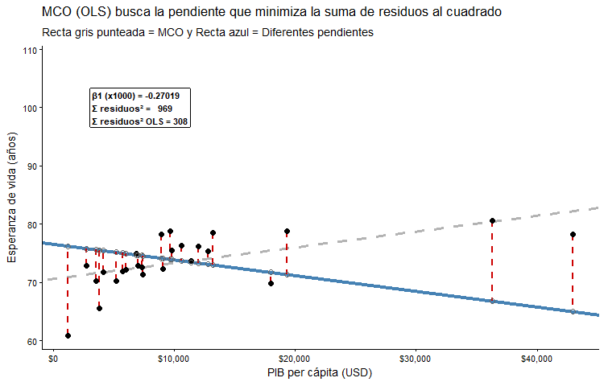



```{r}
#| include: false
library(pacman)
p_load(tidyverse, broom, modelsummary, wooldridge, knitr, ggpmisc, ggrepel, moderndive, ggdag)

theme_set(
  theme_classic(base_size = 16) +
  theme(
    plot.title    = element_text(face = "bold", size = 16, hjust = 0),
    plot.subtitle = element_text(size = 14, color = "#6B7C93", hjust = 0),
    legend.title  = element_text(face = "bold")
  )
)

data(wage1)
data(hprice1)
data(jtrain2)
```

# ¡Bienvenid\@s a la Clase 6!

## Objetivos Clase 6 {.smaller .justify}

En esta clase aprenderemos a **estimar** cuantitativamente la relación
entre dos variables usando un modelo de **regresión lineal simple**. Los
modelos de regresión lineal son una de las herramientas fundamentales
dentro de la econometría aplicada.

Los objetivos específicos de esta clase son:

- Entender el proceso de ir de una **pregunta de interés** a un **modelo
  econométrico**.
- Estimar una regresión con `lm()` e interpretar sus resultados.
- Comprender por qué el método de estimación de Mínimos Cuadrados
  Ordinarios (**MCO u *OLS* en inglés)** tiene propiedades deseables y
  cuáles son las condiciones que lo aseguran (Teorema Gauss-Markov).
- Interpretar coeficientes $\beta$, $R^2$ y significancia estadística.
- Distinguir **correlación** de **causalidad**.

# [De la pregunta al modelo]{style="color:white"} {background-color="#173277"}

## ¿Qué es la econometría? {.medium}

- La econometría desarrolla métodos estadísticos para **estimar
  relaciones económicas**, **probar teorías** y **evaluar e implementar
  políticas públicas** mediante datos [@wooldridge2020].

- Algunas preguntas que la econometría puede ayudar a responder:

  - ¿Cuál es el retorno salarial de un año más de educación?
  - ¿Qué efecto tiene un aumento del salario mínimo sobre el empleo?
  - ¿Un aumento de la dotación policial reduce los delitos?

. . .

::: callout-warning
## Aclaración importante

A diferencia de los **experimentos controlados**, la econometría trabaja
principalmente con **datos observacionales**, en donde el investigador
**no controla** la asignación de las variables. Una de las implicancias
de esto, es que para distinguir entre asociaciones de variables y
causalidad, se requieren métodos econométricos específicos.
:::

## De la pregunta al modelo: 3 pasos {.smaller}

Para aplicar un modelo econométrico y extraer conclusiones de la
relación entre las variables de un conjunto de datos, es recomendable
seguir los siguientes pasos:

::: fragment
**1. Formular la pregunta de interés:**

> Ej: ¿Cuál es el efecto de un año adicional de educación en el salario
> de una persona?
:::

::: fragment
**2. Especificar un modelo econométrico:** Una vez definida la pregunta
de interés, es importante pensar en las variables que permiten la
relación y estimación del objetivo de estudio

$$wage = \beta_0 + \beta_1 \cdot educ + u$$

Donde $u$ recoge todo lo que **no observamos** (habilidad, motivación,
etc.).
:::

::: fragment
**3. Estimar el modelo con datos y contrastar hipótesis.**

$$H_0:\beta = 0\\
H_1:\beta \neq 0 $$
:::

. . .

::: callout-tip
## Resumen

El orden recomendado para iniciar una investigación cuantitativa
empírica es: **pregunta → modelo → datos → estimación →
interpretación**.
:::

## Tipos de datos {.smaller}

| Tipo | Descripción | Ejemplo |
|----------------------|-------------------------|-------------------------|
| **Corte transversal** | Observaciones en **un** momento del tiempo | Encuesta CASEN 2024 |
| **Serie de tiempo** | **Una** unidad observada en múltiples períodos | PIB trimestral de Chile |
| **Corte transversal combinado** | Muestras distintas en distintos períodos | CASEN 2022 + 2024 |
| **Panel (longitudinal)** | Las **mismas** unidades seguidas en el tiempo | Estudio Longitudinal Social de Chile (ELSOC) |

## Tipos de datos {.smaller}

![Elaborado con IA en función de la tabla resumen en base a
[@wooldridge2020]](img/tipos-de-datos.png){width="80%"
fig-align="center"}

::: {.callout-note .fragment}
## Nota

En este curso trabajaremos principalmente con datos de **corte
transversal**. Una de sus ventajas es que, bajo ciertas condiciones,
podemos asumir que los datos fueron obtenidos mediante un **muestreo
aleatorio**.
:::

## Dataset de ejemplo: `wage1` [@wooldridge2020] {.smaller}

526 trabajadores estadounidenses con información sobre salario,
educación, experiencia y características demográficas:

```{r}
#| echo: true
data(wage1)
glimpse(wage1)
```

## Variables principales de `wage1` {.smaller}

| Variable   | Descripción                       |
|------------|-----------------------------------|
| `wage`     | Salario por hora (USD de 1976)    |
| `educ`     | Años de educación formal          |
| `exper`    | Años de experiencia laboral       |
| `tenure`   | Años en el empleo actual          |
| `female`   | 1 si es mujer, 0 si es hombre     |
| `nonwhite` | 1 si no es blanco, 0 si es blanco |
| `lwage`    | Logaritmo natural del salario     |

## Exploración visual {.smaller}

¿Se ve una relación entre educación y salario?

```{r}
#| echo: true
ggplot(wage1, aes(x = educ, y = wage)) +
  geom_point(alpha = 0.4, color = "steelblue") +
  labs(x = "Años de educación", y = "Salario por hora (USD)") +
  theme_classic(base_size = 14)
```

. . .

Parece haber una tendencia positiva, pero con mucha dispersión. ¿Podemos
**cuantificar** esa relación?

## Exploración visual {.smaller}

Si ajustamos una recta se ve más clara la relación, pero ¿cómo obtenemos
esta recta?

```{r}
library(ggpmisc)
#| echo: true
ggplot(wage1, aes(x = educ, y = wage)) +
  geom_point(alpha = 0.4, color = "steelblue") +
  geom_smooth(method = "lm", se = F, color = "red3") +
  # stat_poly_line() +
  # ggpmisc::stat_poly_eq(use_label(c("eq", "R2", "P"))) +
  labs(x = "Años de educación", y = "Salario por hora (USD)") +
  theme_classic(base_size = 14)
```

# [La recta de mejor ajuste: MCO]{style="color:white"} {background-color="#173277"}

## Ecuación de la recta {.smaller .justify}

- ¿Recuerdan la ecuación de la recta que vieron en clases de
  matemáticas?

. . .

$$y = mx + n$$

donde $m$ es la pendiente de la recta y $b$ es el intercepto (donde
corta la recta en el eje **y**). Por ejemplo:

```{r ec_recta, echo = FALSE, out.width="80%"}
#| out-width: "50%"
m <- 2
b <- 1

datos_recta <- tibble(
  x = 0:5,
  y = m * x + b
)

datos_recta |> 
  ggplot(aes(x = x, y = y)) +
  geom_point(size = 2) +
  geom_line(linewidth = 1) +
  scale_x_continuous(breaks = seq(0,6,1), limits = c(0,5.5), expand = c(0.0, 0.0)) +
  scale_y_continuous(breaks = datos_recta$y, limits = c(0,11), expand = c(0.01, 0.01)) +
  labs(
    x = "x",
    y = "y"
  ) +
  theme_classic()
```

. . .

$$y = 2x + 1$$ con $m=2$ y $n=1$

## Una comparación útil {.smaller .justify}

::::::: columns
:::: {.column width="50%"}
::: {.fragment .fade-in}
Clase de **matemáticas**:

- $y = n + mx$

- $n$ es el intercepto en el eje

- $m$ es la pendiente
:::
::::

:::: {.column width="50%"}
::: {.fragment .fade-in}
Clase de **econometría**:

- $\hat{y} = \hat{\beta}_0 +\hat{\beta}_1x +  \hat{\mu}$

- $\hat{\beta}_0$ es el intercepto en el eje x

- $\hat{\beta}_1$ es la pendiente

- $\hat{u}$ es el residuo o la diferencia entre lo observado y lo
  estimado: $\hat{u} = y_i - \hat{y_i}$
:::
::::
:::::::

- $\hat{\beta}_0$ y $\hat{\beta}_1$ se conocen también como coeficientes
  de regresión y serán nuestros **parámetros a estimar**.

- $\hat{y}$ lo denominamos como los **valores ajustados**, o bien, los
  valores estimados por nuestra función para cada valor posible de $x$.

## Definición del modelo de regresión simple {.smaller}

Si contamos con dos variables ($x$ e $y$) y estamos interesados en
**explicar** $y$ en términos de $x$, o bien, como varía $y$ cuando $x$
cambia, un modelo de regresión lineal simple nos puede ayudar a
formalizar el planteamiento de este problema matemáticamente y estimar
un parámetro ($\beta_1$) que describa esta relación:

. . .

$$y = \beta_0 + \beta_1x + \mu$$ Donde $\beta_0$ es el intercepto,
$\beta_1$ la pendiente y $\mu$ el término de error que representa todos
los factores distintos de $x$ que afectan a $y$. En este sentido, el
término de error ($\mu$) también se conoce como *inobservable*.

- Notar que el modelo de regresión anterior es un **modelo poblacional**
  o **teórico**: describe la relación entre $x$ e $y$ en la población.
  Sin embargo, en la práctica no conocemos los valores reales de
  $\beta_0$ ni de $\beta_1$, por lo que debemos estimarlos.

## Valores predichos $\hat{y}$ y residuos $\hat{u}$ {.smaller}

- En la práctica, dado que solo observamos una muestra de datos,
  estimamos una recta que describa nuestra *"mejor predicción"* para $y$
  dado los valores de $x$. Asumiendo que $E(\mu) = 0$ y que
  $Cov(x,\mu) = 0$ tenemos que:

. . .

$$\hat{y} = \hat{\beta}_0 + \hat{\beta}_1x$$

donde $\hat{y}$ representa el valor de $y$ **predicho o ajustado** por
el modelo para cada valor de $x$.

- Algo similar ocurre con el **error** y el **residuo**. En el modelo
  poblacional, $\mu$ representa el error verdadero, es decir, todos los
  factores no observados que afectan a $y$. Pero como no conocemos la
  relación verdadera, tampoco observamos directamente $\mu$, mientras
  que en la muestra, lo que sí podemos calcular es el **residuo**:

. . .

$$\hat{u} = y - \hat{y}$$

Es decir, el residuo mide cuánto se *"equivoca"* la recta estimada al
predecir cada observación.

. . .

::: callout-tip
## En simple

$y$ es el valor observado, mientras que $\hat{y}$ es el valor que
predice la recta estimada. Por otro lado, $\mu$ es el error verdadero
pero no observable; $\hat{u}$ es el error que observamos después de
estimar el modelo, es decir, la diferencia entre el dato real y lo que
predice la recta.
:::

## ¿Cómo estimamos la mejor recta? {.smaller}

Podríamos trazar infinitas rectas a través de la nube de puntos, cuya
pendiente sería una estimación de la relación entre $y$ y $x$. El método
de mínimos cuadrados ordinarios (MCO u OLS) elige la que **minimiza la
suma de los residuos al cuadrado**:

$$\min \sum_{i=1}^{n} \hat{u}_i^2 = \min \sum_{i=1}^{n} (y_i - \hat{y}_i)^2$$

## Residuos de manera visual {.smaller}

```{r}
#| echo: false
#| fig-height: 4
library(gapminder)

sudamerica <- gapminder |>
  filter(year == 2007,
         continent == "Americas")

mod_sa <- lm(lifeExp ~ gdpPercap, data = sudamerica)

sudamerica_pred <- sudamerica |>
  mutate(pred = mod_sa$fitted.values)

ggplot(sudamerica_pred, aes(x = gdpPercap, y = lifeExp)) +
  geom_smooth(method = "lm", se = FALSE, color = "lightgrey",
              linewidth = 1.2) +
  geom_segment(aes(xend = gdpPercap, yend = pred), color = "red3",
               alpha = 0.6) +
  geom_point(color = "steelblue", size = 3) +
  geom_point(aes(y = pred), shape = 1, color = "grey40", size = 3) +
  ggrepel::geom_text_repel(aes(label = country), size = 2, seed = 42) +
  labs(x = "PIB per cápita (USD)",
       y = "Esperanza de vida (años)",
       title = "OLS minimiza la suma de estos segmentos al cuadrado") +
  theme_classic(base_size = 14)
```

Los segmentos rojos son los **residuos** ($\hat{u}_i$): la distancia
entre cada punto observado (●) y su valor predicho sobre la recta (○).

## ¿Por qué esa pendiente y no otra? {.smaller}

Una forma alternativa de entender MCO es pensar que este método **prueba
todas las rectas posibles** y elige la que produce la **menor suma de
residuos al cuadrado** (SSR). Observemos cómo cambia la suma de residuos
al cuadrado (SSR) a medida que la recta ajustada varía:

{width="80%" fig-align="center"}

. . .

::: callout-tip
## En simple

La recta se "estabiliza" en la pendiente que **minimiza** la SSR.
Cualquier otra recta produce una suma de residuos al cuadrado más
grandes.
:::

## Modelo de Regresión Lineal Simple (Resumen) {.smaller}

***Objetivo***: El modelo de regresión simple puede utilizarse para
estudiar la **relación entre dos variables**.

- Si queremos explicar una variable $y$ en términos de $x$, es decir,
  analizar cómo varía $y$ cuando varía $x$, el siguiente modelo de
  regresión puede ayudarnos a realizarlo [@heiss2020]:
  $$y = \beta_0 +\beta_1x+\mu$$

- Se llama *simple* porque solo buscamos explicar $y$ a través de **una
  sola variable** $x$. Si utilizamos más variables explicativas(2 o más)
  lo llamaremos **modelo de regresión múltiple**.

- **Estimador de** $\beta_0$:
  $$\hat{\beta_0} = \bar{y} - \hat{\beta_1}\bar{x}$$

. . .

- **Estimador de** $\beta_1$: Corresponde a la covarianza dividido en la
  varianza de x
  $$\hat{\beta_1} =\rho_{xy}\times(\frac{\sigma_y}{\sigma_x})  = \frac{Cov(x,y)}{Var(x)}$$

. . .

- **¿Cómo lo implementamos en R?:** Utilizando la función `lm()` (linear
  model del paquete `stats` que viene cargado por defecto).

## Primera regresión en R {.smaller}

- Para estimar los parámetros de una regresión lineal mediante MCO
  utilizamos la función `lm()` (linear model), especificando al menos
  los siguientes argumentos:
  - **formula:** Para especificar la variable dependiente $y$ junto con
    la o las variable(s) explicativa(s) $x$ debemos escribir: `y~x`.
  - **data:** debemos indicar el nombre del objeto o dataset sobre el
    cual haremos la regresión (importante fijarse en el formato en que
    se encuentre)
- Con la función `summary()` podemos imprimir un resumen de los
  principales resultados de la regresión:

## Primera regresión en R {.smaller}

```{r}
#| echo: true
modelo1 <- lm(wage ~ educ, data = wage1)
summary(modelo1)
```

## ¿Qué Tipo de Objeto Entrega `lm`? {.smaller .justify}

```{r, echo=TRUE}
reg_mtcars <- lm(hp ~ mpg, data = mtcars)
names(reg_mtcars)
```

- `lm` entrega una **lista** de objetos que guardan distintos valores.
  En particular, los objetos que más nos interesan son los siguientes:

  - **coefficients:** Representa los coeficientes estimados de la
    regresión. Se pueden extraer con la función `coef(reg_mtcars)`
  - **residuals:** Entrega los residuos de la estimación. Se pueden
    extraer con la función `resid(reg_mtcars)`
  - **fitted.values:** Representa los valores predichos (las
    estimaciones en la variable dependiente) que conforman la recta de
    regresión. Se pueden extraer con la función `fitted(reg_mtcars)`

## ¿Cómo se visualiza lo anterior? {.smaller .justify}

Ahora entendemos de dónde proviene la recta que estimamos en la clase 3
con `geom_smooth(method = 'lm')`:

```{r, echo=TRUE}
#| code-line-numbers: "3"

ggplot(mtcars, aes(x = mpg, y = hp))+
  geom_point()+
  geom_smooth(method = 'lm', se = F)+ #lm de 'linear model'
  theme_classic()
```

## ¿Cómo resumir en una tabla los resultados? {.smaller .justify}

Esto se puede hacer de varias formas, pero por ahora veremos 4:

1.  Con la función `summary()` (paquete base). Esta es la más básica y
    resume los valores más importantes al momento de analizar los
    resultados de una regresión
2.  Con la función `tidy()` del paquete `broom`. Esto permite generar un
    tabla de resultados en formato tidy como hemos visto en clases
    anteriores del parámetro estimado, su error estándar, su estadístico
    t y su valor-p
3.  Con la función `glance()` también del paquete `broom`. Esta función
    entrega otras estadísticas que son interesantes de analizar como el
    $R^2$ que explicaremos más adelante.
4.  Con la función `get_regression_table()` del paquete `moderndive`.
    Está basada en la función `tidy` pero agrega más información
    relevante para el análisis

## ¿Cómo interpretar los resultados de los coeficientes? {.smaller}

- **Estimate:** Los coeficientes estimados para cada variable. Indican
  la cantidad de cambio en la variable de respuesta por unidad de cambio
  en la variable predictora, manteniendo constantes otras variables
  (*ceteris paribus*).

- **Std. Error:** El error estándar del coeficiente. Proporciona una
  medida de la variabilidad de la estimación del coeficiente.

- $t$ value: El valor t para la prueba de hipótesis de que el
  coeficiente es **igual a cero**. Se calcula como el coeficiente
  dividido por su error estándar.

- $Pr(>|t|)$: El p-valor asociado con el valor t. Indica la probabilidad
  de observar un valor $t$ tan extremo como el observado (o más extremo)
  si la hipótesis nula es [**verdadera**]{style="color:green"}.

## ¿Cómo interpretar los valores-p? {.smaller}

- **Significancia (Asteriscos):** Los asteriscos junto a los p-valores
  indican el nivel de significancia:

  - `***`: $p < 0.001$
  - `**`: $p < 0.01$
  - `*`: $p < 0.05$
  - `.`: $p < 0.1$
  - `Sin asterisco`: $p ≥ 0.1$

- Los asteriscos son una forma rápida de identificar qué variables son
  estadísticamente significativas en el modelo.

. . .

::: callout-tip
## En simple

Generalmente lo que buscamos es al hacer inferencia sobre los parámetros
estimados es **rechazar la hipótesis nula**. Con valores-p **pequeños**
(ej $< .05$), **rechazamos** la hipótesis nula de que el parámetro
estimado es igual a 0. Con valores-p **grandes** (ej $> .05$)), **no se
puede rechazar** la hipótesis nula, por lo que **no** se cuenta con
evidencia estadística suficiente de un efecto de la variable $x$ sobre
$y$.
:::

## Extraer resultados con `broom` {.smaller}

El paquete `broom` convierte la salida de `lm()` en tibbles ordenados:

::::::: columns
:::: {.column width="50%"}
::: fragment
**`tidy()`** — coeficientes

```{r}
#| echo: true
tidy(modelo1)
```
:::
::::

:::: {.column width="50%"}
::: fragment
**`glance()`** — métricas del modelo

```{r}
#| echo: true
glance(modelo1)|>
  select(r.squared, sigma, p.value, nobs)
```
:::
::::
:::::::

. . .

::: callout-tip
`tidy()` y `glance()` transforman la salida estándar de `summary()` en
tibbles que podemos manipular con `dplyr` para filtrar, graficar, y
todas las funciones que vimos en la unidad I.
:::

## Interpretar los coeficientes {.smaller}

Del modelo $\widehat{wage} = \hat{\beta}_0 + \hat{\beta}_1 \cdot educ$:

```{r}
#| echo: true
library(moderndive)
get_regression_table(modelo1)
```

. . .

::: {.callout-note style="font-size:1.1em"}
$\hat{\beta}_1$ = **`r round(tidy(modelo1)$estimate[2], 3)`**: por cada
año adicional de educación, el salario por hora aumenta en promedio
**`r round(tidy(modelo1)$estimate[2], 2)` USD** (de 1976).
:::

. . .

- $\hat{\beta}_0$ = `r round(tidy(modelo1)$estimate[1], 3)`: el salario
  estimado cuando `educ = 0`. En este caso no tiene una interpretación
  práctica útil ya que no se puede recibir un salario laboral negativo.

## Unidades de medición y formas funcionales {.smaller}

- Cuando se multiplica la **variable dependiente** por una constante $c$
  (lo que significa multiplicar cada valor de la muestra por $c$),
  entonces las estimaciones de MCO del **intercepto** y de la
  **pendiente** también son multiplicadas por $c$.

- La bondad de ajuste ($R^2$) del modelo **no depende** de las unidades
  de medición de las variables.

- En el modelo log/nivel, $100*\beta_1$ entrega la **semielasticidad**
  de y respecto a x, mientras que el log/log $\beta_1$ corresponde a la
  **elasticidad**.

. . .

A continuación se resumen la formas funcionales en donde se ocupan
logaritmos y su interpretación.

## Unidades de medición y formas funcionales {.smaller}

| Modelo | Ecuación | Interpretación |
|-----------------|:-------------------|:-----------------------------------|
| Lineal-Lineal | $Y=\beta_0+\beta X$ | Un cambio de una unidad en $X$ esta asociado con un cambio de $\beta$ unidades en $Y$ |
| Log-Lineal | $log(Y)=\beta_0+\beta X$ | Un cambio de una unidad en $X$ esta asociado con un cambio de $(100*\beta)\%$ en $Y$ |
| Lineal-Log | $Y=\beta_0+\beta log(X)$ | Un cambio de 1% en $X$ esta asociado con un cambio de $\frac{\beta}{100}$ unidades en $Y$ |
| Log-Log | $log(Y)=\beta_0+\beta log(X)$ | Un cambio de 1% en $X$ esta asociado con un cambio de $\beta\%$ en $Y$ |

A continuación, se presenta un ejemplo de interpretación con los datos
*ceosal1* del paquete `wooldridge`:

## Un mismo dataset, cuatro formas funcionales {.smaller}

Para comparar las cuatro formas funcionales usaremos `hprice1`
[@wooldridge2020]: 88 viviendas con su precio de venta y superficie
construida.

```{r}
#| echo: true
data(hprice1)
hprice1 |> select(price, sqrft, lprice, lsqrft) |> head(4)
```

- `price`: precio de venta, en **miles de USD**
- `sqrft`: superficie construida, en **pies cuadrados**
- `lprice`, `lsqrft`: sus logaritmos naturales, ya calculados en el
  dataset

## 1. Nivel-Nivel: ¿en cuántos USD cambia el precio? {.smaller}

```{r}
#| echo: true
mod_nn <- lm(price ~ sqrft, data = hprice1)
tidy(mod_nn)
```

. . .

::: callout-note
$\hat{\beta}_1 =$ **`r round(tidy(mod_nn)$estimate[2], 3)`**: cada pie
cuadrado adicional de construcción se asocia, en promedio, a un aumento
de
**\$`r format(round(tidy(mod_nn)$estimate[2]*1000, 0), big.mark=".")`**
en el precio de la vivienda (recordar que `price` está en miles de USD).
Este efecto en dólares es el **mismo** para una casa chica que para una
grande.
:::

## 2. Log-Nivel: ¿en qué % cambia el precio? {.smaller}

```{r}
#| echo: true
mod_ln <- lm(lprice ~ sqrft, data = hprice1)
tidy(mod_ln)
```

. . .

::: callout-note
$\hat{\beta}_1 =$ **`r round(tidy(mod_ln)$estimate[2], 5)`**.
Multiplicando por 100, cada pie cuadrado adicional aumenta el precio en
un $0.04\%$ aprox. Como esta cifra es difícil de leer, conviene
expresarla para un cambio más intuitivo de $X$: **cada 100 pies
cuadrados adicionales** aumentan el precio en aproximadamente
**`r round(tidy(mod_ln)$estimate[2]*100*100, 1)`%**.
:::

## 3. Nivel-Log: ¿qué pasa si $X$ cambia en %? {.smaller}

```{r}
#| echo: true
mod_nl <- lm(price ~ lsqrft, data = hprice1)
tidy(mod_nl)
```

. . .

::: callout-note
$\hat{\beta}_1 =$ **`r round(tidy(mod_nl)$estimate[2], 2)`**. Dividiendo
por 100: un aumento de **1%** en la superficie construida se asocia a un
aumento de
**\$`r format(round(tidy(mod_nl)$estimate[2]/100*1000, 0), big.mark=".")`**
en el precio de la vivienda. Este modelo es útil cuando esperamos que
**cambios porcentuales similares en** $X$ (y no cambios de una unidad)
produzcan efectos parecidos en $Y$.
:::

## 4. Log-Log: la elasticidad {.smaller}

```{r}
#| echo: true
mod_ll <- lm(lprice ~ lsqrft, data = hprice1)
tidy(mod_ll)
```

. . .

::: callout-note
$\hat{\beta}_1 =$ **`r round(tidy(mod_ll)$estimate[2], 3)`** es la
**elasticidad** del precio respecto a la superficie: un aumento de
**1%** en los pies cuadrados se asocia a un aumento de
**`r round(tidy(mod_ll)$estimate[2], 2)`%** en el precio. Como es menor
a 1, decimos que el precio de la vivienda es **inelástico** respecto a
la superficie (aumenta menos que proporcionalmente).
:::

## 🧠 Pregunta N° 1 {.quiz-question .smaller}

Estimamos `lm(wage ~ educ)` y obtenemos $\hat{\beta}_1 = 0.54$. ¿Cuál es
la interpretación correcta?

::: nonincremental
***Seleccione la opción correcta***

- [Las personas con más educación ganan \$0.54 USD más que las que no
  tienen
  educación]{data-explanation="La comparación no es con 'los que no tienen educación' sino por cada año adicional de educación. Además, β₁ mide el cambio marginal, no una comparación de grupos."}
- [Por cada año adicional de educación, el salario por hora aumenta en
  promedio \$0.54 USD]{.correct
  data-explanation="Correcto. β₁ mide el cambio promedio en Y (wage) asociado a un incremento de una unidad en X (educ), manteniendo todo lo demás constante."}
- [El 54% de la variabilidad del salario se explica por la
  educación]{data-explanation="Eso sería la interpretación de R² = 0.54, no del coeficiente β₁. El coeficiente mide el cambio en Y por unidad de cambio en X."}
- [Si una persona estudia 0.54 años más, su salario se
  duplica]{data-explanation="El coeficiente indica un aumento de $0.54 USD por año, no una duplicación. Además, duplicar el salario depende del nivel base."}
:::

## 💻 Ejercicio Aplicado 1: Coeficientes estimados {.smaller}

Usando `gapminder` (año 2007), estime la relación entre la esperanza de
vida (`lifeExp`) como variable dependiente y el PIB per cápita
(`gdpPercap`) como variable explicativa. ¿Cuánto **aumenta** la
esperanza de vida por cada \$1.000 USD adicionales de PIB per cápita?

```{webr}
library(gapminder)
library(dplyr)
library(broom)

gap_2007 <- gapminder |> filter(year == 2007)

modelo <- lm(___ ~ ___, data = gap_2007)

# Coeficientes
tidy(modelo)

# Hint: β₁ está en unidades de 1 USD.
# Para interpretarlo por cada $1.000, multiplique por 1000.
```

## Bondad de ajuste: $R^2$ {.smaller}

- La bondad de ajuste es una medida que permite resumir qué tan bien el
  modelo de regresión describe los datos observados, es decir, qué tan
  bien la variable $x$ explica a la variable dependiente $y$.
- El **R²** indica qué **proporción de la variabilidad** de $Y$ es
  explicada por el modelo.
- Va de 0 (no explica nada) a 1 (explica toda la variabilidad).
- En `R` podemos acceder de manera rápida a este valor con la función
  `glance()`:

. . .

```{r}
#| echo: true
glance(modelo1)$r.squared # Recordar que modelo 1: lm(wage ~ educ, data = wage1)
```

. . .

::: callout-note
Un $R^2$ de `r round(glance(modelo1)$r.squared, 3)` significa que la
educación por sí sola explica solo el
**`r round(glance(modelo1)$r.squared * 100, 1)`%** de la variabilidad
del salario. El resto se debe a otros factores no incorporados al modelo
(experiencia, sector, habilidades, etc.).
:::

. . .

::: callout-warning
Un $R^2$ bajo **no** significa que el modelo sea inútil. Significa que
hay muchos otros factores que influyen en $Y$. En ciencias sociales,
$R^2$ de 0.10–0.30 pueden seguir siendo útiles.
:::

## Bondad de Ajuste {.smaller .justify}

Para entender matemáticamente cómo se calcula el $R^2$ tenemos que
considerar las siguientes medidas:

1.  **Suma Total de Cuadrados (STC o SST)**: Es una medida de la
    variación muestral total en la variable dependiente $y_i$, es decir,
    mide qué tan dispersos están las $y_i$ en la muestra:
    $\sum_{i=1}^{n}(y_i-\bar{y}_i)^2 = (n-1)*var(y)$
2.  **Suma Explicada de Cuadrados (SEC o SSE)**: Mide la variación
    muestral de los valores predichos $\hat{y_i}$:
    $\sum_{i=1}^{n}(\hat{y_i}-\bar{y}_i)^2 = (n-1)*var(\hat{y})$
3.  **Suma Residual de Cuadrados (SRC SSR)**: Mide la variación muestral
    de los residuos $\hat{y_i}$:
    $\sum_{i=1}^{n}(\hat{\mu_i}-\bar{y}_i)^2 = (n-1)*var(\hat{\mu})$

. . .

- La variación total de y puede expresarse como la suma de la variación
  explicada más la variación no explicada SRC: $STC = SEC + SRC$

- De esta manera, el $R^2$ queda definido como:

. . .

$$R^2 \equiv \frac{SEC}{STC} = 1 - \frac{SRC}{STC}$$

## Cálculo del $R^2$ {.smaller .justify}

- Veamos el de nuestra regresión realizada para `modelo1` con el dataset
  de `wage1`

. . .

```{r, echo=TRUE}
summary(modelo1)$r.squared
glance(modelo1) |> 
  select(1) #Otra forma de acceder rápidamente al R2
```

## Cálculo del $R^2$ {.smaller .justify}

- Si lo calculamos manualmente, podemos utilizar lo que ya sabemos que
  representa:

. . .

```{r, echo=TRUE}
var(fitted(modelo1)) / var(wage1$wage ) #Varianza de y_gorro sobre varianza de y
```

## Recap: Visualizar la regresión {.smaller}

```{r}
#| echo: true
ggplot(wage1, aes(x = educ, y = wage)) +
  geom_point(alpha = 0.4, color = "steelblue") +
  geom_smooth(method = "lm", se = TRUE, color = "red4") +
  labs(x = "Años de educación", y = "Salario por hora (USD)",
       title = "Regresión simple: wage ~ educ") +
  theme_classic(base_size = 14)
```

# [¿Por qué confiar en OLS?]{style="color:white"} {background-color="#173277"}

## Propiedades de MCO (Teorema Gauss-Markov) {.smaller .justify}

Si se cumplen ciertos supuestos, MCO tiene las **mejores propiedades**
que podemos pedir para un estimador lineal:

::: {.callout-note style="font-size:1.05em"}
## Teorema de Gauss-Markov

Entre todos los estimadores que son **lineales** e **insesgados**, MCO
es el que tiene la **menor varianza** (*Best Linear Unbiased
Estimator*).
:::

. . .

En español: OLS no solo le *"apunta"* en promedio al valor correcto (es
**insesgado**), sino que además es el que *"apunta"* con la **menor
dispersión** posible (es **eficiente**).

## Los 5 supuestos de Gauss-Markov {.smaller}

| \# | Supuesto | ¿Qué significa en simple? |
|----------------------|-------------------------|-------------------------|
| **SLR.1** | Linealidad en parámetros | La relación puede escribirse como $y = \beta_0 + \beta_1 x + u$ |
| **SLR.2** | Muestreo aleatorio | Los datos fueron obtenidos aleatoriamente de la población |
| **SLR.3** | Variación en $X$ | La variable explicativa no es constante (ej: hay variación en `educ`) |
| **SLR.4** | Media condicional cero | $E(u|x) = 0$: los factores no observados no están correlacionados con $X$ |
| **SLR.5** | Homocedasticidad | $Var(u|x) = \sigma^2$: la dispersión del error es la misma para todos los valores de $X$ |

. . .

::: callout-warning
El supuesto **más difícil** de cumplir en la práctica es el **SLR.4**:
si hay variables omitidas que afectan tanto a $Y$ como a $X$, el
coeficiente $\hat{\beta}_1$ estará **sesgado**. Esto se llama **sesgo de
variable omitida** y es uno de los problemas centrales de la
econometría.
:::

## Recap: Inferencia sobre los coeficientes {.smaller .justify}

En la Clase 5 vimos cómo interpretar intervalos de confianza, valores-p
y realizar pruebas de hipótesis. Ahora aplicamos la misma lógica a los
coeficientes de la regresión:

- $H_0: \beta_1 = 0$ → la educación **no** tiene efecto sobre el
  salario.
- $H_A: \beta_1 \neq 0$ → la educación **sí** tiene efecto.

. . .

```{r}
#| echo: true
tidy(modelo1, conf.int = TRUE) |>
  select(term, estimate, std.error, p.value, conf.low, conf.high)
```

## ¿Es el efecto significativo? {.smaller}

```{r}
#| echo: true
(p_val <- tidy(modelo1)$p.value[2])
```

- El **p-value** de `educ` es `r format(p_val, scientific = TRUE)`,
  mucho menor que 0.05.
- El **IC al 95%** para $\beta_1$ es
  \[`r round(tidy(modelo1, conf.int = TRUE)$conf.low[2], 2)`,
  `r round(tidy(modelo1, conf.int = TRUE)$conf.high[2], 2)`\], que **no
  contiene el cero**.

. . .

::: callout-tip
Ambos métodos (p-value \< 0.05 e IC que no incluye 0) llevan a la
**misma conclusión**: rechazamos $H_0$ y concluimos que la educación
tiene un efecto **estadísticamente significativo** sobre el salario.
:::

## 🧠 Pregunta N° 2 {.quiz-question .smaller}

Un modelo arroja $\hat{\beta}_1 = 0.32$ con un p-value de 0.18. ¿Qué
concluimos sobre el efecto de $X$ sobre $Y$?

::: nonincremental
***Seleccione la opción correcta***

- [El efecto es significativo porque el coeficiente es
  positivo]{data-explanation="Que el coeficiente sea positivo indica la dirección de la asociación, no su significancia estadística. La significancia depende del p-value."}
- [No podemos rechazar H₀: el efecto no es estadísticamente
  significativo al 5%]{.correct
  data-explanation="Correcto. Como el p-value (0.18) es mayor que 0.05, no tenemos evidencia suficiente para rechazar que β₁ = 0. El efecto estimado podría deberse al azar muestral."}
- [El efecto es exactamente 0.32 en la
  población]{data-explanation="0.32 es el estimador puntual de la muestra. El verdadero parámetro poblacional es desconocido y el p-value alto sugiere que podría ser 0."}
- [Debemos cambiar el nivel de significancia a 0.20 para que sea
  significativo]{data-explanation="Cambiar α para 'forzar' la significancia es una mala práctica (p-hacking). El nivel de significancia se fija antes de ver los resultados."}
:::

## 💻 Ejercicio aplicado 2: Interpretar la salida {.smaller}

Dado el siguiente output, identifique: el coeficiente de `exper`, su
p-value, y si es significativo al 5%. ¿Cuánto aumenta el salario por
cada año adicional de experiencia?

```{webr}
library(wooldridge)
library(broom)

data(wage1)
modelo_exper <- ______(wage ~ exper, data = wage1)

# Extraiga los coeficientes con IC (con la función del paquete moderndive)
______(modelo_exper)

# Extraiga R²
______(modelo_exper) |> dplyr::select(r.squared, nobs)
```

## Resumen sobre interpretación {.smaller}

- Si el valor absoluto del estadístico $t$ es **mayor** que el valor
  crítico (e.g. 1.96), podemos rechazar la **hipótesis nula de que el
  coeficiente es igual a 0**.

- Del mismo modo, si el valor-p asociado al coeficiente es **igual o
  menor** que el nivel significancia definido (e.g. $5\%$), también
  rechazamos la hipótesis nula.

- Si el intervalo de confianza **no contiene el valor 0**, también
  podemos concluir que existe evidencia para rechazar la hipótesis nula

## Ejercicio Grupal (25-30 min) {.smaller}

Trabajarán en **salas pequeñas** con el dataset `wage1`. Los detalles
están en la **Guía de Ejercicio N° 6** disponible en webcursos.

. . .

::: callout-tip
## Recuerden

- Designen a una persona que comparta pantalla.
- Intenten resolver primero y luego revisen la pauta.
- El profesor y ayudante pasarán por las salas.
:::

# [Correlación no es causalidad]{style="color:white"} {background-color="#173277"}

## Ceteris paribus y el contrafactual {.smaller .justify}

- En la mayoría de los análisis empíricos, queremos saber si una
  variable tiene un **efecto causal** sobre otra: ¿cuánto cambiaría $Y$
  si **solo** cambiara $X$, dejando todo lo demás constante (*ceteris
  paribus*)? [@wooldridge2020]

- El problema central es que, para cada unidad de análisis, solo
  observamos **un** resultado posible conocido como **contrafactual**:
  nunca observamos a la misma persona simultáneamente **con** y **sin**
  el tratamiento.

::::::: columns
:::: {.column width="50%"}
::: fragment
**Mundo observado**: el salario de Juan **con** título universitario.
:::
::::

:::: {.column width="50%"}
::: fragment
**Mundo contrafactual**: el salario que **habría tenido** Juan **sin**
título universitario.

*(nunca lo observamos)*
:::
::::
:::::::

. . .

::: callout-important
## El punto clave

Hacer inferencia causal **no** consiste solo en verificar un supuesto
estadístico como $E(u|x)=0$ (SLR.4). Consiste, fundamentalmente, en
poder **construir un buen contrafactual**: un grupo de comparación que
nos diga de forma creíble qué le habría pasado a las unidades tratadas
si no hubiesen recibido el tratamiento.
:::

## Cuando el contrafactual es válido: la asignación aleatoria {.smaller .justify}

La forma más creíble de construir un contrafactual es mediante un
**experimento aleatorizado**: asignar el "tratamiento" ($X$) al azar
entre las unidades, de modo que el grupo tratado y el grupo de control
sean, en promedio, comparables en **todo lo demás**.

. . .

**Ejemplo [@wooldridge2020]:** evaluación de un programa de capacitación
laboral (`jtrain2`). 445 hombres con antecedentes laborales similares
fueron asignados **al azar** a un grupo de tratamiento (`train = 1`) o
de control (`train = 0`), y se midieron sus ingresos en 1978 (`re78`, en
miles de USD).

```{r}
#| echo: true
modelo_jtrain <- lm(re78 ~ train, data = jtrain2)
tidy(modelo_jtrain)
```

. . .

::: callout-note
Al asignar el tratamiento **al azar**, el grupo control se convierte en
un contrafactual creíble del grupo tratado. Por eso, la diferencia de
promedios
(**\$`r format(round(tidy(modelo_jtrain)$estimate[2]*1000,0), big.mark=".")`**
más al año) sí podría interpretarse como el **efecto causal promedio**
del programa.
:::

## ¿Por qué correlación ≠ causalidad? {.smaller .justify}

Con **datos observacionales** (sin aleatorización), una correlación
entre $X$ e $Y$ puede aparecer por razones que **no** son un efecto
causal de $X$ sobre $Y$. Tres casos frecuentes:

::: incremental
1.  **Coincidencia** → correlaciones *espurias* (azar o tendencias
    comunes).
2.  **Causa común** → una tercera variable *confusora* mueve a $X$ e $Y$
    a la vez.
3.  **Causalidad inversa / simultaneidad** → en realidad $Y$ afecta a
    $X$ (o ambas se determinan mutuamente).
:::

. . .

::: callout-tip
En los tres casos la regresión simple mide **asociación**, no
causalidad. Distinguirlos requiere un buen contrafactual
[@huntington-klein2026].
:::

## Razón 1 Coincidencia: correlaciones espurias {.smaller .justify}

A veces dos series se mueven juntas por **puro azar** o porque ambas
crecen en el tiempo, sin ninguna relación real entre ellas. Una
correlación **alta** ($r$) no garantiza ningún vínculo causal
[(ver)](https://www.tylervigen.com/spurious/correlation/3965_ufo-sightings-in-rhode-island_correlates-with_total-number-of-successful-mount-everest-climbs):

{width="62%"
fig-align="center"}

## Razón 2 Causa común: el confusor {.smaller .justify}

🍦 **Ejemplo clásico:** las ciudades con más **ventas de helado**
registran más **ahogamientos**. El helado no causa ahogamientos: el
**calor** —una *causa común* que no está en el modelo— empuja a ambas
variables a la vez.

```{r}
#| echo: false
#| fig-height: 3
dag_conf <- dagify(
  ahogamientos ~ calor,
  helado ~ calor,
  labels = c(ahogamientos = "Ahogamientos (Y)",
             helado = "Ventas de\nhelado (X)",
             calor = "Calor\n(causa común)"),
  exposure = "helado",
  outcome = "ahogamientos"
)

ggdag(dag_conf, text = FALSE, use_labels = "label") +
  theme_dag()
```

. . .

::: callout-tip
La correlación helado–ahogamientos existe, pero se desvanece si
comparamos días con la **misma temperatura**. El confusor "abre" un
camino entre $X$ e $Y$ que **no** es causal.
:::

## Razón 3 — Causalidad inversa / simultaneidad {.smaller .justify}

🚓 ¿Más **dotación policial** *causa* más **delito**? Los datos suelen
mostrar esa correlación positiva, pero el sentido de la flecha está en
buena parte **invertido**: las comunas con más delito son, precisamente,
las que **reciben más policías**. Y como la política busca que la
dotación *reduzca* el delito, **causa y efecto se determinan
mutuamente** (*simultaneidad*).

```{r}
#| echo: false
#| fig-height: 2.6
library(ggplot2)
library(grid)   # arrow() y unit()

nodos <- data.frame(
  x = c(0, 3.2), y = c(0, 0),
  lab = c("Dotación\npolicial (X)", "Delito (Y)")
)

ggplot(nodos, aes(x, y)) +
  annotate("curve", x = 0.7, y = 0.15, xend = 2.5, yend = 0.15,
           curvature = -0.35, linewidth = 0.9, color = "grey30",
           arrow = arrow(length = unit(0.28, "cm"), type = "closed")) +
  annotate("curve", x = 2.5, y = -0.15, xend = 0.7, yend = -0.15,
           curvature = -0.35, linewidth = 0.9, color = "red3",
           arrow = arrow(length = unit(0.28, "cm"), type = "closed")) +
  geom_label(aes(label = lab), size = 5, label.size = 0, fill = "grey95") +
  annotate("text", x = 1.6, y = 0.62,
           label = "¿la dotación reduce el delito?",
           size = 4, color = "grey30") +
  annotate("text", x = 1.6, y = -0.62,
           label = "más delito → más dotación",
           size = 4, color = "red3") +
  scale_x_continuous(limits = c(-1, 4.2)) +
  scale_y_continuous(limits = c(-1, 1)) +
  theme_void()
```

. . .

::: callout-tip
Cuando $Y$ también causa a $X$, el coeficiente de una regresión simple
**mezcla los dos sentidos** y **no** puede leerse como el efecto de $X$
sobre $Y$.
:::

## 🧠 Pregunta N° 3 {.quiz-question .smaller}

Un estudio encuentra una correlación positiva entre el número de
**bomberos** enviados a un incendio y el **daño** causado por el fuego.
¿Cuál es la explicación más probable?

::: nonincremental
***Seleccione la opción correcta***

- [Los bomberos causan el
  daño]{data-explanation="Esto implicaría causalidad directa, lo cual no tiene sentido lógico. Los bomberos llegan para apagar el fuego, no para causar daño."}
- [Los incendios más grandes requieren más bomberos y causan más
  daño]{.correct
  data-explanation="Correcto. La gravedad del incendio (variable omitida) causa tanto el envío de más bomberos como el mayor daño. Es un caso clásico de variable confundente: el grupo con 'pocos bomberos' no es un contrafactual válido del grupo con 'muchos bomberos'."}
- [La correlación es exactamente
  cero]{data-explanation="El enunciado dice que la correlación es positiva. El problema no es que no exista asociación, sino que la asociación no implica causalidad."}
- [Deberíamos usar un R² más alto para resolver el
  problema]{data-explanation="El R² mide bondad de ajuste, no causalidad. Un modelo con R² alto puede ser igual de sesgado si el contrafactual no es válido."}
:::

## ¿Qué falta? Sesgo de variable omitida {.smaller .justify}

En nuestro modelo `wage ~ educ`, el coeficiente $\hat{\beta}_1$
**probablemente está sesgado** porque hay variables omitidas
(experiencia, habilidad, sector, etc.) correlacionadas con la educación.

. . .

La solución: agregar **variables de control** al modelo → pasar de
regresión **simple** a regresión **múltiple**.

. . .

```{r}
#| echo: true
#| eval: false
# Clase 6: simple
lm(wage ~ educ, data = wage1)

# Clase 7: múltiple
lm(wage ~ educ + exper + tenure + female, data = wage1)
```

. . .

::: callout-note
En la **Clase 7** agregaremos **variables de control** para "cerrar" el
camino de algunos confusores *observables*. Aun así, esto **no**
transforma la regresión en un análisis causal: identificar efectos
causales de forma creíble excede el alcance de este curso.
:::

# Recapitulación

## ¿Qué aprendimos hoy? {.smaller}

| Concepto | Idea clave |
|---------------------------------|---------------------------------------|
| **Pregunta → Modelo** | Definir la pregunta, especificar $y = \beta_0 + \beta_1 x + u$, estimar |
| **OLS** | Minimiza la suma de residuos al cuadrado |
| $\hat{\beta}_1$ | Cambio promedio en $Y$ por cada unidad de cambio en $X$ (o en % si hay logaritmos) |
| $R^2$ | Proporción de variabilidad de $Y$ explicada por el modelo |
| **Gauss-Markov** | Si se cumplen los supuestos, OLS es MELI |
| **Significancia** | p-value \< 0.05 o IC que no incluye 0 → rechazamos $H_0: \beta_1 = 0$ |
| **Correlación ≠ Causalidad** | Se requiere un **contrafactual válido** para estimar un efecto causal |

## Funciones clave de hoy {.smaller}

```{r}
#| echo: true
#| eval: false
# Estimar la regresión
modelo <- lm(y ~ x, data = datos)

# Coeficientes como tibble
broom::tidy(modelo, conf.int = TRUE)

# Métricas del modelo (R², sigma, n, p-value global)
broom::glance(modelo)

# Visualizar la recta con ggplot
ggplot(datos, aes(x, y)) +
  geom_point() +
  geom_smooth(method = "lm")
```

## Bibliografía {.smaller}
